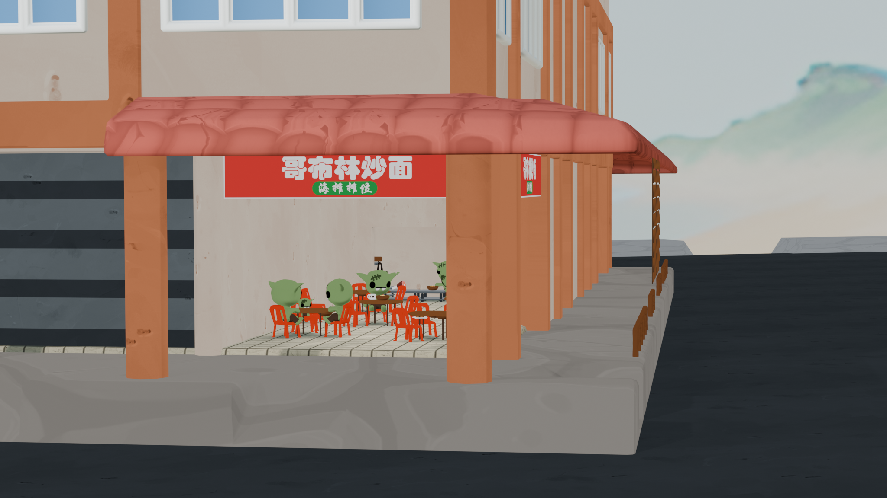
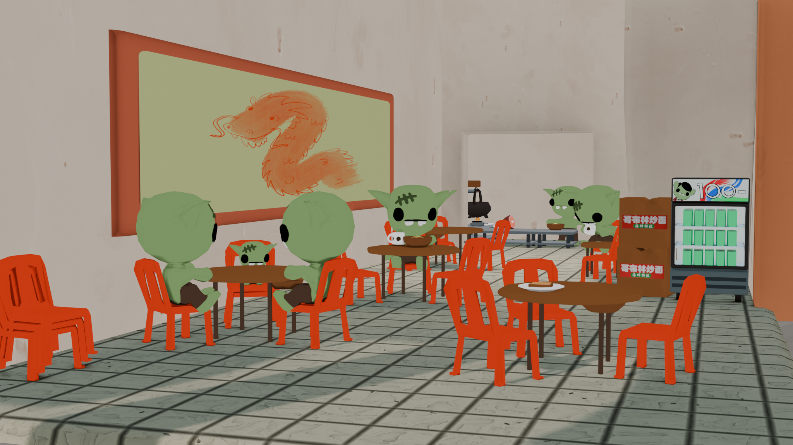

Inspired by [B K Corner](https://maps.app.goo.gl/kdEVvqGHJaNEt9EFA) in Kuching.
Didn't have time to texture this one very well, or build the surrounding
scenery. Maybe it will fit somewhere in a game. It would be cool to have the
buliding be a little hub where different shops open back up as you progress.



  
  


