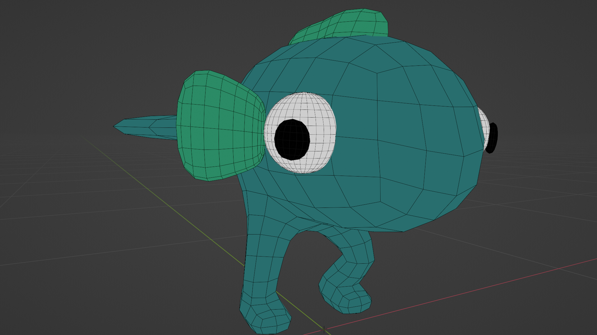
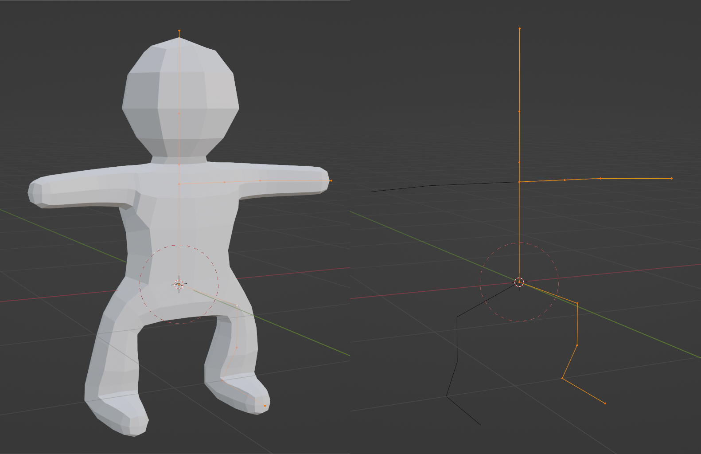



I have yet to spend a _ton_ of time character modeling. These characters are the
best of what I've made so far.

## Legfish

The first character I made. Inspired by a figurine my wife made with some
leftover clay.

For this, I used a [Skin
Modifier](https://docs.blender.org/manual/en/latest/modeling/modifiers/generate/skin.html)
and [Subdivision
Surface](https://docs.blender.org/manual/en/latest/modeling/modifiers/generate/subdivision_surface.html)
based workflow. Joey Carlino has some great
[tutorials](https://www.youtube.com/watch?v=DAAwy_l4jw4&t=2s) for this on
YouTube.

The significant advantage is that we only work with a skeleton instead of actual
geometry until the modifier is applied. This approach delays the need to think
about topology, which was very helpful as this project was one of my first ever
in Blender. The branch merging behavior confused me, so I avoided this workflow
to have 100% control of the topology. In the future, I want to revisit this
approach. Now, I am confident I can fix things by hand as needed.

## Cat Knight



My first run/walk cycle! I'm proud of it. At first, I was resigned to using
[Mixamo](https://www.mixamo.com/#/) because animation is too hard. Their library
wasn't compatible with my stylized characters' oversized heads. The animations
were too "real" as well. The model is cartoony, and the motion should be too.

I read the first few chapters of [The Animator's Survival
Kit](http://www.theanimatorssurvivalkit.com/) because winging it produced
unsatisfying results. While my focus will never be animation, learning the basic
concepts went a long way.

I box-modeled this mesh instead of generating it with the skin modifier. To make
things smoother, I used Catmull-Clark Subdivision and then used the
[Un-Subdivide](https://docs.blender.org/manual/en/latest/modeling/meshes/editing/edge/unsubdivide.html)
operator to keep the amount of geometry manageable while still getting a bit
more smoothness/roundness in the mesh. I got to try out some topology tricks at
the knees and elbows to help them deform properly.

I just copied the head and cut out some parts to make the helmet. Same with the
boots. I lifted the armor from the [Synty Fantasy
Hero](https://syntystore.com/products/polygon-modular-fantasy-hero-characters)
asset pack and played with the scale until it fit the character. I don't plan to
keep it long-term , but it looks good enough for now.

## Gobgob

Because I already had a stylized biped base rigged, I reused that, modeled a new
head, and stitched that on. After extruding the ears, I learned a bit about
rerouting edge/face flow. I like him a lot.
