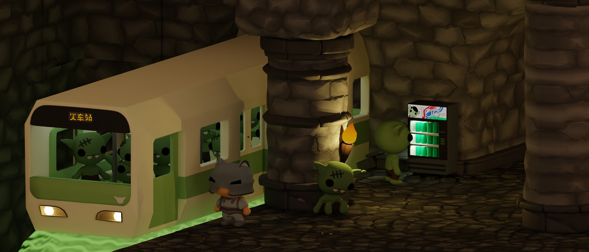
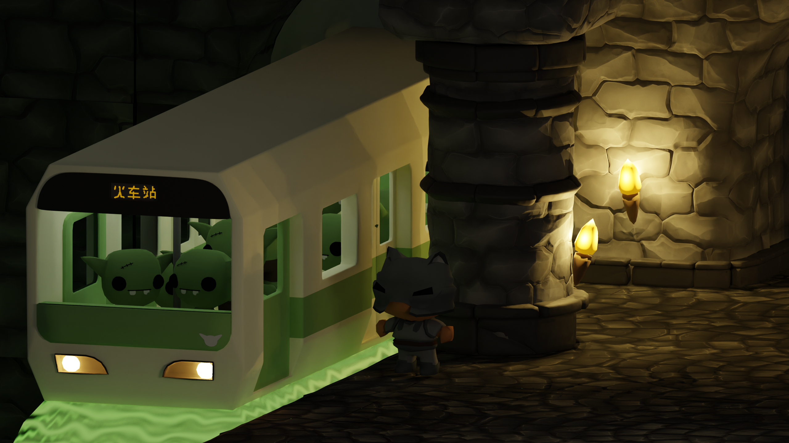
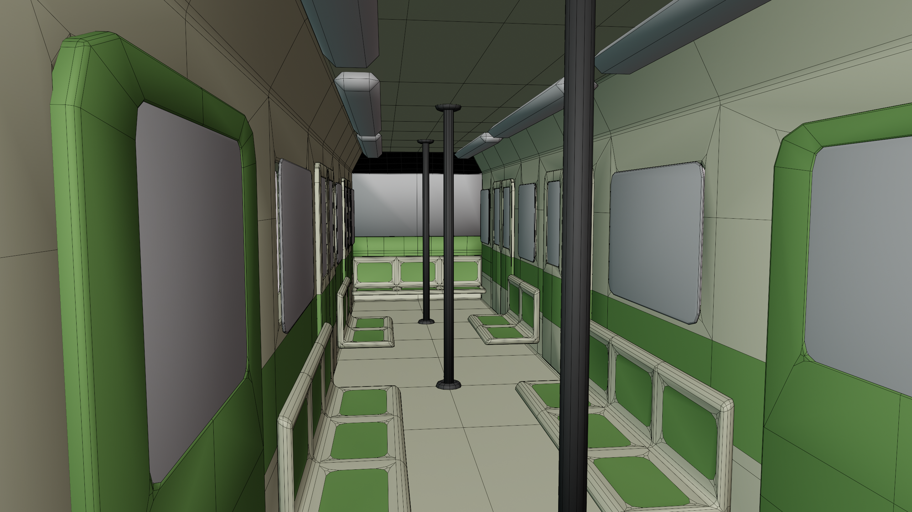

I saw [this](https://joshuaautumn.artstation.com/projects/qAmeAz) picture on
Reddit or something, and I decided to recreate it. There were other decorations
I wanted to put in the train station, like a Goblin-themed vending machine and
better-looking torches. I needed to wrap it up and move on.
To build the environment, I re-used the tileset that I made for my [Wave Function
Collapse](/tech/wfc-02-advanced-wfc/) level editor. Rather than copying the tiles into this blender file and
arranging the tiles by hand, I was able to use my level editor in Godot, then
snapshot the scene using
[PackedScene](https://docs.godotengine.org/en/stable/classes/class_packedscene.html),
and export the `tscn` as GLTF, which I then imported in Blender.

The major caveat is that even though many tiles are re-used throughout the
scene, the exported GLTF contains duplicated mesh data. I plan on looking into
whether this is something that can be optimized in Godot's exporter or is a
restriction in the GLTF format. The `blend` file should not be 90 megabytes.

I also played around with keying arbitrary properties and actually touched the
Non-Linear animation stuff for the first time.





  <!--<video src="anim.webm" class="grid-w50" />-->
  
  
  
  
  


