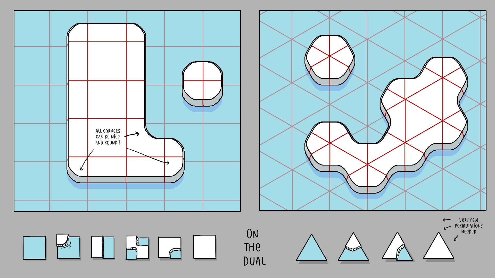
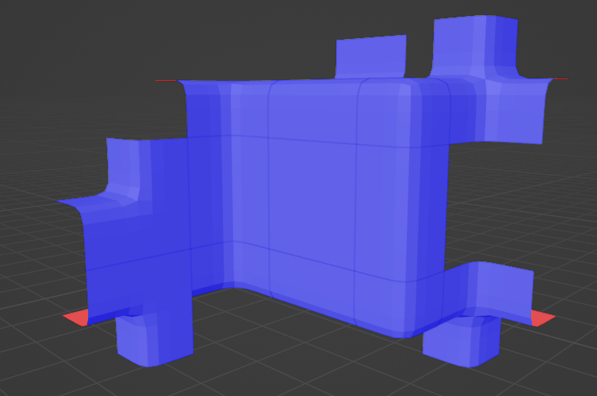
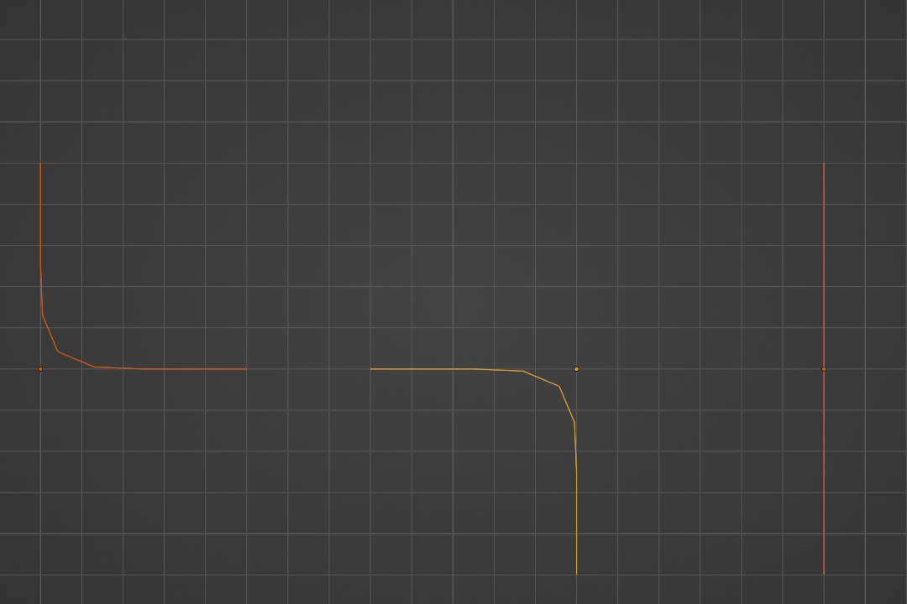
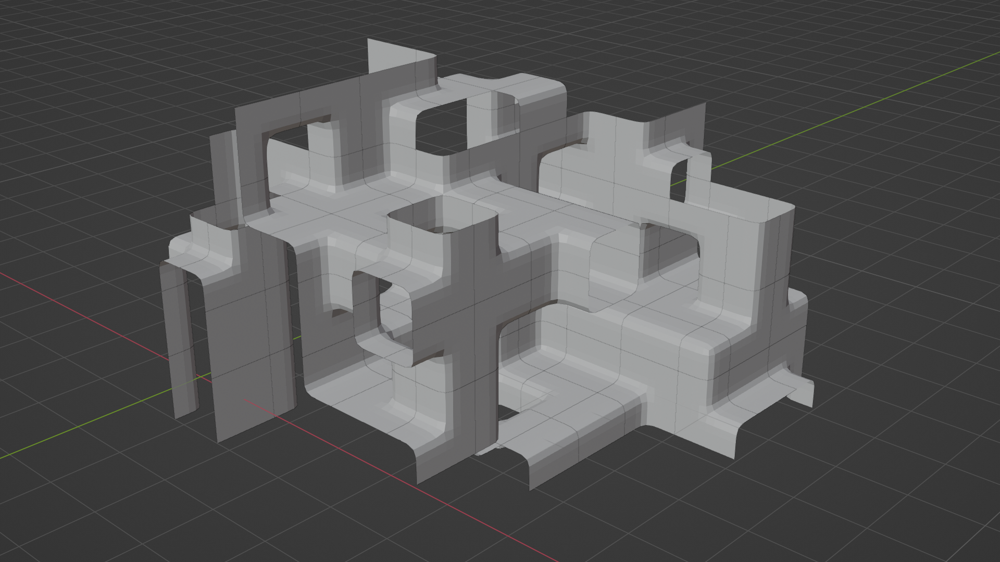
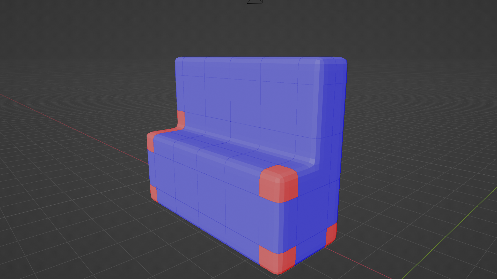

+++
title = "Wave Function Collapse: First attempt"
date = 2023-08-26
+++

At some point in time I followed some indie devs on Twitter. I'd occasionally see retweets of
a cute building game from [Oskar Stålberg](https://twitter.com/OskSta). Didn't think too much of
it at the time. Later I stumbled on [Martin Donald's Wave Function Collapse video](https://www.youtube.com/watch?v=2SuvO4Gi7uY).
The idea was explained so well that I had to try it out. 

# Creating a tileset

In the talk [Beyond Townscapers](https://www.youtube.com/watch?v=Uxeo9c-PX-w&t=126s),
and on [twitter](https://twitter.com/OskSta/status/1448248658865049605) Oskar explains
the concept of the dual-grid. Essentially: cut your tiles in the middle. This is my
first time making a tileset of any kind, and I don't know why anyone would do it
any other way.



I manually modeled out what I thought were the required set of tiles in blender.
I used this graphic to guide me, and thought moving to 3 dimensions wouldn't be that bad.
I would just need to make each of those 2D tiles 3 times: once each for the top, middle and bottom 
layers if you're slicing vertically.



# Determining adjacency

```python
face_verts = []
for v in mesh.vertices:
    # round to 3 decimals so equality will (sometimes) work
    vert_coord_3d = rounded_coordinate(vert) 
    # compare the dimension for this face's axis
    location = vert_coord_3d[face.component] 
    # using float equality is a terrible idea...
    if vert_location_1d == face_location_1d: 
        face_verts.append(vert.co)

socket_id = socket_hash(face_verts)
```

Given a set of tiles, I could go through and look for all the vertices that sat on the bounding box faces
and generate "sockets". This would be my primary piece of adjacency data. If the sockets lined up, it was
valid to place one tile adjacent to another.



# Implementing WFC

With a tileset, and basic adjacency information it wasn't too hard to whip up a basic WFC generator.
For a detailed tutorial, see [Martin Donald's video](https://www.youtube.com/watch?v=2SuvO4Gi7uY). 
The basic structure looks like this:

```python
def solve():
    work_list = []
    solved = False
    iteration = 0
    while not solved and iteration < MAX_ITERATIONS:
        collapsed = collapse()
        if collapsed:
            work_list.append(collapsed)
        else:
            solved = True
        while len(work_list) > 0:
            cell = work_list.pop()
            work_list += propagate(cell)

def collapse():
    unsolved = [cell for cell in grid if len(cell.possibilities) > 1]
    if len(unsolved) == 0:
        # Every cell is solved (or impossible...)
        return None
    # Find the unsolved cell with the fewest number of remaining possible tiles.
    cell = min(unsolved, key=lambda cell: len(cell.possibilities))
    # Reduce it to one possibility
    cell.possibilities = [random.choice(cell.possibilities)]
    return 

# reduce the possibilities of neighboring cells
# to only include tiles that have adjacency sockets that line up.
# return the set of cells that were affected so we can recursively
# propagate the constraint
def propagate() -> List[Cell]:
    pass
```


Using this in a Blender python script, I could generate a random set of tiles that "fit" together in some space:



# Making it interactive

Next, I added a preprocessing step to force empty tiles everywhere but specified coordinates.
This is essentially voxel data.
[BorisTheBrave](https://www.boristhebrave.com/2021/06/06/driven-wavefunctioncollapse/) calls this "Driven" WFC.

```python
[
    (1, 1, 1), (2, 1, 1), (3, 1, 1), (4, 1, 1), (5, 1, 1),
    (1, 2, 1), (2, 2, 1), (3, 2, 1), (4, 2, 1), (5, 2, 1),

    (1, 1, 2), (2, 1, 2), (3, 1, 2), (4, 1, 2), (5, 1, 2),
    (1, 2, 2), (2, 2, 2), (3, 2, 2), (4, 2, 2), (5, 2, 2),

    (1, 1, 4), (2, 1, 4), (3, 1, 4), (4, 1, 4), (5, 1, 4),
    (1, 1, 4), (2, 1, 4), (3, 1, 4), (4, 1, 4), (5, 1, 4),
]
```

Now I can build something blocky like in Minecraft. By typing coordinates by hand in python! Great...



# There are some major issues

Someone more seasoned in procedural generation, or 3D graphics in general may have noticed
a few issues. I'll highlight the major 3 that will each get a dedicated follow up. 

**1. Some tiles have flipped normals**

Notice the red tiles on the corners of the last image?

The main issue is that the sockets don't contain any information about
which side is on the "inside" or outside. There are a few ways to go about tackling this.

**2. Sockets rely float equality and perfect meshes**

While we _want_ two adjacent tiles to fit perfectly, sometimes they don't need to.
Mesh skirts and clever artwork can be used to cover up seams. If we rely on 3 decimal places
of accuracy on every vertex, we will have a hard time creating new tiles and pull our hair out
when tiles that should fit together have different sockets.

**3. The tileset is incomplete**

At this phase in the project, I would create some tiles, then create somee voxel data
and see if the generator would fail. When the generator failed, I'd stare for a while until I realized
I missed some 3D version of Oskar's dual grid guide. In the screenshots above, we're missing _every_
variation of the "diagonal" tile.


