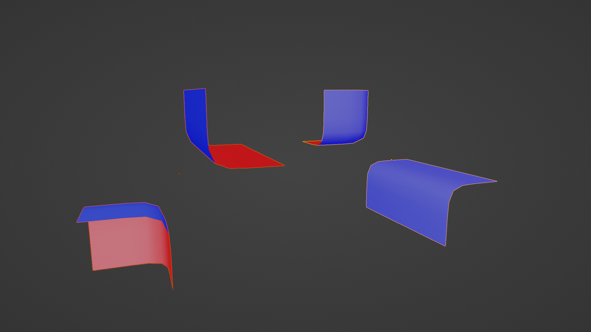
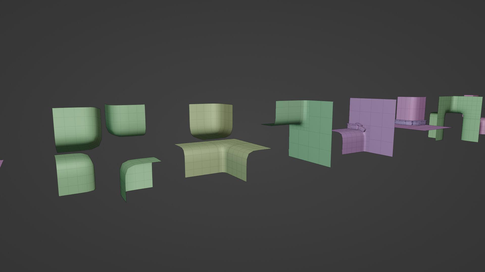

+++
title = "Wave Function Collapse: Enumerating tiles"
date = 2023-08-26
+++

Oskar Stålberg's and BorisTheBrave's willingness to share the dirty
details of their hard work is invaluable. 

---

# Brute Forcing it by hand

In the last blog, I showed a tileset created entirely by hand.
Some very important tiles were missing. These diagnonal pieces:


When I realized I needed these, I added more test cases and things still broke.
I later realized, that I also needed these combinations of corners and edges:



There _must_ be an algorighmic way.

# Oskar already figured it out

It turns out before Townscaper he made a smaller version called 
[Brick Block](https://oskarstalberg.com/game/house/index.html).
In an [article in Vertex magazine](https://tmblr.co/ZRaqvp1x7yvmD) he explains
a way to cut a cube into 8 octants. It turns out that if you look at all the 
possibilities of having an octant filled or not is 2 to the power of 8 (256).

Looking at this like an 8 bit integer means we have "cube IDs" from 0 to 255.
If you have all these tiles, you will _never_ have an unsolvable grid of voxel data.

# 256 tiles is a lot

In the article, Oskar points out that a lot of these end up being rotations
or flipped versions of other permutations. He reduced that to 67 unique cases.
I ended up with 53.. I'm still curious how we got different results.

I'm not much of an artist. 53 was still too many for me!

# Back to manually enumerating tiles

In my initial attempt, I got pretty far by manually enumerating all the
possibilities needed for an infinite grid. Surely I could manually come up with
everything needed for a 2x2x2 grid.

I was able to go back to this classic image:


To give these names:

* Empty
* Corner 
* Edge
* Diagonal
* Bend 
* Full

If we only model the dual grid of _those_ we can eliminate the need to make
a "diagonal". And we don't have to model an "empty" tile. So I started with these 4 tiles:
 


To expand this to 3D, we transitions that let us go upwards. We can simply rotate these 4 tiles and voila.
We're at 8 tiles. 

It doesn't fully cover it though. We have to be able to transition vertically between flat
tiles or edge tiles. We'll call these "lip" tiles since they're kind of skinny. There are 5.
4 for to match up to the base cases and a 5th that is a corner between two lips. It's basically
the "outward" part of an "outward blob cut" approach. 


Finally, we duplicate all of these and flip them upside down so we have some dedicated for the
top layer of our 2x2x2 grid.

In total There are 26 tiles. Very manageable!


# Turning them into dual tiles

Now to combine these tiles. 

We can write an autotiler based on the which octants are filled.
To store the classification data we use a special naming scheme that includes:

* Their base type - Lip, Corner, Bend, Edge
* Their Layer - Top, Bottom
* Their Direction - Horizontal, Vertical, Horizontal + Vertical, Corner

> Note: The following code was written during a long layover after an 18 hour flight. At some point I'll
> go back and clean it up. In the meantime, I hope the comments are accurate.

```python
def base_tile_for(octant, cube_id):
    cube_arr = int_to_cube(cube_id)
    prefix = ["Bottom", "Top"][int(octant[2])]

    # west, east, south, north, bottom, top
    adjacency = []

    for axis in [0, 1, 2]:
        # check directly adjacent (this axis changes)
        for delta in [-1, 1]:
            delta_vec = np.array([0, 0, 0])
            delta_vec[axis] = delta
            cc = octant + delta_vec
            adjacency.append(cube_cell_filled(cube_arr, cc))

    adj_axes = sum(1 for v in [xx, yy, zz] if v)

    # if there was any vertical adjacency, use .V suffix
    z_adj = any(adjacency[4:])

    # check how many cells are filled in this octant's plane for each axis
    n_in_axis = [
        cube_arr[octant[0], :, :].sum(),
        cube_arr[:, octant[1], :].sum(),
        cube_arr[:, :, octant[2]].sum(),
    ]
    # if all 4 cells in some plane were filled, there was a "wall" in that axis
    # walls result in needing a "lip"
    walls = [n == 4 for n in n_in_axes]

    if any(walls):
        hw, vw = walls[0] or walls[1], walls[2]
        if hw and vw:
            suffix = "Lip"
            if adj_axes == 3:
                suffix += ".C"
        elif walls[0] and walls[1]:
            suffix = "Lip.V"
        else:
            if adj_axes == 2:
                suffix = "Flat" if vw else "Wall"
            else:
                suffix = "Lip.Bend" if vw else "Lip.Bend.V"
    elif adj_axes == 0:
        suffix = "Corner"
    elif adj_axes == 1:
        suffix = "Edge"
        suffix += ".V" if z_adj else ".H"
    elif adj_axes == 2:
        suffix = "Bend"
        suffix += ".V" if z_adj else ".H"
    elif adj_axes == 3:
        suffix = "Bend.HV"
    else:
        raise Exception("Somehow adjacency count isn't covered..??")

    return prefix + "." + suffix
```

# Orienting the tiles

Simply selecting the correct tile type is not enough. We must rotate the tiles so that they line up
properly. While there are _probably_ some rules we could add to the mostrosity above, we don't need to.
Doing so would not only add complexity to the code, but require some manual setup in Blender.

Instead we can cheese it with Wave Function Collapse! Using a tileset with very simple geometry, we can
generate all the sockets for these "base" tiles. These only ever need to be generated once, and we can
store them in some JSON file to avoid needing our geometry to be perfect in the future.

Once we have this "golden" adjacency information file, we can use WFC to align everything correctly.

# Result



At this point, we can make the geometry as complex as we want. But if the geometry is complex,
how can we get nice sockets for the _actual_ WFC using these generated tiles? The next post
will explain a better system for adjacency that doesn't rely on analzying 3D meshes.


