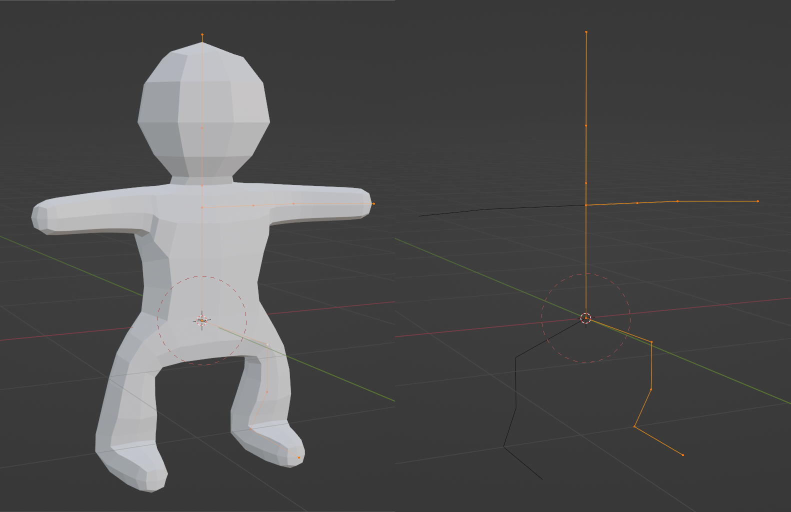
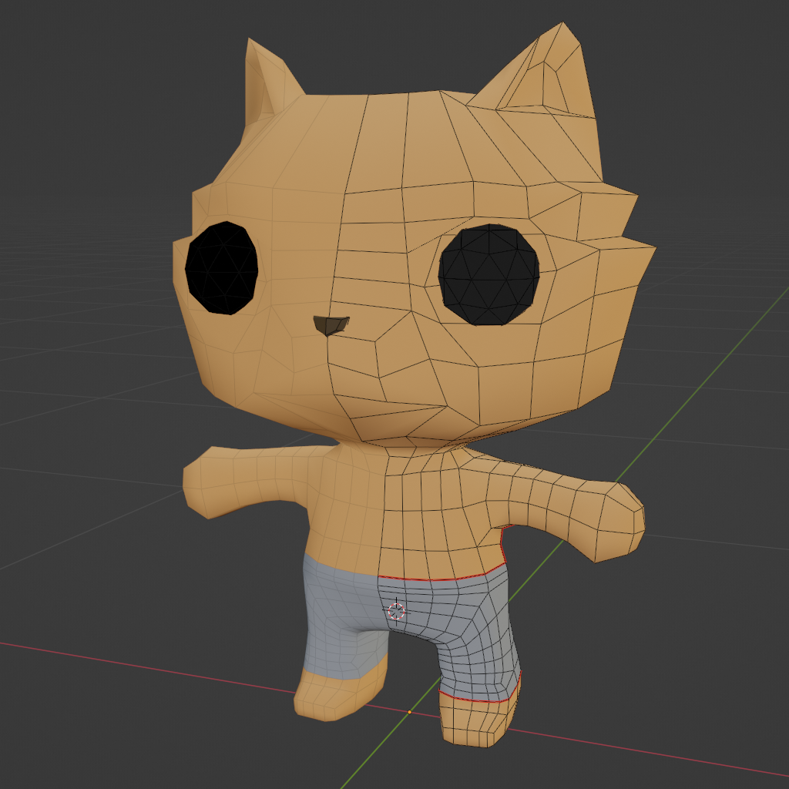
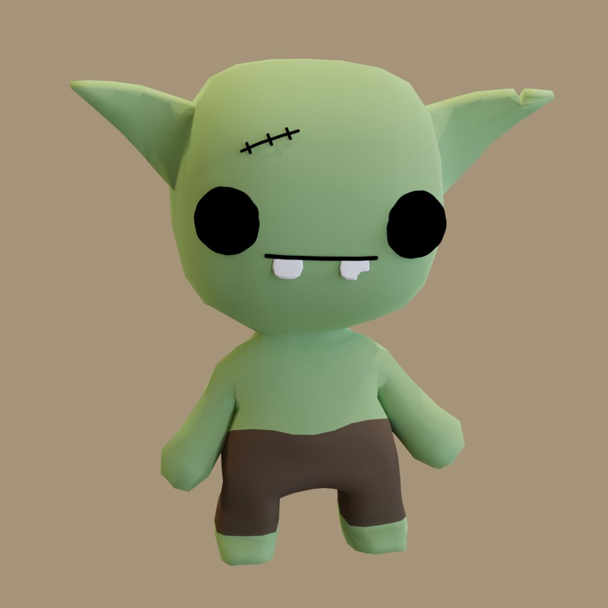

<video src="showcase.mp4" autoplay loop></video>

I haven't spent a _ton_ of time character modeling. 
This is what I've been able to make so far.

## Legfish

This was the first character I made. Inspired by a
figurine I sort of made with my wife's leftover clay.

For this I used a [Skin Modifier](https://docs.blender.org/manual/en/latest/modeling/modifiers/generate/skin.html) 
and [Subdivision Surface](https://docs.blender.org/manual/en/latest/modeling/modifiers/generate/subdivision_surface.html)
based workflow. Joey Carlino has some great [tutorials](https://www.youtube.com/watch?v=DAAwy_l4jw4&t=2s)
on YouTube. 

The major advantage is there is almost no real geometry to manage
until you apply the modifier. This delays the need to think about
topology. This was one of the first things I did when learning blender.
I couldn't really make sense of when branches would merge and I ended up
avoiding this workflow so I would have 100% control of the topology.
In the future, I want to revisit this approach now that I understand
topology and modeling better. It's easier now for me to fixup things that
aren't perfect just using the modifiers.

## Cat Knight 

<video src="cat-run.mp4" autoplay loop></video>

This is my first run/walk cycle! I'm pretty proud of it.
At first I was resigned to using [Mixamo](https://www.mixamo.com/#/)
because animation is too hard. It was difficult to get good results
with my stylized characters massive heads. The animations were too
"real" as well.  The character is cartoony and the motion should be too.

I read the first few chapters of [The Animator's Survival Kit](http://www.theanimatorssurvivalkit.com/)
and while I don't plan on becoming a serious animator, the basic concepts 
are enough to help me work quicker and make something passable.

This was box modeled for the most part. To make things smoother I would use a  
Catmull-Clark Subdivision and then use the [Un-Subdivide](https://docs.blender.org/manual/en/latest/modeling/meshes/editing/edge/unsubdivide.html)
operator to keep the amount of geometry manageable while still getting a 
bit more smoothness/roundness in the mesh. I got to try out some topology tricks at the knees
and elbows to help them deform properly.

To make the helmet, I just copied the head and cut out some parts. Same with the boots.
The armor was lifted from the [Synty Fantasy Hero](https://syntystore.com/products/polygon-modular-fantasy-hero-characters)
asset pack. I just scaled things around until it fit.I don't plan on keeping it long term
but it looks good enough for now.

## Gobgob

Because I already had a stylized biped base all rigged, I reused that and just modeled a new head
and stitched that on. I learned a bit about how to reroute edge/face flow after extruding
the ears. I like him a lot.
 
