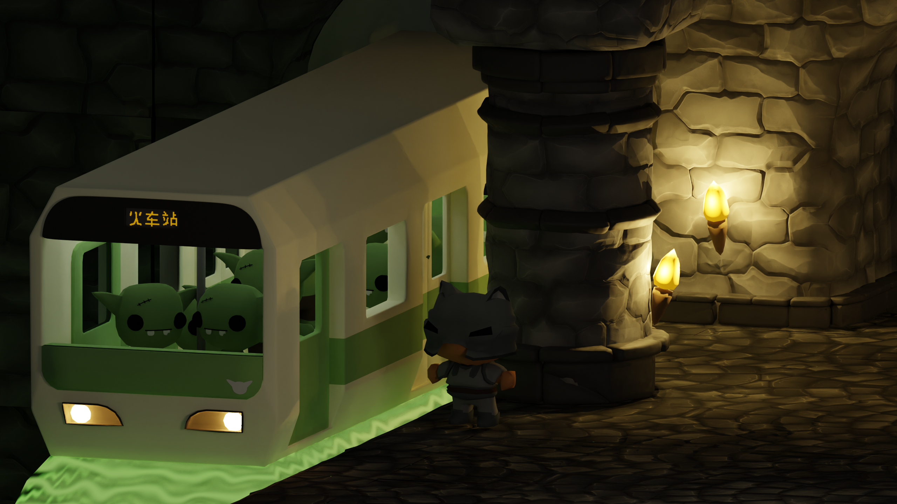
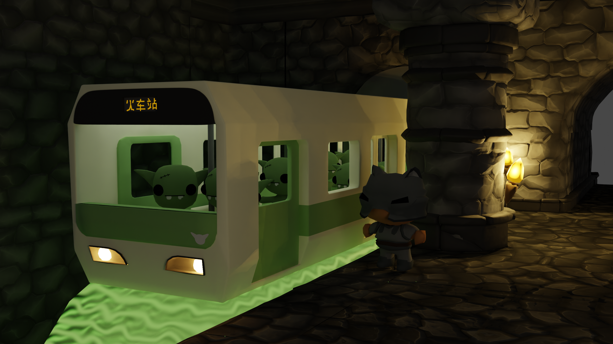
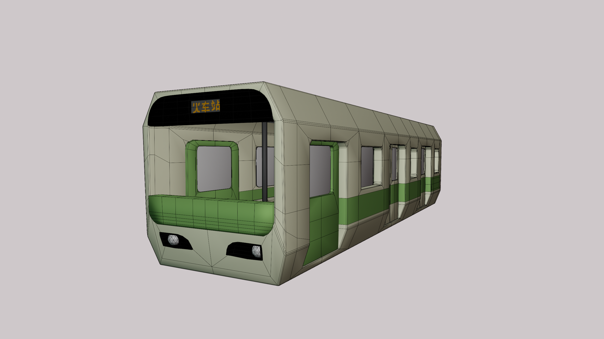
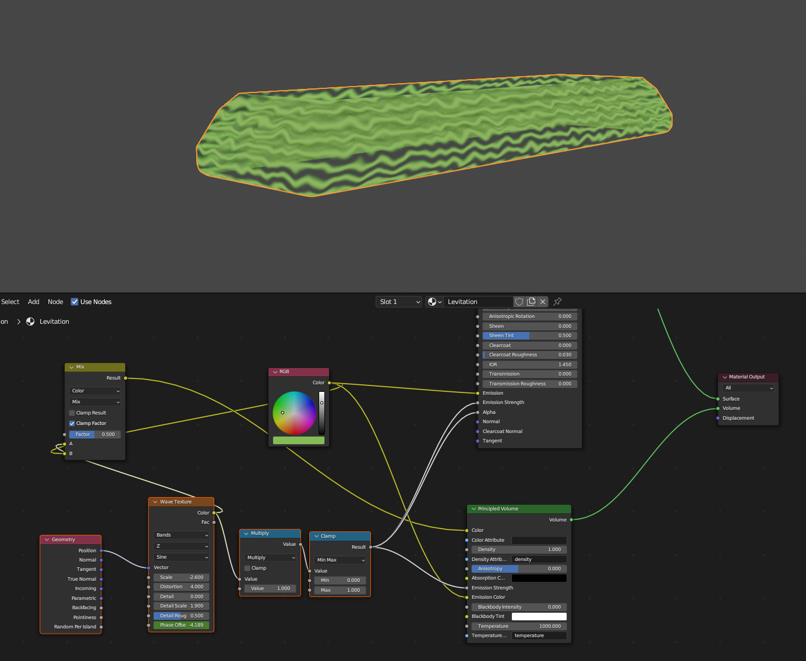
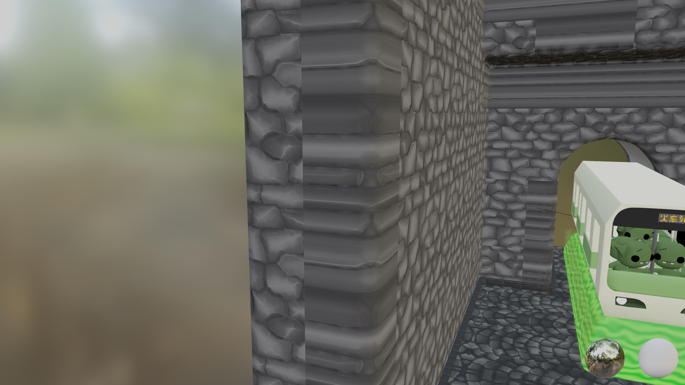

I saw [this]() picture on Reddit or something and I decided to
(sorta) recreate it. There were other decorations I wanted to put 
in the train station like a Goblin themed vending machine, and better
looking torches. I needed to wrap it up and move on though.

To build the environment, I re-used my tileset that I made for 
my Wave Function Collapse based level editor. Rather than copying
the tiles into this blender file and arranging them by hand I was
able to use the level editor in godot, save the scene using [PackedScene](https://docs.godotengine.org/en/stable/classes/class_packedscene.html)
and then Godot let me export to GLTF, which I then imported in blender.

The major caveat is that even though may tiles are re-used, the export
duplicated mesh data for each instance. I plan on looking into into whether
this is something that can be optimized in Godot's exporter or is a restriction
in the GLTF format. The `blend` file should not be 90 megabytes.

---

### Animation

<video src="anim.mp4" autoplay loop></video>

This was my first time doing a couple of things in Blender.

1. Keying arbitrary properties. The torches have their "Power" animated to go up and down.
   The phase offset on the wave texture is also keyed to increase with time.

2. Using the Non-Linear Animation Tool. Before I would just duplicate the keyframes for the 
   duration of the clip. I wanted to repeat the idle animation of my character.

### Projection

 

I personally liked using an orthographic camera for rendering as an art piece.

Perspective projection gives much more of an "in-game" feel. It would be cool
to make put this in a game someday. Maybe as a fast travel system like Hollow
Knight's stag.

### Wireframes

One lesson in this project is that it's not always worth it to
cut holes in things that will never deform and you can cover using
separate objects. It was also the first time I'd really used the bevel
modifier and needed to keep the topology clean enough for smooth shading.

Although not strictly necessary, I did take the time to model 
the interior of the train.

### Texturing

To color, I used a simple pallete texture. Entire faces are each assigned a 
color using this texture. Except for the "LCD" screen on the front of the train.
Although this is based on a Japanese subway train, I don't know Japanese. I know
a tiny bit of Mandarin, but I don't really know how to write it. If I understand
correctly, a lot of characters are used in Japan as well. Anyway, my wife and I
thought  it would be funny if it said the destination was "Train Station".

I wanted only the text on the screen to be emissive. It probably isn't the simplest
solution, but the first thing I thought of is to check for certain colors and plug
that into the "emsisive" socket of Blender's BSDF node. I ended up also using that
for the lights on the interior.

I didn't feel like modeling anything else, so for the underneath of the train
we're just gonna say "it's magic". I decided to mess around with some built-in
noise textures and the Wave Texture node is pretty cool. I made parts of it
transparent and most of it emissive and it looked deceint. Plugging it into the
volume output looked decent in the render so I left it. 

The walls use some PBR textures [I bought from CGTrader](https://www.cgtrader.com/3d-models/textures/miscellaneous/stylized-pbr-textures-bundle)
(well worth it imo). I'll probably talk about it later, but I can't/don't want to
unwrap these tiles, so I use a triplanar mapping. I still can't figure out a good
way to make Blender ignore object rotations when using this. For the tiles visible
in the render, I unroated the objects and rotated the geometry instead.
