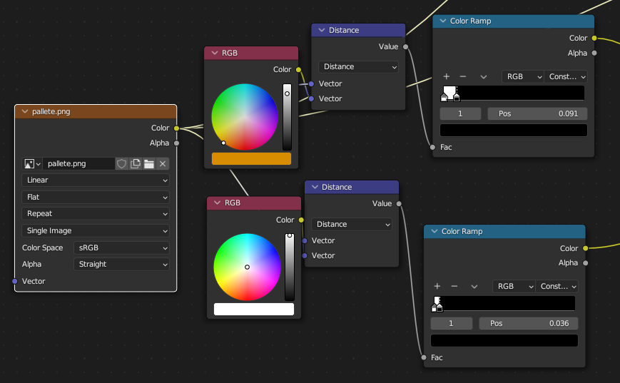

--- 
title: Train Station 
---

I saw [this](https://joshuaautumn.artstation.com/projects/qAmeAz) picture on
Reddit or something, and I decided to recreate it. There were other decorations
I wanted to put in the train station, like a Goblin-themed vending machine and
better-looking torches. I needed to wrap it up and move on.
To build the environment, I re-used the tileset that I made for my Wave Function
Collapse level editor. Rather than copying the tiles into this blender file and
arranging the tiles by hand, I was able to use my level editor in Godot, then
snapshot the scene using
[PackedScene](https://docs.godotengine.org/en/stable/classes/class_packedscene.html),
and export the `tscn` as GLTF, which I then imported in Blender.

The major caveat is that even though many tiles are re-used throughout the
scene, the exported GLTF contains duplicated mesh data. I plan on looking into
whether this is something that can be optimized in Godot's exporter or is a
restriction in the GLTF format. The `blend` file should not be 90 megabytes.

---

### Animation

<video src="anim.webm" autoplay loop></video>

This was my first time doing a couple of things in Blender.

1. Keying arbitrary properties. The torches have their "Power" animated to go up
   and down. The phase offset on the wave texture is also keyed to increase with
   time.

2. Using the Non-Linear Animation Tool. Before I would just duplicate the
   keyframes for the duration of the clip. I wanted to repeat the idle animation
   of my character.

### Projection

I personally liked using an orthographic camera for rendering as an art piece.

Perspective projection gives much more of an "in-game" feel. It would be cool to
make put this in a game someday. Maybe as a fast travel system like Hollow
Knight's stag.

### Wireframes

One lesson I learned during this project is that it's probably not worth cutting
holes in things that will never deform, and you can cover them using separate
objects. It was also the first time I'd used the bevel modifier, and I needed to
keep the topology clean enough for smooth shading.

Although not strictly necessary, I did take the time to model the interior of
the train.

### Texturing

To color, I used a simple palette texture. Entire faces are each assigned a
color using this texture. Except for the "LCD" screen on the front of the
train. While I referenced a Japanese subway train, I can't speak or read
Japanese. I do like the style of Kanji here, and I a decent amount of Chinese, 
so I just put "火车站" (huo che zhan) meaning train station.

I wanted only the text on the screen to be emissive. It probably isn't the
simplest solution, but I first thought to check for specific colors and plug
that into the "emissive" socket of Blender's BSDF node. I ended up also using
that for the lights on the interior.

I didn't feel like modeling anything else. Instead of building the mechanisms
beneath the train car, we will say, "It's magic." I decided to mess around with
some built-in noise textures, and the Wave Texture node is pretty cool. I made
parts of it transparent and most of it emissive. The result is decent. Plugging
it into the volume output seemed fine in the render, so I left it.
