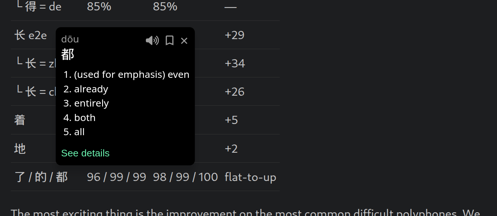

The core piece of functionality in Bookchoy is "tap on a character, see a popup
with the dictionary definition". Sounds simple, but because of the ambiguity in
the language it's not a trivial problem. I think while it can be a crutch,
having the ability to not lose your flow in reading/navigating/writing is
critical, to avoid just getting bored or frustrated and stopping the session. I
want this functionality everywhere: on my phone, in my browser, in my primary
text editor (neovim).

The easy way to solve the "what _word_ is this" is to show all possible matches
in the dictionary and let the user figure it out from context clues. That's what
I did for [bookchoy.nvim](https://github.com/stevenctl/bookchoy.nvim). This is the
approach I've seen in other apps and chrome extensions. Not great, it relies on the
user to be a bit further along in their learning and still leaves room for mistakes.
It also means if you want to show pinyin above the characters, you can only choose
one for the most part, which is going to be your best guess which will probably be
wrong a lot for 得/地/长/行 and the like.

An alternative solution is manually annotating text with correct word
boundaries/dictionary mappings. This restricts things to a curated content
library, so that's not really any good for learning using content I'm actually
interested in.

So, as I detailed in my previous posts, I want a model that has super high
accuracy. There is [jieba](https://github.com/fxsjy/jieba) which seems to have
been published in 2012 and last updated in 2019/2020. There's also
[pinyin-jyutping](https://github.com/Vocab-Apps/pinyin-jyutping) but again, the
accuracy isn't good enough.

My first attempt at training my model was to train two separate ALBERT models:
one for word segmentation and one for pinyin. The training data was from some
github repo and it turned out to be labeled using the libraries above.. so I
was just learning the wrong mappings. This was partially addressed by the
harness that merged the results of the models and applied some manual crutches
to bias things towards what was probably the natural distribution in the wild
of the mappings to just push my arbitrary accuracy number higher.

My second attempt addressed the data issues, by using Gemini 3 (~November
2025) to label the same set of sentences + my own library of graded readers.
This was better, but I made some mistakes in the labeling process and didn't
audit it well.

My third attempt was this weekend, and it had three pieces.

First, the training itself. I used
[karpathy/autoresearch](https://github.com/karpathy/autoresearch). I let it
look at my existing training loop and harness and asked it to focus on unifying
the two model approach. The core intuition is that the correctt pinyin for a
character in many cases is a result of the correct segmentation.

Second, a better labeling approach. This time I used the
latest Gemini flash model, after finding the accuracy was barely higher with
the Pro model despite a much higher price tag. The approach to the labeling
this time was to tell the LLM my list of candidates based on the brute forced
list of mappings from the dictionary, then asking it to pick the correct ones.
I discard results that don't line up with my dictionary, and let Claude iterate
on a small sample set, improving the prompt and validation till the LLM could
100% my hand picked examples. Then on the full run, I audited inconsistencies
on bigram/trigrams as well as pulled all samples containing the most ambiguous
characters and then audited those partialy by hand, and partially using a more
expensive and accurate LLM.

Third, the training loop was driven by an agent that tuned hyperparameters and tried
a bunch of strategies for training algorithms and sampling algorithms which squeezed out a decent
few points of accuracy on the long tail.

The new model is a single encoder, with multiple heads for the two different tasks,
with the harness that combines their results no longer having manually tuned crutches
to bias the results for certain cases. There are so many wins here:

* The model size went from 2 models totalling 32MB to a single 17MB model.
* The latency was reduced by about 40%.
* No hardcoded crutches. This is kind of a win in terms of generalization, but also may
  indicate I haven't reached the ceiling yet on what I can squeeze out of these models.

Using the new labeled test data to compare the old and new models, the results are pretty good:

Overall:

| metric           | Previous (shipped) | New (champion) | Δ     |
|------------------|--------------------|----------------|-------|
| full word F1     | 96.85              | 97.67          | +0.82 |
| A-phonetic macro | 74.6               | 84.2           | +9.6  |

Full word F1 is easier than it looks. There are so many unique characters and
super common segmentations that the unambiguous cases converge pretty quickly.
We still made an improvement there. A small percentage increase there is
actually pretty huge considering the scope of that metric.

A-phonetic macro is the avergage of per-reading accuracy on any character that has
multiple readings. We made a huge jump there, which is really exciting because that's
the core problem we're trying to solve. Most of the error cases are no longer pinyin errors
but segmentation errors. I'm still not happy with it, but this is a data issue for sure, not
a model issue. Even training a full sized BERT to attempt a distillation training workflow
showed that training a tiny model performed just as well, suggesting model capacity is not
the bottleneck.

Hard polyphones:

| reading      | Previous     | New           | Δ          |
|--------------|--------------|---------------|------------|
| 得 e2e       | 61%          | 88%           | +27        |
| └ 得 = dé    | 23%          | 90%           | +67        |
| └ 得 = děi   | 55%          | 100%          | +45        |
| └ 得 = de    | 85%          | 85%           | —          |
| 长 e2e       | 62%          | 91%           | +29        |
| └ 长 = zhǎng | 52%          | 86%           | +34        |
| └ 长 = cháng | 72%          | 98%           | +26        |
| 着           | 85%          | 90%           | +5         |
| 地           | 89%          | 91%           | +2         |
| 了 / 的 / 都 | 96 / 99 / 99 | 98 / 99 / 100 | flat-to-up |

The most exciting thing is the improvement on the most common difficult
polyphones. We are _well_ past a coinflip now. Again, the improvements left on
the table are bounded by the data I have available. Next time I have a free
weekend we're gonna do another round of labeling and training and hopefully I
see a jump.

## Shipping without perfect accuracy

While I'm happy with the big improvements, how can I plan on shipping this in an app
targeting language learners without high 90s accuracy on everything? The key to making this
not a big issue is the other piece of the new model harness: confidence.

| metric               | value   | meaning                                                       |
|----------------------|---------|---------------------------------------------------------------|
| AUROC                | 0.97    | cleanly separates right from wrong (>0.8 = usable)            |
| ECE                  | ~1–1.7% | predicted confidence ≈ actual accuracy (well-calibrated)      |
| mean conf when right | 0.99    |                                                               |
| mean conf when wrong | 0.80    |                                                               |
| top-2 recovery       | 95%     | of the errors, the correct answer is the model's #2 candidate |

Using confidence outputs in the UI allows me to proactively decide when I need
to flalback to showing more candidates or a simple warning on an individual
word that might be wrong according to the model. This helps me sleep better at night knowing I made
an attempt to avoid misleading learners.

## What's next in Bookchoy

The next release will have this improved model baked in. The following release
will have my new sync engine turned on, and the confidence based UI. Why a new
sync engine? I'll talk more about that in a future post, but it's in service of
a huge new feature: the Chrome extension! Netflix, iQiyi and ANY text on ANY
webpage; all lets you quickly look up words, translate sentences and save them
to review in the app.

