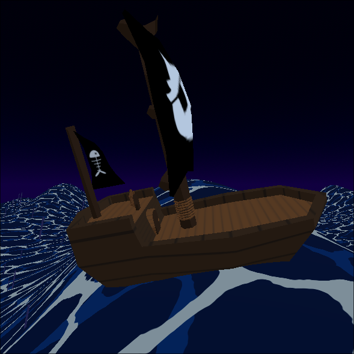
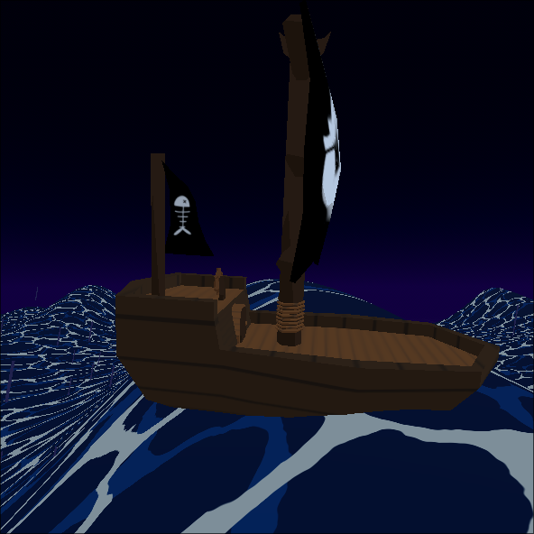
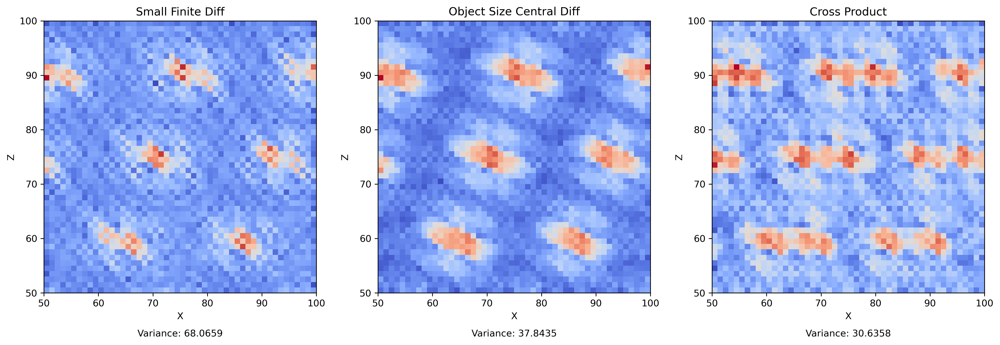
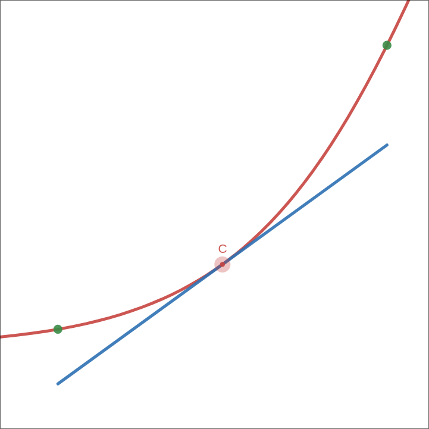



During the intro to a game I (perodically) work on, the player starts on a
pirate ship. Realistic water doesn't fit the style, and scroling textures on a
big plane looked pretty boring. To make things a bit angrier I needed intense
waves, and I needed those waved to actually affect the world.

## Waves

To keep it simple, I just did procedural heightmap; i.e. set the vertical
coorinate to be a function of the horizontal position and time.

There's this [Sum of
sines](https://developer.nvidia.com/gpugems/gpugems/part-i-natural-effects/chapter-1-effective-water-simulation-physical-models#:~:text=The%20sum%20of%20sines%20gives,to%20the%20continuous%20water%20surface.)
technique that can give a semi-realistic texture to the surface of the water. I
don't need realism, but the variety it provides is pretty good. Simplifiying it
to just add two waves together gave pretty good results!

```glsl
float wave(vec3 p) {
	float time = TIME * wave_speed;
	vec2 uv = (p.xz + time * vec2(0.5, 0.5)) * wave_size;
	float dist = length(uv);

	return pow(2.1231, sin(dist) + sin((uv.y + 1.0))) * height;
}

void vertex() {
	world_position = (MODEL_MATRIX * vec4(VERTEX, 1.0)).xyz;
	VERTEX.y = wave(world_position);
}
```

## Floating

The fun part is making the waves interactive. There are two components to
making objects float on top of our waves:

* Position: move the object up and down so it sits on top of the water.
* Rotation: orient the object according to the slope of the waves.

We generally want some of the object to sit beneath the surface of the water.
There are more realistic buoyancy simulations that figure out the displacement according
to the amount of a volume that sits beneath the surface. The complexity and noise that
comes with an accurate solution doesn't fit the style, so instead we're going to fit a plane to
the waves surface.

It's easy to adjust the plane within the Godot editor, without doing anything
custom, by defining a CSGBox3D that is thrown away at runtime.


### Orientation


The easiest way to orient the object is find the slope of the wave using basic
"rise over run"; aka finite differences with a small step.

```gdscript
var small_dx = _wave(center + Vector3.RIGHT * step / 2) - _wave(center + Vector3.LEFT * step / 2)
var small_dz = _wave(center + Vector3.BACK * step / 2) - _wave(center + Vector3.FORWARD * step / 2)
var gradient = (Vector3(small_dx, 0.0, small_dz) / step).normalized()
```

If the surface of our wave is very noisy, this will look pretty bad. A quick
fix would be sampling at the edges of the plane that makes up our object's
"floating surface". This would be "central differences".

```gdscript
# find points on each side (the rotation puts us into global space, needed by _wave)
var left = _wave(center + (Vector3.LEFT * size.x / 2).rotated(Vector3.UP, plane.global_rotation.y))
var right = _wave(center + (Vector3.RIGHT * size.x / 2).rotated(Vector3.UP, plane.global_rotation.y))
var front = _wave(center + (Vector3.FORWARD * size.y / 2).rotated(Vector3.UP, plane.global_rotation.y))
var back = _wave(center + (Vector3.BACK * size.y / 2).rotated(Vector3.UP, plane.global_rotation.y))

var gradient = Vector3((left - right) / size.x, 1.0 , (front - back) / size.y).normalized()
```

Central differences will use a diamond shaped sample of points. Taking the
corners into account, the normals can be calculated by looking at the triangles
that make up our quad. In this example, I only use front and back triangles
because I assume the shape of my rectangle is longer on that axis.

```gdscript
# find the corners (the rotation puts us into global space, needed by _wave)
# Define corners in local space
var local_corners = [
    Vector3( half_x, 0,  half_z), Vector3(-half_x, 0,  half_z), # front
    Vector3(-half_x, 0, -half_z), Vector3( half_x, 0, -half_z), # back
]

# Rotate and add to center (global space), then apply wave
for i in range(local_corners.size()):
    local_corners[i] = center + local_corners[i].rotated(Vector3.UP, rot_y)
    local_corners[i].y = _wave(local_corners[i])

# Also project center on the wave
center.y = _wave(center)

# Compute the two triangle normals
var normal_f = (local_corners[1] - center).cross(local_corners[0] - center).normalized()
var normal_b = (local_corners[3] - center).cross(local_corners[2] - center).normalized()

# Average the normals, then undo the global space rotation
var normal = ((normal_f + normal_b) * 0.5).rotated(Vector3.UP, -rot_y).normalized()
```


    
    
    


From left to right are examples using the back normal, the averaged normals and
the front normal on top of a sharp peak.

For fun, I plotted a 'smoothness' field to see how much variety I was getting and whether
there were sharp peaks or valleys that would make things look bad. Unsurprisingly, the approach
that samples the largest area gave the smoothest results.



### Position

A naive `position.y = wave(position.xy)` means that at concave parts of the curve,
our plane will undernath the surface.


    
    


If we instead use the mean of our samples, we fix the concave case but now
we'll end up submerged in convex areas. To get the best of both, we just take
the `max` of the center sample or the edge samples' mean
([desmos](https://www.desmos.com/calculator/y4neofo1zw)).

```gdscript
# for central differences, re-use the samples
surface_point.y = max(center.y, (left + right + front + back) / 4)
# or if we're doing triangles, re-use those samples
surface_point.y = max(center.y, (front_l + front_r + back_l + back_r) / 4)
```

## Riding the Waves

In another fun experiment, I took things a step further and actually used the waves to drive
the motion of the boat. While this may or may for the gameplay to move the boat
around, it could be a cool effect for objects that fall into the water.

While we could find the [partial
derivatives](https://www.wolframalpha.com/input?i=derivative+of+e%5E%28sin%28sqrt%28x%5E2%2By%5E2%29%29+%2B+sin%28y%29%29+*+H)
of our wave analytically to get aprecise slope, we'd have to keep that code in
sync with the existing. The normals and the gradient are closely related. In
fact, code for the wave. Not worth it, and we can just re-use the normal
calculation; to get the gradient.

```gdscript
func fit_plane(plane: Node3D, size: Vector2) -> Transform3D:
    # ...
	var step = .2
	var small_dx = _wave(center + Vector3.RIGHT * step / 2) - _wave(center + Vector3.LEFT * step / 2)
	var small_dz = _wave(center + Vector3.BACK * step / 2) - _wave(center + Vector3.FORWARD * step / 2)
	var grad = (Vector3(small_dx, 0.0, small_dz) / step).normalized()

    var surface_point = center - grad
    # ...
```




Simply setting the object's position to the `surface_point` like this it will
slide towards a local minimum of the wave and get stuck there. When we use a
smaller step we lag behind the wave, so the gradient at the point of the boat
changes over time. This results in a nice swaying effect.





## Swimming

What about objects that aren't _always_ in the water? We can re-use all of what
we've done so far to implement a swimming mechanic. Instead of the model being
a child of the plane, we can have a plane that is the child of a body.


First we detect whether or not we're in the water to turn the influence on or off:

```gdscript
# get swimming position of the parent body
var surface_pos = water.fit_plane(self, Math.vec2(size))
surface_pos.origin -= (global_position - parent.global_position)

# activate swimming mode if we're submerged
if surface_pos.origin.y > global_position.y:
    active = true
    animation.queue_action("swim")

# if the player jumps or otherwise ends up above the surface, we're no longer swimming
if parent.global_position.y - surface_pos.origin.y > deactivate_margin:
    active = false
```

And then apply the influence of the water on the body to `velocity` rather than directly
changing the `position`.

```gdscript
# align to surface
parent.global_position.y = surface_pos.origin.y

# push the player around with the waves
parent.velocity += (surface_pos.origin - parent.global_position) * delta
```



This bobbing effect looks neat. After some fine tuning, it could be pretty
good, but there is already a lot of motion applied to the player outside their
control. Another layer of unpredicatability would take away from the fun, so
instead, lets make them stick to the water's surface.

```gdscript
parent.velocity += (surface_pos.origin - parent.global_position) * Vector3(1, 0, 1) * delta
parent.global_position.y = surface_pos.origin.y
```



Well, setting the position directly means `move_and_slide` doesn't get the
opportunity to slide the player and leads to them clipping through walls.
Instead, we can _assign_ the y component of velocity so that it puts us exactly
on the surface.

```gdscript
var impulse = (surface_pos.origin - parent.global_position) * Vector3(delta, 1/delta, delta)
parent.velocity += impulse
parent.velocity.y = impulse.y
```



## What's next

* Make some levels with this!
  * Swimming/water levels. Diving?
  * Make it so you can drive the ship.
  * Taking advantage of the waves to gain some height could be a game mechanic.
* A better surface shader, that uses depth and a bit of transparency.
* ~~Foam.~~ I made foam!


