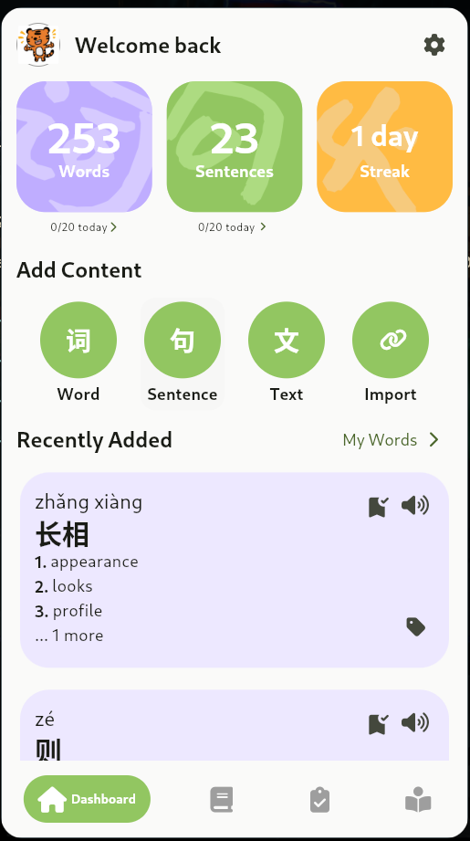
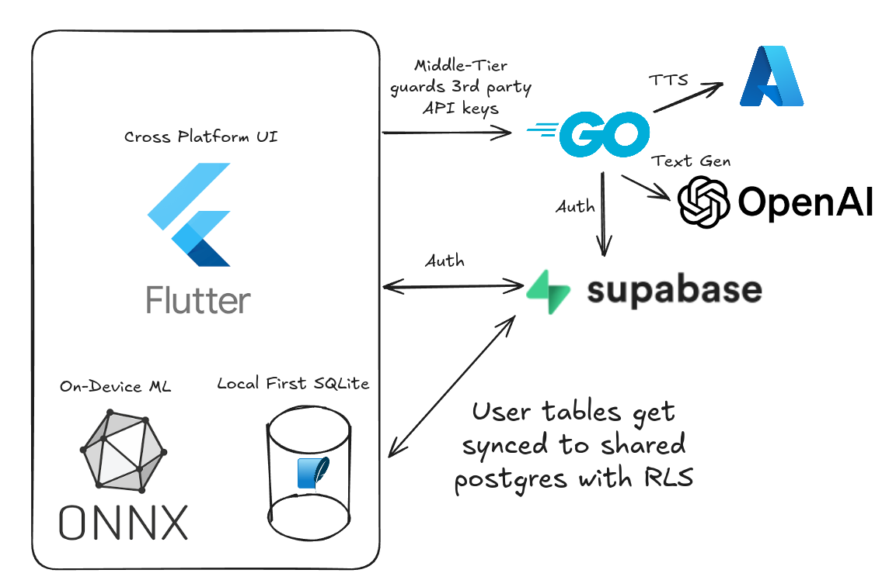
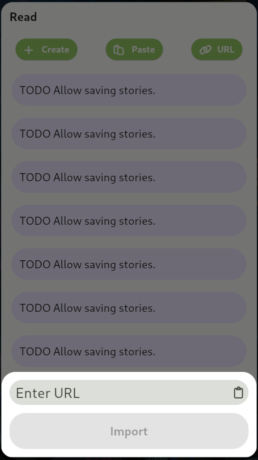
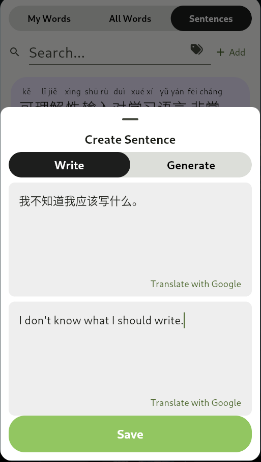
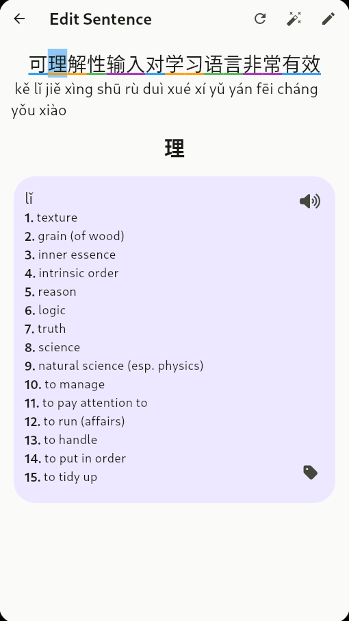
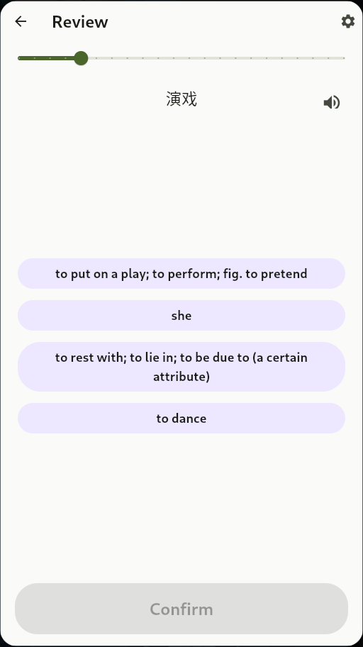
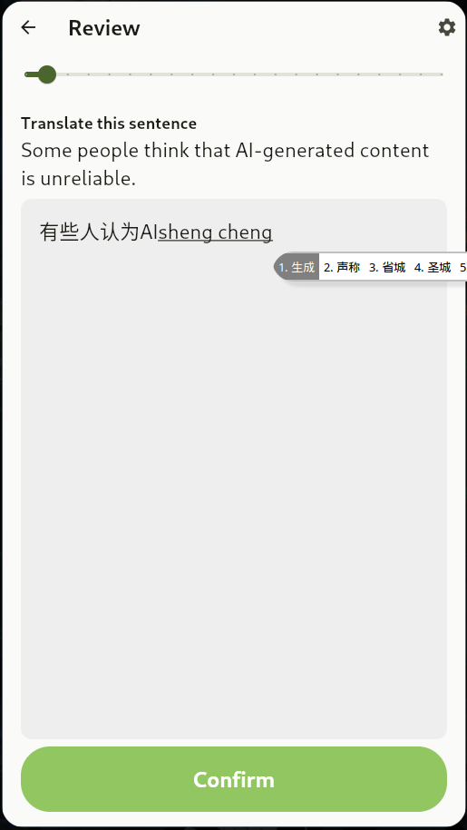
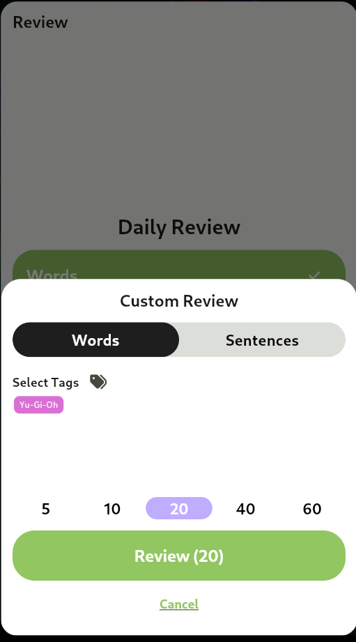
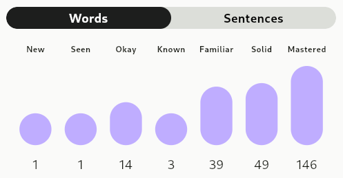

I've been studying Mandarin Chinese for a few years, starting with basic
phrases (Pimsleur) and then moving on to [Hello Chinese](https://www.hellochinese.cc/). This app was
excellent for the basics, offering (quality!) gamified lessons and a content of library
with a slick reading interface where you could tap unknown words for
translation and audio.

After completing all the structured lessons, I focused on reading. When I saved
new words, they went into a separate review system: **flashcards**. I found
this system, particularly the self-grading aspect, less engaging than the
original lessons and their multiple-choice based review system.

More critically, the flashcard system lacked the **typed-response grammar
review**—where I had to translate an English sentence into Chinese. I believe
this **output practice** was essential for building muscle memory in sentence
structure (and typing on a pinyin keyboard). Losing these features was the main
reason I stopped using the app's review system.

## Focusing on Comprehensible Input

After this I shifted my focus to **Comprehensible Input (CI)**: audio, text,
or video that I could mostly, but not entirely, understand. CI is often touted as the
"natural way babies learn languages," but I don't see how I could have started with it.
Alongside consuming content, progress slowed without **output**, **review** and a bit of
other structured learning. Just getting to the point where I could understand content beyond
beginner level was incredibly gratifying. I can still remember the feeling of "Holy shit I understand exactly what he
said!" the second time I tried listening to [Tea Time Chinese
(茶歇中文)](https://teatimechinese.com/).

My favorite CI resources for Chinese are:

* [Tea Time Chinese (茶歇中文)](https://teatimechinese.com/).
* [Lazy Chinese](https://www.lazychinese.com/)
* [Hello Chinese (Graded readers)](https://www.hellochinese.cc/)
* [DuChinese](https://duchinese.net/)

## Tutoring

Outside of self-study, I've tried some tutoring services. I found that I prefer
unstructured conversation practice (using [italki](https://www.italki.com/))
over more formal classes with vocab lists and exercises. Once I found a good fit
with one teacher on italki, it felt like talking with a friend. We stick to 99.99%
Chinese and he does a great job of teaching me new Chinese words using only Chinese.

## Intermediate Plataue

Even with all of these tools, I really felt that intermediate plataue. Progress was
fast and things were smooth when I was tearing through the main course on HelloChinese.
I wanted a similar experience, but with the freedom to learn about topics that I wanted,

# The app (so far)

Flashcard apps like Anki are missing something, and I personally find the card creation process
to be a bit of a chore. Apps like DuChinese are great, but sometimes I want to read something that isn't
in their library. The goal is to build an e-reader with an SRS, so I could easily review
stuff I encounter in content and in real life.


    
    


So far I have:

* A dictionary interface built on top of the open-source **[CC-CEDICT](https://www.mdbg.net/chinese/dictionary?page=cedict)**.
* A custom **SRS** for both words and full sentences, complete with stats and a streak tracker.
* A **Reader** interface that provides the familiar tap-to-lookup experience found in apps like DuChinese and Hello Chinese.
* Integrated **Text-to-Speech (TTS)** throughout the app.

And I planned to add:

* A library of Comprehensible Input content to feed into the reader
* Camera based OCR to look up words you encounter IRL
* Component/radical search for the dictionary
* A floating widget that displays over other apps to look up words
  the way you would in my reader mode.

## Local First



As much logic as possible lives in the Flutter/dart codebase. SQLite stores the dictionary
and the user's data locally, mirrored to Postgres (Supabase) using a custom sync engine for
specifc tables.

Supabase offers other benefits like auth and object storage, and convienently
provides a Flutter SDK. Postgres is a great fit because it allows modeling the local
and server side schemas nearly 1:1, and RLS (row level security) lets me avoid writing
my own middle layer for all database access.

For translations, Google provides an offline SDK for on-device use. It's honestly
pretty bad, but combined with word-by-word lookups and a bit of skepticism you can
usually tell if it's misleading you or not. It's better than nothing when there is no
internet connection.

Identifying which word a user tapped on is actually pretty complex in Chinese.
There are no spaces or other word separators, and some characters have multiple
meanings and pronunciations. This process needs to be fast, and cannot rely on
having an internet connection. So I got custom word segmentation and pinyin
prediction model running entirely on-device. More on that later.

## Text-to-Speech

Language learning is an audio-visual process. In Chinese, where the written
characters are not directly tied to pronunciation, hearing is just as important
as reading.

Getting accurate output from TTS services is challenging because of
**polyphones**: a single character may be pronounced differently based on
context (e.g., in "他们在那里带了很长时间。", is 长 pronounced *cháng* or
*zhǎng*?). Some text to speech services get it right most of the time, but
they rely on context from the surrounding text. In a dictionary lookup for a
single word, there is no context to draw from.

The only service I found that support providing pinyin was **Azure's TTS**,
which accepts `phoneme` element. Hopefully providers like ElevenLabs,
or even better: on-device TTS engines, will support this in the future.


## Reader






Arguably the most critical tool besides the SRS, is the reader. This is still
quite a work in progress. Currently you can import content from:

* Arbitrary clipboard text
* Webpage URLs, with a best-effort to identify where the primary content is on a
  webpage. (There's special handling for the transcripts on
  https://teatimechinese.com!)
* YouTube captions (assuming the given video provides Chinese language captions).

I'd like to see this evolve to support more content sources, and ideally a curated
library of content that users can read from directly in the app. Possibily even allow
user generated content or allow teachers/authors to publish their own content and earn
revenue from it.

## Automated dictionary mappings

The most complex piece in the reader is "tap-to-lookup" because of the ambiguity in
pronunciation, meaning and word boundaries in Chinese text. Let's look at a few examples:

### Example 1: 把面拉成长条

Take this sentence about making noodles:

> **把面拉成长条。**<br/>
> bǎ miàn lā chéng cháng tiáo.<br/>
> _Pull the dough into long strips._


**Word Segmentation**

Where do we break up the words? There are two possible segmentations here:

1. **Correct Segmentation:** `把 | 面 | 拉 | [成] | 长条` ("Pull the dough **[into]** long strips").
2. **Incorrect Segmentation:** `把 | 面 | 拉 | [成长]| 条` ("Pull the dough **[grow up]** strip").

The easiest algorithm to implement is greedily matching the longest possible
string that exists in the dictionary, but that leads to the incorrect segmentation above.

**Pronunciation ambiguity (polyphones)**

Even with the correct segmentation where 成 and 长 are separated, there are
still multiple possible pronunciations for 长, each with different meanings:

1. 长 (cháng) - long (adjective)
2. 长 (zhǎng) - to grow (verb)

The correct pronunciation in this case is (cháng), but without context, it's impossible
to know which dictinaroy entry to show.

### Example 2: 的,话 vs 的话

> 如果你喜欢周杰伦的话，你应该听妈妈的话。<br/>
> rúguǒ nǐ xǐhuān Zhōu Jiélún dehuà, nǐ yīnggāi tīng māma de huà<br/>
> _If you like Jay Chou, you should listen to what your mother says._

In this case, 的话 has two possible meanings:

1. 的话 - a conditional particle meaning "if the previous statement is true, then..."
2. 的 - posessive particle; 话 - words (in this case, "what your mother says")

The correct one in this case is the first one, but again, without context it's
impossible to know which dictionary entry to show. Again, greedy matching would fail
on one of these cases but not both!

### Context Aware Models

While yes, the above could be solved by presenting the user with all
possible interpretations and letting them pick, that is a poor user experience.
Best case scneario, we added friction to the lookup process. Worst case scenario,
the user gets confused and gives up. Actually, the worst case scenario is that
the user picks the wrong meaning and gets stuck with that misunderstanding.

Perhaps over time, a static mapping of common phrases that should take priority
could be built up. I don't have such a dataset, and even then edge cases
wouldn't be covered. []() is one of the best libraries available for this task, but
it doesn't get our test cases correct:

```
>>> # this should be 'bǎ miàn lā chéng cháng tiáo'
>>> p.pinyin('把面拉成长条')
'bǎ miànlā chéngzhǎng tiáo'
>>> # segmentation should be different for each 的话
>>> p.pinyin('如果你喜欢周杰伦的话，你应该听妈妈的话')
'rúguǒ nǐ xǐhuan zhōujiélún dehuà ， nǐ yīnggāi tīng māma dehuà'
```

Offline first is one of our core requirements, so an LLM
is out. We need an SLM: small language model.

### Word Segmentation Model

To do this, I introduced a word segmentation model, from
[ckiplab/ckip-transformers](https://github.com/ckiplab/ckip-transformers/tree/master).
This model does a _decent_, but not perfect job at segmenting things. I ended up having
to hand-tune the output with some threshold. In the future I'll probably train my own model.
I need to research how they trained it and what dataset they used, and probably generate
data that cover more of these ambiguious cases.

```dart
// each token gets a score on whether it should be part of
// the same word as the preceding token
final bScore = tokenScores[i][0];
final iScore = tokenScores[i][1];

// do some funny math to figure out _how_ confident the model is
// this makes the numbers a bit more interpretable for tuning threshold
final pB = exp(bScore / temperature) /
    (exp(bScore / temperature) + exp(iScore / temperature));
final pI = exp(iScore / temperature) /
    (exp(bScore / temperature) + exp(iScore / temperature));
final absDiff = (pB - pI).abs();

// only include it if we're above `threshold` difference
// in confidences for or against inclusion
if (bScore > iScore && absDiff > THRESHOLD) {
  if (current.isNotEmpty) {
    tokens.add(current);
  }
  current = sentence[i - 1];
} else {
  current += sentence[i - 1];
}
```

### Pinyin Prediction Model

As we pointed out above, segmentation alone is not enough. There are plenty of
cases where segmentation does not resolve the ambiguity (and also times where
the model is just wrong).

The next most coarse level of disambiguation is pinyin prediction. Given the
segmented text with pinyin, we can pick a more accurate entry from the
dictionary.

Building on top of the
[ckiplab/ckip-transformers](https://github.com/ckiplab/ckip-transformers/tree/master)
ALBERT models, I trained them on a token classification task to predict the
pinyin for each character in a sentence. My fuzzy estimation for the number of
classes is 2086 based on permuatations of initials, finals and tones. Then
adding a few special cases like `r` for erhua, spaces, and special tokens like
`[CLS]` and `[SEP]`. This might be an overestimate, but I'd rather have excess
classes than be missing some.

It took some trial an error to get the training process and hyper parameters right.

> Input: `我 不 知 道 这 是 不 是 爱 。`
>
> Expected Output (Pinyin): `wǒ bù zhī dào zhè shì bù shì ài`<br/>
> Predicted Output (Pinyin): `wǒ bù zhī dào zhè shì bù shì ài`

But finally, I think the finally understands what 爱 (love) is.

Looking at per-character accuracy is a bit misleading. Although it's **99.62%**,
this errors I'm trying to resolve are rare, so we can expect a simple mapping to
succeed most of the time. Looking at sentence-level accuracy (i.e., all characters in the
sentence must be correct), we get **96.91%** accuracy on the test set. Not as good, but
far better than some of the other options out there. Still, there is room for improvement.



For training data, I found [krmanik/Chinese-Example-Sentences
](https://github.com/krmanik/Chinese-Example-Sentences) which is generated from
[Tatoeba](https://tatoeba.org/zh-cn/downloads) but uses
[pinyin-jyutping](https://github.com/Vocab-Apps/pinyin-jyutping) so the data
isn't reliable. I cleaned up some of the ambigiuous cases manually but this is
almost definitely the source of innacuracy in the model.


In the future I'll do something similar, sourcing data from Tatoeba, and using
the `pinyin-jyutping` library. Instead of `pinyin()`, we can call
`pinyin_all_solutions()` to bulid a batch dataset to send to an LLM for
auditing. In addition to Tatoeba, an LLM may be able to generate sentences specifically
for ambigious cases.




Using a combination of both models, and biasing towards longer words found in the
dictionary, we can generate fairly accurate dictionary mappings for entire sentences.
The best part is that it runs in milliseconds on even a low end Android Go device, and requires
less than 50MB of disk space for both models combined.


### SRS





The SRS itself is a pretty basic [Leitner
system](https://en.wikipedia.org/wiki/Leitner_system). There's actually very
little interesting technical stuff going on here. The interface on top of it is
what I find more useful than others' systems; but it's still very, very simple.


  
  
  


I can add Words by pressing a single button from either the dictionary or the
reader. Sentences can be added manually, or generated with a call to an LLM.


  
  


Multiple choice gives a more engaging review experience than simple flashcards,
with direct, red, loud "you are wrong" feedback. The technical challenge here
is generating distractors. For now, I'm doing a basic KNN search on some small
100d word embeddings, and taking the closest words as distractors, discarding
the 10 closest to avoid synonyms. I also sometimes show other words the user
added. There is a lot of room for improvment here to keep things challenging
but fair.


  
  


Seeing words in context is also incredibly important, so when we have
sentences that use a word, fill-in-the-blank questions are generated.

Saved sentences are fed directly into the sentence review. This activity
is more time consuming than the multiple-choice word review, but output
shouldn't be ignored as part of a review habit.


  
  


Any reviewable item also can be given custom tags. The use-case I had in mind
was preparing for specific events. I play the Yu-Gi-Oh TCG, and I think it
would be fun to one day play in a competition overseas, speaking my target
language. You can kick off a review session for just the words and sentences
with your custom tag(s) at any time.

## What's next?


  


The main idea of the app is "bring your own content". I've been dogfooding
it for a little while now, and it has definitely sped up my vocab acquisition.
There is a lot of polish yet to be done. Scalabilty checks, testing on other devices,
and just a couple more features:

* A screen reader to get the tap-to-lookup experience in any app.
* Curated content library. Maybe even daily/weekly releases of short readers,
  like [Maayot](https://www.maayot.com/).
* Reccomendation algorithms to suggest new words or stories based on what you already know.
* Improvments to the Pinyin model and more testing for Traditional Chinese (繁体字).
* Better distractor generation for the SRS, and more question types like matching games.
* Integrate a higher quality dictionary. CEDIT is pretty good, but I at least need
  to have the option to hide "Potentially innapropriate words". For example,
  reading about [a duck (鸭) shouldn't show a slang definition "male prostitute" by
  default.
  ](https://www.mdbg.net/chinese/dictionary?page=worddict&email=&wdrst=0&wdqb=%E9%B8%AD)

I'm not sure when it will be done. I'll continue to iterate. It's a slow going
process and I just have the nights and weekends that I'm not doing other
hobbies and work. Hopefully I can make this project a priority in the near future.
