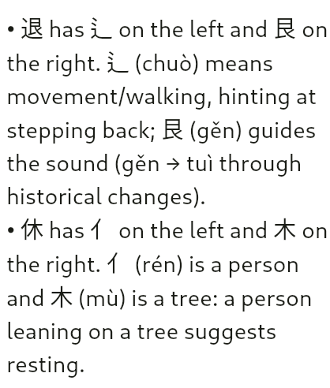
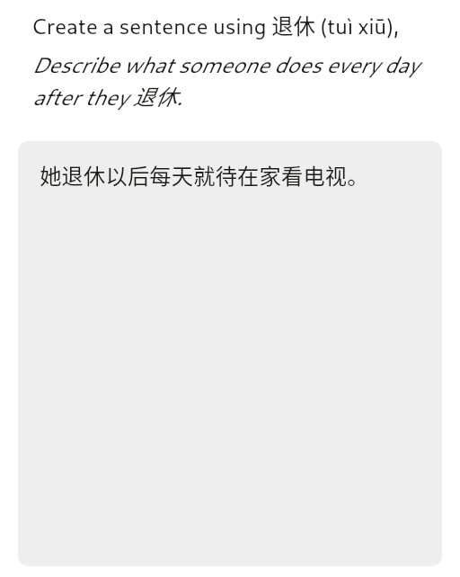
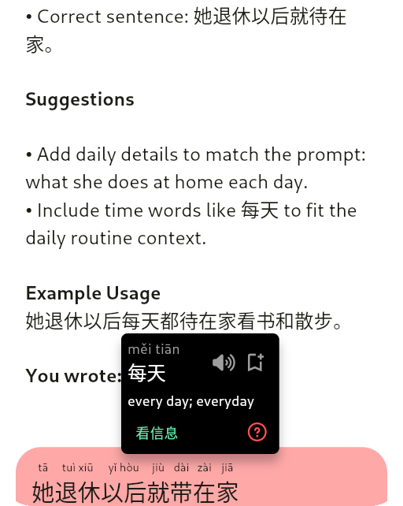
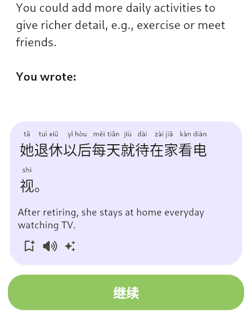
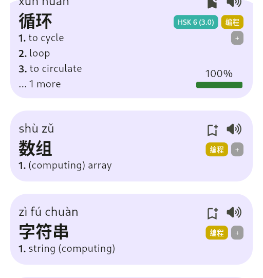
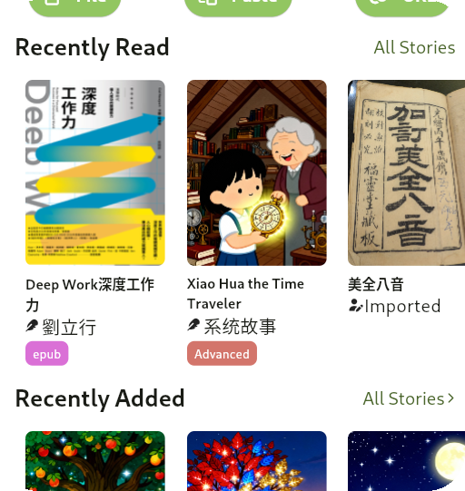
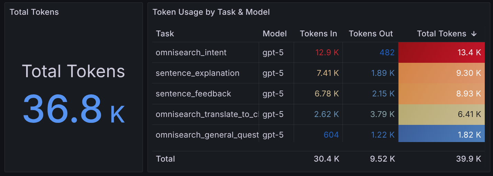

It's been a while! My [last post](/posts/chinese_app_og/) was about
this app, about a year ago after a couple months of work. I did not
expect this to be a long-term project.

Studying Mandarin became one of my main hobbies. Using my own app to study was
cool, but it had lots of issues so I kept chipping away at it over nights and
weekends. At this point I use it daily. After showing my in-laws (who are
Malaysian Chinese, and native speakers), they showed enormous support and ended
up motivating me to polish it for release as a proper app.


If you're reading this post after December 2025, the app is (hopefully) available.
See [https://bookchoy.app](https://bookchoy.app) for download links and more information!


### Another use-case

It turns out the reading feature would actually have utility to my native
speaker in-laws . Malaysia is an intersting place linguistically, in one
sentence you might hear English, Malay, Mandarin, and other Chinese dialects
all mixed together. There are a lot of differences in word choice compared to
what you might hear in China. Some people, especially the younger generation,
might speak fluently and can read most of what they'd encounter on a daily
basis, but when speaking to China-chinese colleagues or friends, they might run
into words they don't know. My in laws in particular had some books they picked
up in Taiwan and they'd encounter words they didn't quite know, or traditional
versions of characters they didn't recognize. I built the app for advanced
beginners/intermediate learners, but it turns out it can be useful for native
speakers and advanced learners too!

## More LLM stuff

### Omnisearch

I'm definitely not bought in on the whole "LLMs will solve everything" hype, but
language learning, and translation are both pretty fuzzy tasks. For example:

> I missed you.

This could mean a few things in English:

1. I missed the chance to see you. (我错过了你。)
2. I long for you. (我想你。)
3. I tried to hit you (in a game or something) but failed. (我没打中你。)

LLMs are a pretty good tool to provide multiple options with context and
explanations when the user doesn't want to write a full prompt, or allow the
user to provide context.

Translation is one of many usecases for the app. I wanted to easily look up
anything from the home screen of the app, so I built an "omni-search" bar that
is partially powered by AI.


Based on the input, I can infer whether I just want to search words, sentences
and stories (in-app content), or perform a more complex task that requires AI.

The supported AI tasks are currently:
* Translate (English <-> Chinese)
* Word Overviews
* Related word lookup (synonyms, antonyms, or easily confused words)
* Generate example sentences
* General Q&A as a catch-all for things like "when should I use 了 vs 过?"

Most of these tasks are used elsewhere in the app, with an easy way to get to
them from the omni-search bar as soon as you open the app. In the future this
may open a chat-like interface, but I'm not trying to build a ChatGPT wrapper
just yet.

The AI generated responses re-use the reader, so you can tap words, and
sentences to save them or explain them. This is everywhere in the app.

I'm not simpliy throwing things over the wall to an LLM provider. There is a multi-step
process that involves classifying user intent, fine-tuned task-specific prompts, picking
an appropriate model, and most importantly: RAG. Between the dictionary and some other
useful corpora, I have a lot of relevant information to provide context to the LLM.

### Character breakdowns

One cool feature that AI helps with is breaking down words character-by-character,
and breaking down characters into their components. I realized that because I pretty
much only type Chinese using pinyin input, I don't recognize some characters unless
I see them in a familiar context, or I confuse similar-looking characters.


    
    



Taking a moment to look at each piece of a word helps me remember it better.
It's probably not a bad idea to try to write it once or twice on paper, but
this is rarely convienent when learning a word when I'm out and about. If
you're lucky, a nice pneumonic like "休 has a person 人 leaning on a tree 木,
suggestint resting."

One improvement I'd like to make here, is always including info from the
traditional versions of characters, as some semantic information might be lost
in the simplification.

Again, we can't just rely on the LLM here. I have a tree-based decomposition
dataset that I use to make sure the LLM doesn't guess, as it will almost always
guess incorrectly.

### Writing Exercicses (造句)

Output is important. In the last post I had already built a review system where
you memorize phrases or sentences, but this isn't a super creative exerciese. Now,
when learning new words, you can write a response to a prompt using the new word and
get feedback on whether your word choice makes sense, grammar is correct and suggestions
on improving your overall expressiveness so you don't sound like a robot.


    
    
    


Then, you can save what you wrote for review later.

## Lots of small stuff too

Besides all the AI stuff, I've added a ton of new small features. Few
highlights include:

**Word Lists**

Pre-built lists of words for specific topics (e.g. business, travel, HSK levels)
that you can directly review or add to your own list in bulk. This also includes
a system for me to easily push new entries to the dictionray without app updates,
so that word lists can include jargon that might not be in a standard dictionary.


    
    



**Re-trained Word Mapping Model**

It turned out there was a lot wrong with the data I was using to train the
pinyin model. The dataset I used was a large corpus of Chinese sentences
from the web, and I didn't realize it was parsed using [python-pinyin-jyutping-sentence](https://github.com/Vocab-Apps/python-pinyin-jyutping-sentence).
I was essentially training on the output of a mostly rules-based system and
learning its innacuracies.

I took that same corpus combined with candidate mappings from a dictionary and
ran it through an LLM (gpt-5-mini and gemini-3 preview). The LLM did a much
better job of word segmentation, and selecting the correct pinyin for each word
in context. The library failed on very common cases, both on tones and
pronunciations:

```
'地' (114x): llm='de' vs lib='dì' (112x) +2 more patterns
'都' (66x): llm='dōu' vs lib='dū' (64x) +2 more patterns
'来' (48x): llm='lai' vs lib='lái' (35x) +10 more patterns
'还' (47x): llm='hái' vs lib='huán' (44x) +3 more patterns
'个' (46x): llm='ge' vs lib='gè' (41x) +5 more patterns
'得' (44x): llm='de' vs lib='dé' (44x)
'的' (43x): llm='de' vs lib='yī' (4x) +34 more patterns
'奶' (43x): llm='nai' vs lib='nǎi' (40x) +3 more patterns
'更' (39x): llm='gèng' vs lib='gēng' (34x) +5 more patterns
'什' (36x): llm='shén' vs lib='shí' (36x)
```


I'm much more confident on the new model which is trained on more data, and
cleaner data.


| Model                                 | Seq Acc | Token Acc | Seq (no tone) | Token (no tone) | Polyphone |
|---------------------------------------|---------|-----------|---------------|-----------------|-----------|
| pinyin_jyutping_sentence (baseline)   | 5.36%   | 96.55%    | 42.91%        | 98.20%          | 91.74%    |
| Albert-Base Old Dataset               | 0.64%   | 95.61%    | 43.91%        | 99.15%          | 93.77%    |
| Albert-Base New Dataset (attempt 1)   | 28.21%  | 98.67%    | 58.33%        | 99.40%          | 98.13%    |
| Albert-Base New Dataset (attempt 2)   | 39.42%  | 98.99%    | 70.19%        | 99.59%          | 98.54%    |


> Attempt 1: Overcomplicatd pipeline with spcecial loss to try to emphasize
> polyphones.
>
> Attempt 2: Simpler pipeline, fine tuning step just focuses on
> confusion set from main training step. Also I remembered to turn on gradient
> clipping!

It's helpful to look at the accuracy ignoring tones in order to get an idea of
whether it's getting the overall syllable or tone wrong. The "sequence"
accuracy is whether any word in a 128 token sequence (batches of sentences) is
wrong, so it's much naturally much lower.

I also realized [ckip-transformers]() has a GPL license. Although I may open
source eventually, but not just throw my amalgm of LLM generated helper scripts
and hacks on GitHub. For now, I've switched to
[UER-py](https://github.com/dbiir/UER-py/). The
`uer/albert-base-chinese-cluecorpussmall` has the exact same architecture and
vocab as the CKIP model, so it was a drop-in replacement.


**Optimized data sync**

I've evolved my generic SQLite -> Supabase sync engine to be more efficient,
using some version numbers, push timestamps and high-water marks to avoid
querying or sending excess data. It also supports conditional hard deletes,
and customizable merging strategies! Latency on this is way down.

**Embedded Video Player**


    


For Videos that have subtitles, an embedded video player
syncs the reader interface with the video playback. You can look up
words while watching, and use the transcript to scrub.

**Import epub files**

The reader can now import epub files. Currenlty this works by converting
them into Markdown, but in the future this will be extended to preserve
the original formatting.


    


Also, the library UI received a facelift!

## Productionization

I'm very used to working with Kubernetes, but that's definitely overkill for
this project that consists of a single backend Go service and a Flutter
front-end.

Unfortunately, my experience with Cloud Run, ECS, and Azure Container Apps have
been less than stellar. There is too much boilerplate, and I don't like the
idea of being tied to the cloud provider's ecosystem for observability and
everything else.

[Fly.io](https://fly.io) is pretty awesome. Declariative configuration,
command-line driven deployment, and still using Docker images makes it very
easy to deploy the app itself. The best part is that they provide built-in
Prometheus and Grafana. All I had to do is instrument my app and put the
metrics port in the app's config file. They handle TLS certs, load balancing,
and basic ingress. Add-ons like Redis and Postgres are there when I need them.


### Rate limiting

[Agentgateway](https://agentgateway.dev/) is a very cool open-source project
that my amazing colleague [John Howard](https://blog.howardjohn.info/)
bootstrapped. For me it solves two problems:

* Ingress: Basic controls on who can access certain routes, global rate-limiting per-user, and authentication.
* [LLM Consumption](https://agentgateway.dev/docs/llm/about/): cost control, (token aware!) rate limiting, per-user rate limiting.

Deploying this on Fly.io was super easy, along with the Envoy rate limiting
server pointing to a managed Redis instance.

### Observability

In my actual job, I build networking software (Istio, Gloo Mesh) that customers
deploy themselves. I haven't been directly responsible for an individual live
service in a few years, although I build a product that helps people operate
live services.

One of the main use cases for that software is observability. Golden metrics
(latency, errors, requests) aren't enough when you're paying per token. LLM
usage is unpredictable. Different queries use wildly different token counts,
and agentic loops can result in a non-deterministic number calls from a single
user action. Tracking what types of queries happen, how fast they are, and how
many tokens they burn is critical for both costs and user experience.

Using a combination of Fly.io's managed Prometheus/Grafana and Agentgateway's
LLM-specific metrics, I have a pretty good picture of how the system is behaving.



Currently I'm tracking things like:
* Latency per LLM call, and latency per task type
* Requests per task
* Tokens per task
* Total tokens by task

## What's next?

Over the next few weeks, I will be going through the release process for Google
Play. When Google approves the app for release, I'll initially do a soft launch
to get feedback from real users. After that, an iOS release will follow. It's
so hard to stop adding features, tweaking the UI and fixing little bugs, but I
need to get this in other people's hands and stop developing in a vaccum.

Realistically, this probably won't be available until after the winter holidays
when I'll have more free time to focus on this outside of nights and weekends.

### Bigger Plans

If I gain traction, I have some bigger plans for the app. I realy do believe
in human tutors. I know there is an AI craze right now, and a lot of "talk to a robot"
language apps, but my personal view is that AI is a tool to augment what people can do,
not replace them.

While obviously I'm not a Chinese teacher, my Chinese is very very basic, with the
help of people actually qualified to teach, the app could become a platform to
allow tutors to create lessons, quizzes, assign reading and connect with students.

Another idea is a "journaling" feature where you can get either AI or human feedback
on your writing.

I am already working on finding partners to help me with sourcing reading
content for the app, as even though you can import your own content, having a
library of graded readers and stories would be a huge plus. Maybe something
like [Maayot](https://www.maayot.com/) that provides very short, level
appropriate, daily reading passage with some discussion questions.

There are so many possibilities. For now, I feel what I've bulit is a core platform
that I can build on top of.

### Browser Extension

After the initial Android release, I actually plan on building a browser extension
before focusing on iOS. I want the same experience for looking up words and explaining
sentences to be available when browsing the web.

Not only on web pages, but videos, TVs and movies too. In an hour of
vibe-coding, I got a prototype working that brings the same experience to the
subtitles on iQiyi. I'm confident I can get that working on Netflix, YouTube,
and other popular platforms. This seems like table stakes looking at apps like
Migaku and LanguageReactor.


### Download it now

If you're reading this post after December 2025, the app is (hopefully) available.
See [https://bookchoy.app](https://bookchoy.app) for download links and more information!
