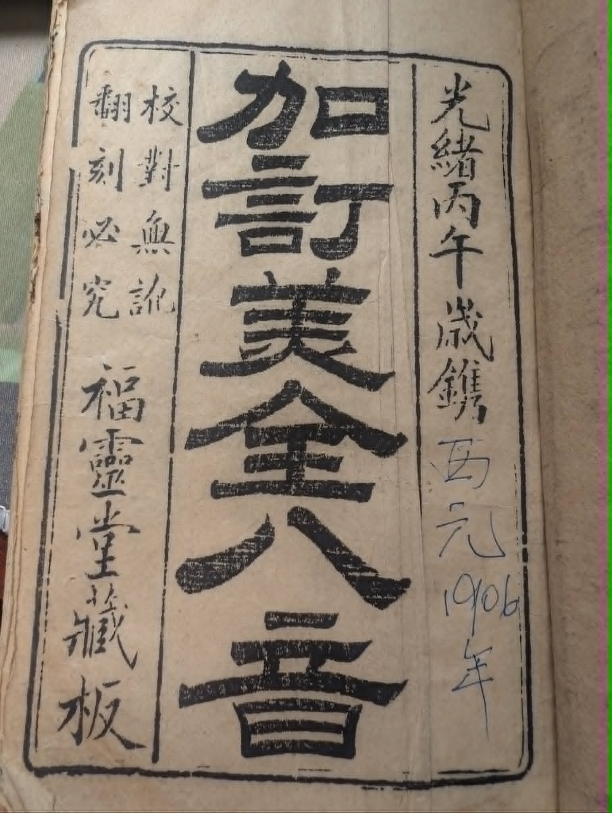
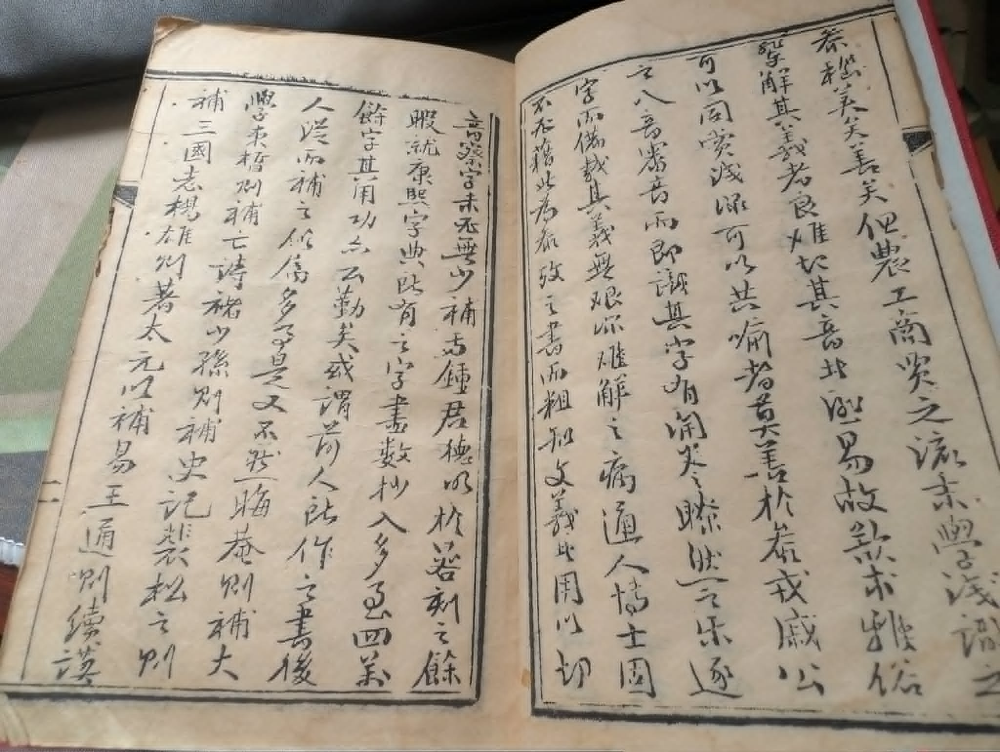
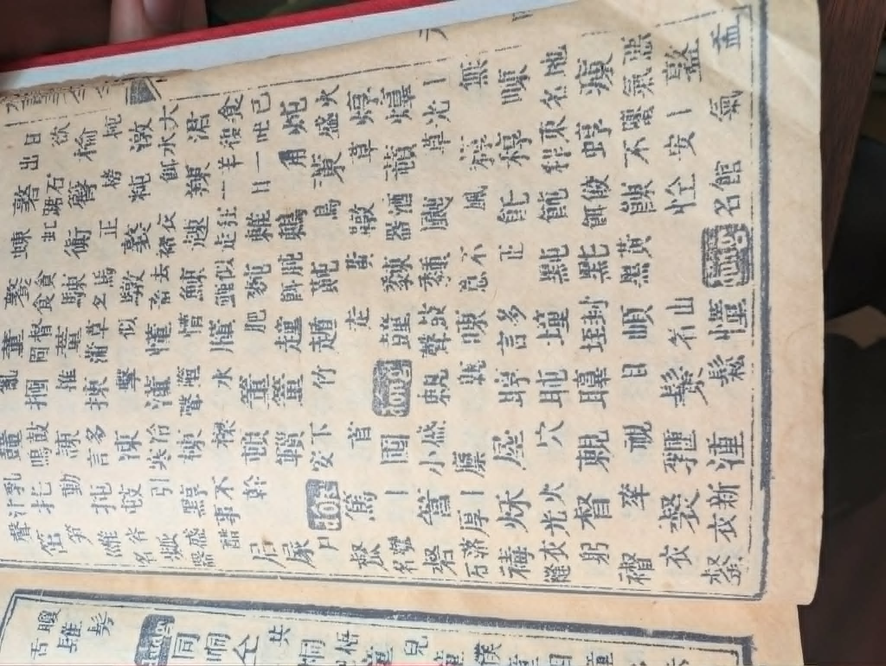

第一次跟我老婆去马来西亚的时候，我一直要等她
帮我翻译。除了她的公公，外公，外婆之外，大家都说英语。
就是有时比较方便讲中文。回来美国我决定学习华语了。现在
我觉得我的中文不错，已经到中级了。前次回去马来西亚，
虽然他们讲中文大我概都明白，但是有时候他们还讲另一个
语言:**福州话**。

在网上我也找了一个会福州话的老师。上了几次课了，
我很快发现她的福州话不一样！我老婆告诉我，他们的
福州话和中国的，甚至马来西亚其他地方的，都不一样。
他们可能会用不一样的声调，不一样的词汇，等等。那个
中国福州的老师教我他们的福州话已经被普通话影响了。

上次回去古晋，她外公外婆给我一本书：美全八音。这是一本
福州话的字典。我根本不知道怎么用。首先，它用的是繁体字。
其次，它写的语法很奇怪。好像不是普通话来的，或者是古代的语法。

我仔细地用人工智能和OCR来翻译。原来，这就是一本“韵书”。
前面有一个曲子，可是书法很难看懂。

> 找到了一个人翻译了这个曲子！ https://zhuanlan.zhihu.com/p/96448334

然后说明一下怎么用。

> 三十六字母

用36个字来表达福州话的语音。有一个小曲子来记住：

> 春花香，秋山開，嘉賓歡歌須金杯，
> 孤燈光輝燒銀缸，
> 之東郊，過西橋，雞聲催初天，
> 奇梅歪遮溝。

接下来，他们解释那36个字有15个字头（initial sound)：

> 每字母分出十五字頭

| #  | Initial | Roman letter (per book) | Exemplar (per book)            |
|----|---------|-------------------------|--------------------------------|
| 1  | 柳      | l                       | 巃                             |
| 2  | 邊      | —                       | 枋 (???)                       |
| 3  | 求      | g                       | 公                             |
| 4  | 氣      | k                       | 空                             |
| 5  | 低      | d                       | 東                             |
| 6  | 波      | p                       | 蜂                             |
| 7  | 他      | —                       | 通                             |
| 8  | 曾      | —                       | 宗                             |
| 9  | 日      | —                       | 齈 (???)                       |
| 10 | 時      | —                       | 嵩                             |
| 11 | 鶯      | —                       | 溫                             |
| 12 | 蒙      | —                       | 儍/傻 (???)                    |
| 13 | 語      | —                       | ngǔng (romanized, rising tone) |
| 14 | 出      | —                       | 春                             |
| 15 | 喜      | —                       | 風                             |

然后，有7个声调：

> 每字頭呼出七音

| # | Character (book) | Tone |
|---|------------------|------|
| 1 | 風               | 上平 |
| 2 | 粉               | 上上 |
| 3 | 訓               | 去上 |
| 4 | 拂               | 入上 |
| 5 | 雲               | 平下 |
| 6 | 鳳               | 去下 |
| 7 | 佛               | 入下 |

最后，直接解释一下怎么找词典里面的字：

> 取字之法，須要調七音之第一音，即上平字，自然順口；音流出七音之別。
> 假如欲取佛字，先調風字最順；風字順口，音調出七音：
> 風、粉、訓、拂、雲、佛、鳳是也。不論何字，以此類推。

就是说，从“上平”这个声调开始，然后用那个小曲子和36个字母来找到你想找的字具体的地点。
到这里我发现，你需要已经说福州话了，才能用这本字典。

虽然这本书很有趣，但我没办法使用它来学习福州话。
可能我有一天去找个地方把它变成电子书，然后写程序
反过来它的系统：用字来找声音。

可是我觉得最棒的学法就是去外婆家！
