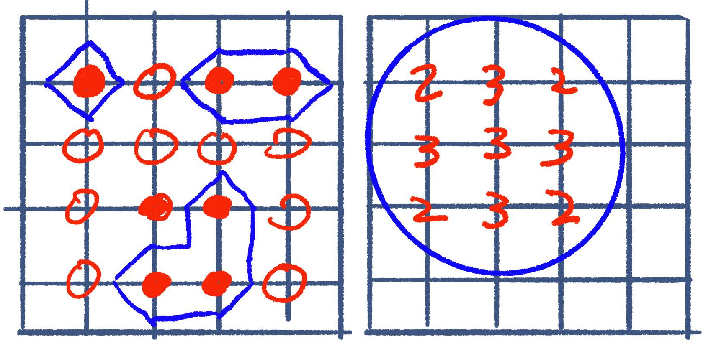
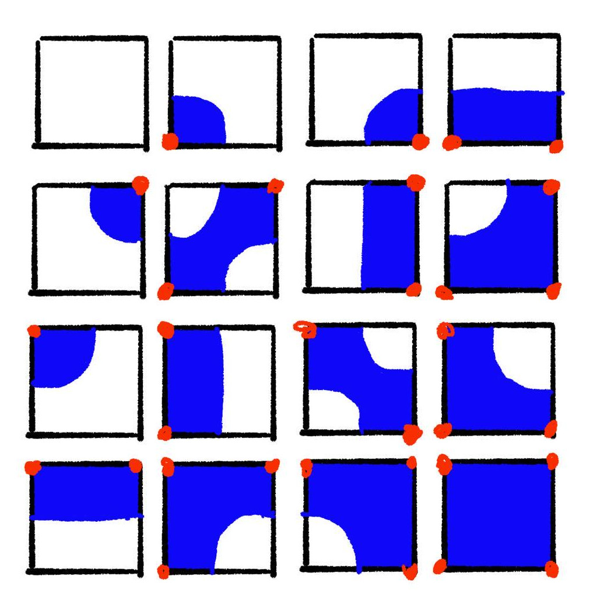
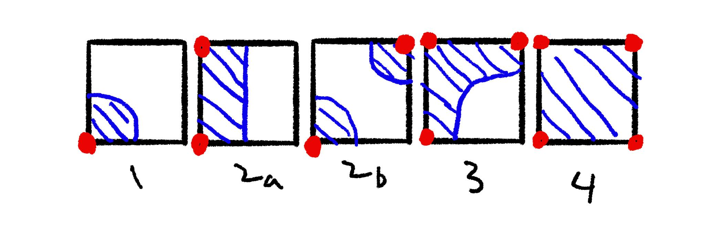

+++
title = "2D Autotiling with Simplified Marching Squares"
weight = 1
+++

<video src="demo.webm" autoplay muted loop></video>

## Motivation

Although this is the first post in the series, I'm writing this code last. I
haven't written the 2D part before, but it's useful for understanding how the 3D
version works. There are lots of [better choices for 2D
autotiling](https://www.boristhebrave.com/2021/09/12/beyond-basic-autotiling/).
This tutorial is a baby step towards what I  truly want to show.

## Marching Squares Overview

[Marching Squares](https://en.wikipedia.org/wiki/Marching_squares) and it's 3D
cousin [Marching Cubes](https://en.wikipedia.org/wiki/Marching_cubes) are both
algorithms for converting an array of scalar values into a shape or mesh. These
algorithms are pretty robust and with high enough resolution and smart
interpolation, they will produce a very nice output.

Both algorithms operate on a dual grid. You can think of this as having a
secondary grid offset by half a cell. I prefer to imagine the cells as
containing data and the corners of the cells containing separate but related
data. In this case, the corners of the grid represent the "density" information.
That could be a '0` meaning "empty," or a `1` indicating "filled." If we want a
smoothed result, we could use an arbitrary scalar value telling us _how_ full it
is.



The goal here is 2D auto-tiling, not generating a smooth mesh. So we can treat
the corners as either filled or empty. We have four corners per cell with two
possibilities. That's 2⁴ (16) total combinations.



Depending on the art style, you may not need unique tiles for the same shape in
different directions. If we remove cases that are mirrors or rotations of
others, we only have five things to draw. Notice that in that `2b`, the diagonal
case can either be a gap or a bridge. In marching squares, this is called a
saddle point. We're just going to make that an artistic/gameplay choice here.



## Implementation

For this tutorial, I'm going to use Godot with GDScript. Feel free to follow
along with whatever you're comfortable with.

### Lookup Table

We can think of each corner as one bit of a 4-bit integer. Starting in the top
left, moving in clockwise order, we will set the least significant bit for each
"filled" corner.

```gdscript
var lookup = {
	# empty
	0: {"tile": 0, "rotation": 0}, 

	# corner 
	1: {"tile": 1, "rotation": 0},
	8: {"tile": 1, "rotation": 1},
	4: {"tile": 1, "rotation": 2},
	2: {"tile": 1, "rotation": 3},

	# edge 
	3: {"tile": 2, "rotation": 0},
	6: {"tile": 2, "rotation": 3},
	9: {"tile": 2, "rotation": 1},
	12: {"tile": 2, "rotation": 2},

	# diagonal 
	5: {"tile": 3, "rotation": 0},
	10: {"tile": 3, "rotation": 1},

	# bend
	7: {"tile": 4, "rotation": 0},
	11: {"tile": 4, "rotation": 1},
	13: {"tile": 4, "rotation": 2},
	14: {"tile": 4, "rotation": 3},

	# full
	15: {"tile": 5, "rotation": 0},
}
```


Here I a dictionary to make it easier to write by hand.
Usually you'll see this as an array, especially when
passing it to a compute shader.


### Cursor

<video src="step-1.webm" autoplay muted loop></video>

Pretty simple:

```gdscript
func _ready():
	cursor = ColorRect.new()
	cursor.color = Color(1, 0, 0, 0.5)
	cursor.size = Vector2(TILE_SIZE, TILE_SIZE)
	add_child(self.cursor)

func _input(event):
	if event is InputEventMouse:
		var rounded = Vector2i(event.position / TILE_SIZE) * TILE_SIZE
		self.cursor.position = rounded
		if event is InputEventMouseButton and event.is_pressed():
			_toggle(rounded)
```

### Bit Flipping

First we add a top level dictionary:

```gdscript
// Vector2i -> int
var tiles = {}
```

We will key the dictionary by the `Vector2i` coordinate where we want to draw
the tile. The value is the index to use in the lookup table. We will mani

We manipulate the index at the four surrounding coordinates when we click on the
grid. We can think of the coordinates we click on as the "corners" or the "dual
grid" of the grid that tiles draw. The bit we change must correspond to the
corner of the tile grid cell on which this "dual" coordinate lies. Since the
bottom right corner uses the the first bit, we start with that and then go
counterclockwise.

```gdscript
var offsets =  [
	Vector2i(1, -1),
	Vector2i(0, -1),
	Vector2i(0, 0), 
	Vector2i(1, 0), 
]

func _toggle(pos: Vector2i):
	var grid_coord = pos / TILE_SIZE
	
	for i in range(len(offsets)):
		var offset_coord = grid_coord + offsets[i]
		if offset_coord not in tiles:
			tiles[offset_coord] = 0
		tiles[offset_coord] ^= 1 << i
```

### Lookup and Draw

Finally, we can do a lookup using the index which we just modified.

```gdscript
func _toggle(pos: Vector2i):
    ...
    for i in range(len(offsets)):
        # flip a bit 

    	var s = get_node_or_null(str(offset_coord))
		if not s:
			s = Sprite2D.new()
			s.name = str(offset_coord)
			s.texture = tileset
			s.region_enabled = true
			s.position = (offset_coord + Vector2i.DOWN) * TILE_SIZE
			add_child(s)
		
		if tiles[offset_coord] == 0:
			s.queue_free()
		else:
			var tile = lookup[tiles[offset_coord]]		
			s.region_rect = Rect2(tile["tile"] * TILE_SIZE, 0, TILE_SIZE, TILE_SIZE)		
			s.rotation_degrees = 90 * tile["rotation"]
```

## Conclusion

Pretty simple. Less than 100 lines of code and we have a working demo.
Extending this to 3 dimensions isn't difficult. Instad of each cell having
four corners, it has 8. The hard part is building a tileset and lookup table
that can support 2⁸ (256) possibilities.
