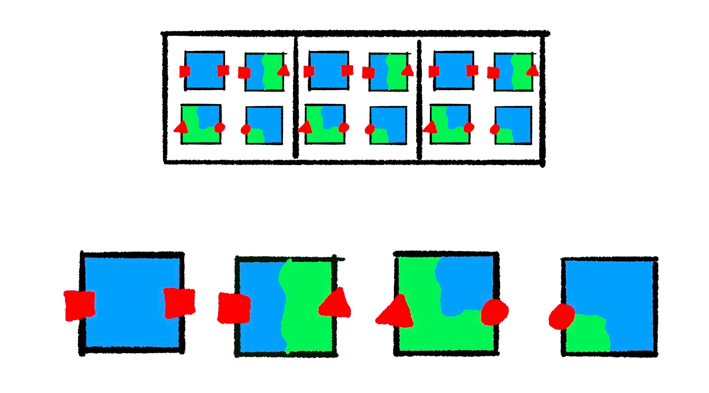
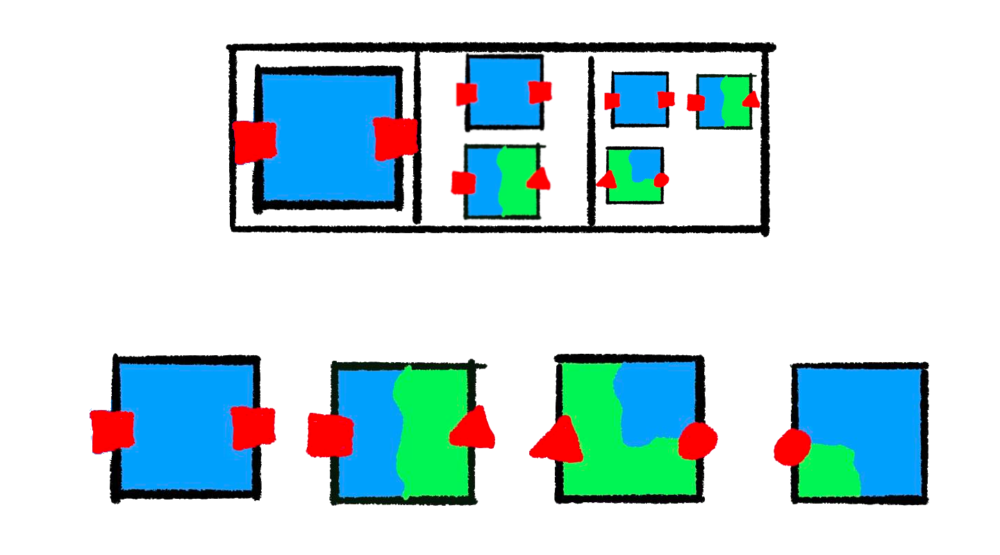
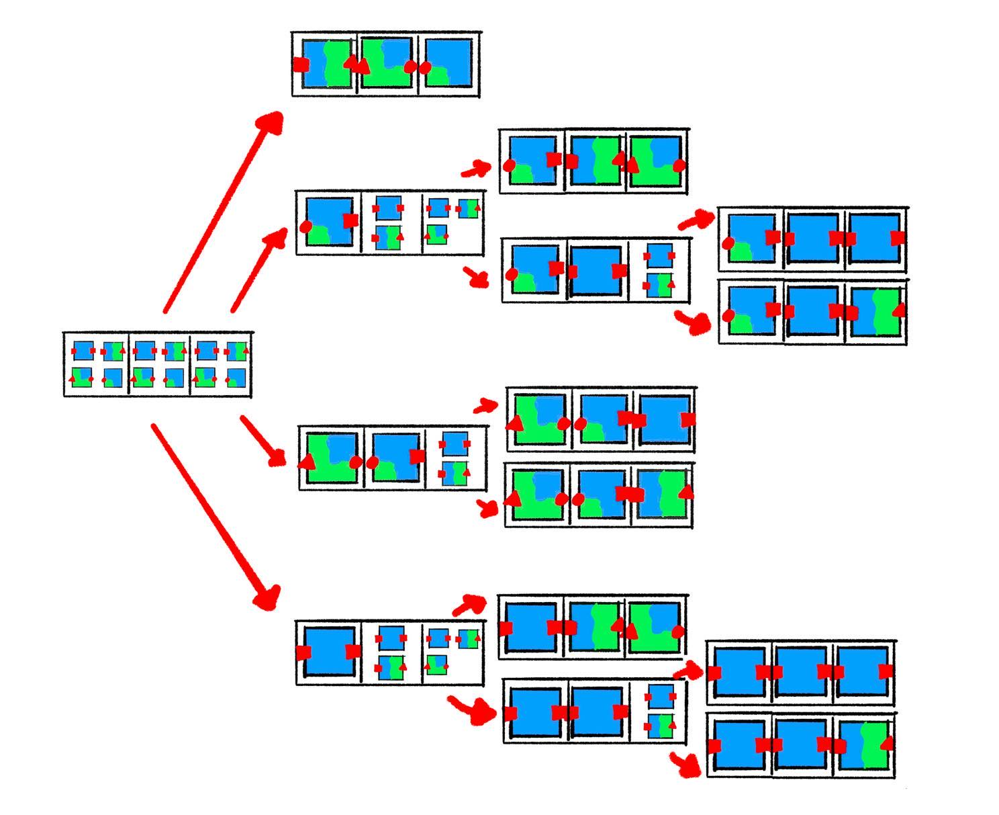
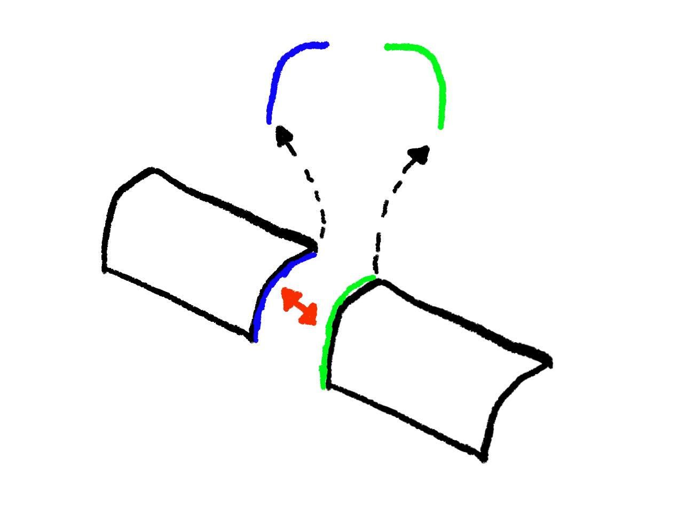
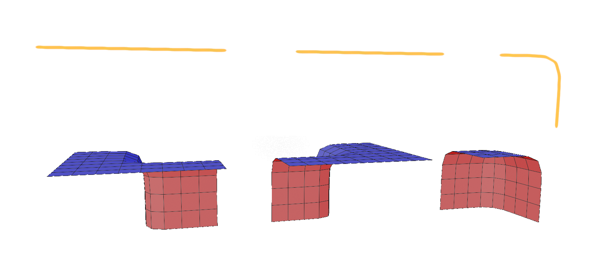

<video src="generate.webm" autoplay muted loop></video>

This 3D autotiling project started when I stumbled on [Martin Donald's Wave
Function Collapse video](https://www.youtube.com/watch?v=2SuvO4Gi7uY). He
explained it so well that I had to try it out.

In this post I will attempt to outline the high-level structure of a Wave
Function Collapse implementation with a bit of pseudo-Python. This is not a
tutorial, but more of a brief recap of my first implementation from over a year
ago.

## Algorithm

The algorithm has two main phases: Collapse and propagation. Collapse is a cute
name for picking a value for some cell. When we observe the cell reduces its
superposition of possible states into a single value. Propagation is where we
use that definite value to narrow down the possible values of neighboring
cells.


  I used the word Collapse instead of Observe/Observation. Collapse is what
  happens due to observation and propagation. Oops.


We start with a grid and a tileset. Each cell of the grid contains all of the
tiles as its possibilities.



Next, we pick a random tile for one of the cells. Because the "square" socket
is on the right side of the tile we picked, the next cell can only contain
tiles that match that socket on the adjacent side. That propagates out into the
third cell as well. Our middle cell only exposes a triangle and a square so the
tile with a circle on the left gets eliminated.



From this state, if we choose the "edge" tile with the triangle socket for the
middle cell there is only one compatible tile in the rightmost cell, therefore
the grid is solved. If we choose another completely blue tile here, we must
make one more choice.



We end up with a solid number of possible final states even in our limited
example. The number of choices is less than or equal to the number of cells.
In practice, we rarely make a random choice for the majority cells. After a
few essential cells are collapsed, the propagation step chooses by process of
elimination. The worst case, performance-wise, is if we have so many compatible tiles
that we don't quickly prune possibilities in the first few iterations.

## Types

I have a handful of foundational structures in my implementation.

### Prototypes

```python
class Prototype:
    name: str
    mesh: str
    rotation: int

    # sockets
    north: str
    east: str
    south: str
    west: str
    top: str
    bottom: str
```

A prototype represents a possible choice to put somewhere in the grid. We will
have 4 prototypes for each tile in our tileset, one for each 90-degree
rotation.

### Sockets

On each of the 6 faces we will have a socket. These identify which `Prototype`s
can connect to each other in each direction. The socket represents what we see
when we look at one face of the tile's bounding box.



For the north and south or east and west sockets to match, they must be mirrors
of one another. For a vertical face's socket to fit the sockets must be
identical. Sockets are arbitrary strings, except for the suffixes on horizontal
faces' sockets: `s` (symmetrical) and `f` (flipped).

```python
def compatible_sockets(face, a, b) -> bool:
    # symmetrical faces should be identical
    if face in {"top", "bottom"} or a.endswith("s"):
        return a == b     
    flipped_b = socket[:-1] if socket.endswith("f") else b + "f"
    return a == flipped(b)
```

### Cells

```python
class Cell:
    possibilities: list[Prototype]
```

A cell is one element in a `Grid`, which is just a collection of `Cell`s.

### Grid

How you represetnt a `Grid` depends on your application. BorisTheBrave wrote an
entire C# library, [Sylves](https://boristhebrave.com/docs/sylves/1/), for
handling grids. 

It could be a 3D array:

```python
class Grid:
    grid: list[list[list[Cell]]]
```

Or for an infinite grid, a map that lazily populated:

```python
class Grid:
    grid: dict[Vec3, Cell]

    def __getitem__(self, coord: Vec3):
        if key not in self.grid:
            self.grid[coord] = Cell()
        return self.grid[coord]
```

Our only requirement is that we can use a 3D coordinate as a key.

## Implementation

```python
def solve():
    work_list = []
    solved = False
    iteration = 0
    while not solved and iteration < MAX_ITERATIONS:
        iteration += 1

        cell, coord = grid.find_min_entropy()
        if cell is None:
            solved = True
            break

        cell.collapse()
        work_list.append(coord)
        while len(work_list) > 0:
            work_list += propagate(work_list.pop())
```

Here is the algorithm we described earlier: 

1. Make a random selection in one of the cells 
2. Recursively propagate that out and repeat until every cell has only
   one possibility. 

You can perform the selection bit by hand in this [web
demo](https://bolddunkley.itch.io/wfc-mixed) from [Martin Donald](https://www.youtube.com/@MartinDonald).

### Collapse

In this algorithm, "entropy" is a cute name for the length of a `Cell`'s
possibility list. Zero means there is a contradiction and we will never be able
to solve the `Grid`. One means we have already chosen the `Prototype` for
this cell. In each iteration, we find the unsolved Cell we're most certain
about:

```python
def min_entropy(self) -> Cell:
    def entropy(cell):
        if cell.entropy() < 2:
            return math.inf
        return cell.entropy()
    return min(self.grid, key=entropy)

```

Then we "collapse" its possibilities into a random choice:

```python
def collapse(self):
    idx = randint(0, len(self.possibilities) - 1)
    self.possibilities = [self.possibilities[idx]]
```

### Propagate

```python
def propagate(coord):
    cur_cell = self.grid.get(cur_coord)
    changed_neighbors = []
    for direction in opposing_faces.keys():
        next_coord = add_vec3(cur_coord, face_deltas[direction])
        if not self.grid.is_in_bounds(next_coord):
            continue
        next_cell = self.grid.get(next_coord)
        changed = grid[next_cell].constrain_to_neighbor(cur_cell, direction)
        if changed:
            changed_neighbors.append(next_coord)
            self.propagation_stack.append(next_coord)
    return changed_neighbors
```

Any time we change the possibility list of one cell,
the neighboring cells are possibly affected. We reduce the possibility list
of each adjacent cell with `constrain_to_neighbor`, and if that causes
a change, we will have to propagate to _that_ cell's neighbors as well.

### Constrain

```python
def constrain_to_neighbor(self, cell: Cell, face: str):
    old = len(self.possibilities)
    self.possibilities = [
        p
        for p in self.possibilities[]
        if compatible_sockets(my_face, p[my_face], cell[face])
    ]
    return old != len(self.possibilities)
```

Here, we reduce the possibility list to only include `Prototype`s that are compatible
on the opposing face.

There are far more efficient ways of doing this, like setting up an adjacency
table. This is also the part of the algorithm that will most likely have edge
cases to help guide the algorithm's behavior to produce specific results.

## Generating Sockets and Prototypes

### Sockets from Geometry



To use the algorithm above will need to label each of our tiles with sockets.
We could do this by hand. 16 meshes, multiplied by their 6 cell
faces 96 labels would need to be written out. Why spend twenty minutes
doing something tedious when you can spend a couple hours automating it?

My strategy for automating this is to filter the vertices to only those that sit
on the face of the tile's bounding box, and generate a hash to use as the socket.
There are some special considerations, though:

1. We need to know if a socket is a mirror of another socket.
2. If we want rotated `Prototype`s, we need to be able to rotate a socket.
3. For faces with no vertices, we must know if they're inside pieces or outside
   pieces, otherwise we might expose some backfaces instead of generating
   something manifold.

Using a hash alone won't cut it; we would lose the vertex info. To handle this
we can map the hash to some friendly name, and use suffixes to indicate these
things.

1. `f` - a flipped version of a socket
2. `s` - a socket that is symmetrical (no need to flip)
3. `r0`, `r1`, `r2`, `r3` - number of 90 rotations done to a socket

We're also going to have to look at some normal data
to cover that "empty" socket scenario.

Using the mesh data is pretty finnicky. It's hard to tell what direction things
are facing reliably. The requirements put on the artist to make near perfect
meshes are also very annoying. For high poly meshes, the implementation I have
here would be slow or not even work. I ended up mostly abandoning this
approach. I'll get into that in a later post.

The implementation can be found [here](https://github.com/stevenctl/basic-wfc-blender/blob/main/wfc/adjacency.py)
along with a sample Blender file you can use to run the code. Rather than
walking through the entire thing, I'll highlight some semi-interesting bits.

#### Detecting Interiors

```python
def is_interior(o: bpy.types.Object, face):
    axis, sign = get_axis(face)
    detected_sign = 0
    max_poly = -float("inf")
    for p in o.data.polygons:
        normal = Decimal(f"%.{DECIMAL_PLACES}f" % p.normal[axis])
        if normal.is_zero():
            continue

        normal_sign = 1 if normal > 0 else -1
        for vert_idx in p.vertices:
            vert_value = sign * o.data.vertices[vert_idx].co[axis]
            if vert_value > max_poly:
                detected_sign = normal_sign
                max_poly = vert_value

    return detected_sign != sign:
```

I'm just finding the _mesh_ face that's furthest in the axis
for our tile face (north, west, top, etc.), and seeing if its
normal matches that direction.

This is a simplistic method that's prone to errors. It's good enough for
because the meshes are so simple. The plan was that I would run this on the
simple versions, and then re-use that data after I add details and art to the
meshes.


## Conclusion

While this post was mostly pseudo code, it matches up pretty well to my first
WFC attempt. The code is available
[here](https://github.com/stevenctl/basic-wfc-blender) as well as a sample
Blender file you can use to run it. This implementation has majorissues and
isn't scalable, but I found I use for it that's covered in a later post.
