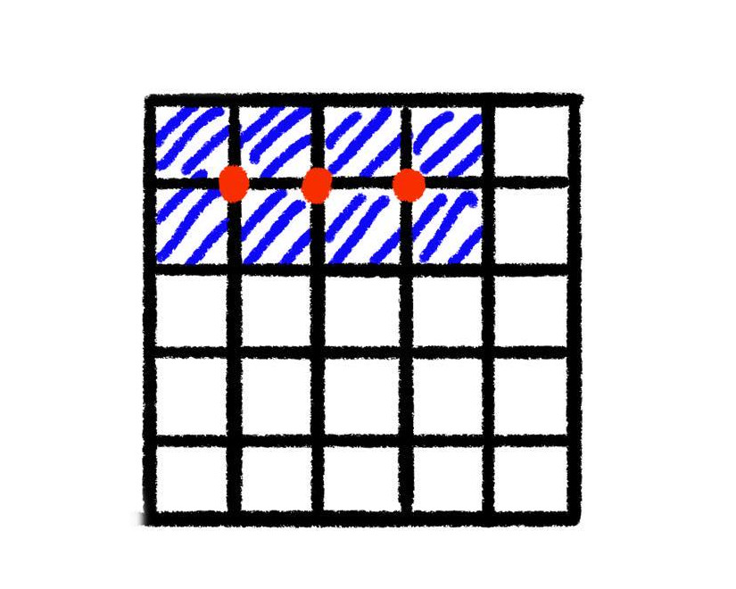
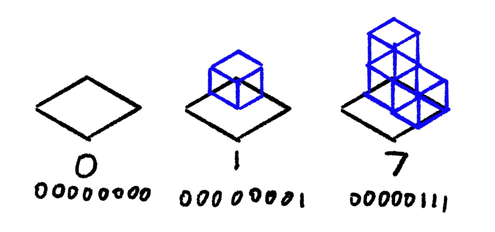

The point of exploring WFC was not to use it directly for procedural
generation. We want a very controlled collapse. [BorisTheBrave
describes](https://www.boristhebrave.com/2021/06/06/driven-wavefunctioncollapse/)
Townscaper as "Driven WFC". This is the process of intentionally setting up the
initial conditions to achieve a specific result.

## Initial Constraint 

Our method of "driving" WFC will be specifying which cells aren't empty.

In the [marching squares](../01-marching-squares/) post I described a
dual-grid. Because our tiles describe transitions, we can't say a single cell
is filled. We must use at least 4 non-empty tiles in 2D, or 8 tiles in 3D to
create a manifold shape.



If a user fills the coordinates: `[(0, 0, 0), (0, 1, 0), (0, 2, 0)]` we will
expand that to 16 coordinates. It's not 24 because the affected cells overlap.

For each those expanded coordinates, we remove `empty` from the possibility
list. The cells not included in that list have their possibility list reduced
to _only_ the `empty` prototype. The full implementation is
[here](https://github.com/stevenctl/basic-wfc-blender/blob/7b44e30794c7ee7dd2ef1e8c377494c48f87bd20/wfc/solver.py#L311C15-L311C24).

This is the result:

<video src="inconsistent.webm" autoplay muted loop></video>

## Ambiguous Cases

The example above _should_ be a plain rectangle. The problem is our constraint
says "every cell must have a non-empty tile". That is satisfied. 

### Special "empty" Tile

We could expand the constraint to say "all our tiles must be connected on a non-empty face". 

```python
{
    "name": "empty",
    "mesh": "",
    "rotation": 0,
    "north": "empty;empty_only",
    "east": "empty;empty_only",
    "south": "empty;empty_only",
    "west": "empty;empty_only",
    "top": "v_empty;v_empty_only",
    "bottom": "v_empty;v_empty_only",
}
```

We can give the `empty` prototype a special socket `empty_only`.

* An `empty` tile can allow the `empty` socket from any tile.
* A tile with a mesh that has an `empty` socket shouldn't connect to other
  other meshes outside faces.

In the "constrain to neighbor" step, we modify our rules a bit:

```python
if not cell.possibly_empty():
    if "empty" or "v_empty" in allowed_sockets:
        allowed_sockets -= {"empty", "v_empty"}
        allowed_sockets += {"v_empty_only", "empty_only"}
```

filled cells can't use their `empty` side to connect to other filled cells now.


### The Donut Case

<video src="donut.webm" autoplay muted loop></video>

Stopping empty sockets from connecting to each other restricts
us from getting some valid results. It is also insufficient.
Half of the connecting faces of the `L` tiles are not empty,
so our special rule isn't triggered. How can we fix this?

### Simplified Marching Cubes



Again, we go back to looking at Marching Squares, except this time Marching
Cubes. In that algorithm, we set a bit on the cell's `tile_index` that
corresponds to each "filled" corner from the dual grid. We can expand it to 3D,
generating a `cube_id` based on which octants contain the mesh.


The cognitive load is too much for manually labeling the tiles. We can simplify
this to just _count_ the number of filled octants. We'll call that the `volume`
of a tile. This reduces the manual labeling workload.

When we're setting our initial conditions, we find the volume for each cell, then
constrain it to all the tiles with that volume:

```python
corner_counts = {}
for coord in crossgrid:
    for coord in expand_coord(coord):
        if coord not in corner_counts: 
            corner_counts[coord] = 0
        corner_counts[coord] += 1

protos_by_voume = itertools.groupby(prototypes, lambda p: p.volume)

for coord, cell in grid:
    volume = corner_counts[coord]
    cell.possibilities = copy(protos_by_voume[volume])
```

This ends up being much cleaner. No special casing `empty` or looking for
fully surrounded cells. And it gets us the result we want.

### Impossible Configurations

You may have noticed a while ago, or maybe you noticed when we brough up marhcing squares.
If a square has 4 corners, or 4 bits, there are 2⁴ tiles to cover every case. In 3D this
explodes to 2⁸ (256) tiles. Our manually created tileset cannot handle all possible user input.

