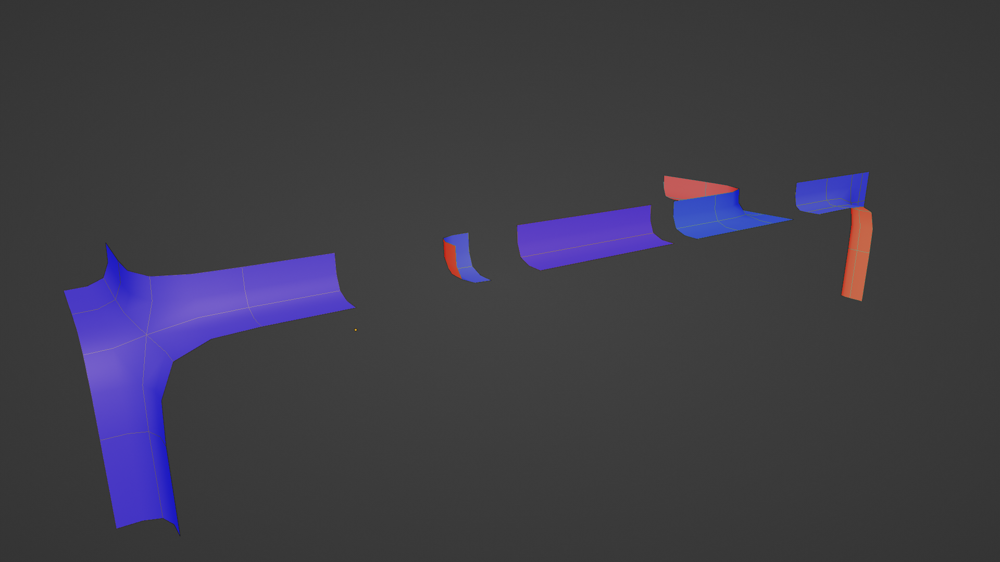

In the [last post](../03-driven-wfc/) we realized that the manually
created tileset would need 256 tiles to cover every case. While we can rotate
and flip our tiles to bump the number up, we can't be sure we covered all the cases.
At the same time, we will eliminate the need to manually label our tiles
with `volume` data.

## Enumerating Tiles

To ensure we don't miss any possibilities, let's enumerate all the cases in code.
Intuitively, there can't be 256 _unique_ cases. Let's figure out how many are left
if we ignore duplicates.


We can take an integer between `0` and `255` and convert it
to or from a `2x2x2` array of "filled" or "empty".

```python
def int_to_cube(c_int: int) -> np.ndarray:
    s = format(c_int, "#010b")
    o = np.array([int(s[i]) for i in range(2, len(s))]).reshape((2, 2, 2))
    return o

def cube_to_int(cube: np.ndarray) -> int:
    return int("".join(cube.reshape(8).astype(str)), 2) ```

We're using Python 3 with NumPy because `ndarray` is very convenient.
This code doesn't need to run in our game engine and will end up
being more useful in Blender scripts, which must be Python.

Similar to 2D, many of cases are transformations of other cases. We can generate
the unique cases pretty easily:

```python
def possible_tiles():
    seen = set()
    unique_cubes = set()

    def add(cube, unique=False):
        v = cube_to_int(cube)
        if unique and v not in seen:
            unique_cubes.add(v)
        seen.add(v)

    # skip 0 and 255 because they don't need a model
    # they're empty and interior tiles
    for i in range(1, 255):
        if i not in seen:
            unique_cubes.add(i)
        seen.add(i)

        # register the transformations as "seen"
        # so that we will ignore them in future iterations
        rc = int_to_cube(i)
        for rot in range(4):
            rc = np.rot90(rc, axes=(0, 1), k=rot)
            seen.add(cube_to_int(rc))
            seen.add(cube_to_int(np.flip(rc, axis=1)))

    return unique_cubes


if __name__ == "__main__":
    tiles = possible_tiles()
    print(len(tiles))
```

53 unique cases. Not bad! We can safely ignore the `0` and `255` cases. Because
0 is empty and 255 is completely on the interior, so we can't actually see it,
there is no need to provide a model for them.

## Less Modeling

If I were to manually build the 53 models, there would certainly
be repetitive substructures. While iterating on art, it would be
very annoying to update every variation to keep the look consistent.

What if we imagine each octant as a tile? It can't be that hard to auto-tile a
2x2x2 grid. In the talk [Beyond
Townscapers](https://www.youtube.com/watch?v=Uxeo9c-PX-w&t=126s), and on
[twitter](https://twitter.com/OskSta/status/1448248658865049605) Oskar uses
this image to show tiles for a dual-grid.


I tried to classify the square cases. 

* Empty
* Corner
* Edge
* Diagonal
* Bend
* Full

Those are the cases I want to end up with at the end. The combinatorial
explosion into 3D is big. Let's cut those into quadrants to make the _dual-dual_ tiles. 
We end up eliminating the Diagonal case. Only four models are needed to start:


Expanding to 3D isn't that bad. We just need walls, edges and bends along the Up axis.
That can be accomplished with some simple rotations.


It doesn't fully cover it though. We have to be able to transition vertically
between flat tiles or edge tiles. We'll call these "lip" tiles since they're
kind of skinny. There are 5. 4 for to match up to the base cases and a 5th that
is a corner between two lips. It's basically the "outward" part of an "outward
blob cut" approach.




Finally, we duplicate all of these and flip them upside down so we have some
dedicated for the top layer of our 2x2x2 grid that transition from the ceiling
downward instead of from the floor upward.

In total There are 26 tiles to model. Very manageable!


## Assembling WFC Tiles

To combine the tiles, we rely heavily on some naming/classification.
The names of the Blender object concatenate:

* Their base type - Lip, Corner, Bend, Edge
* Their Layer - Top, Bottom
* Their Direction - Horizontal, Vertical, Horizontal + Vertical, Corner

We can then determine which micro-tile belongs in an octant
based on which neighboring octants are also filled. The implementation is
[here](https://gist.github.com/stevenctl/3492292c6461c8235e22f858c22ce6b8).
I wrote it on a long flight and jetlag affected the readability. The rules are:

* If 4 octants are filled in the same "plane", this is either flat or a "lip". 
* If 3 adjacent octants are filled, this is a 3-way bend.
* If 2 adjacent octants are filled, this is a 2-way bend.
* If 1 adjacent octant is filled, this is an edge.
* If 0 adjacent octants are filled: this is a corner.

## Orienting the Tiles

We know which category of tiles go where but the simple rules above don't
explain how to rotate them into alignment. I was far too lazy to figure this
out. Turns out I wrote an algorithm for this already. WFC!

If we run our [adjacency](../02-basic-wfc/#generating-sockets-and-prototypes)
script, then setup a 2x2x2 WFC grid and set the [initial conditions](../03-driven-wfc/)
of each cell to have all the rotations of the mesh that we're sure we want...
it will spit out exactly what we need!

## Conclusion


This generation workflow greatly reduces the amount of modeling I need to do.
That's important because I'm not very good at 3D modeling. There are other advantages, though:

* We don't need to figure out the "volume" of each tile by hand (unless we add additional "special" tiles)
* It opens up a way to use the octant bits to create adjacency data instead of vertices. (Keep reading!)

