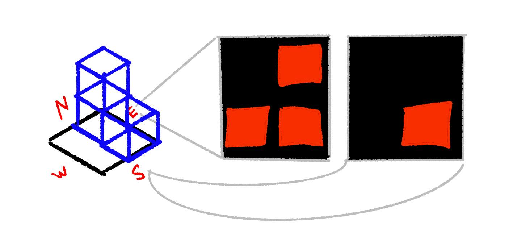

+++
title = "Optimizations"
weight = 5
+++

In the previous post, we discussed how we could use 8 bit integers to represent
a cube divided into 8 octants. This idea inspired me to abandon mesh data as a
means for adjacency data in favor of 2D images.

## Simplification

To use a representation of a "socket" in our WFC we only have a few requirements:

* Capture the contour of a single face of a tile
* We can easily check if it is flipped or symmetrical.
* Easy to determine if it's a rotation of another tile.

What are the drawbacks of the current approach?

* An opaque string does not preserve the visual representation.
* Suffix markers: `s` (symmetrical) `r` (rotations), `f` (flipped) have to
  be trusted. We can't reproduce them from their base case without the mesh.
* Meshes must be perfectly constructed to have verts sitting on bounding box faces.
* Small errors in the model can cause incompatible tiles.

The current model makes for a nice workflow in the happy path, but failure cases
are a pain to debug or notice. Instead, we can use this cube data to create simple
2D images:



We can auto-generate these for our standard 256 prototypes. This does
place a new burden on the artist: they must manually draw images for
additional tiles outside of the base set. Manually drawing low-resolution
images turns out to be easier than makinag sure 3D meshes perfectly align.
It is often easier to hide seams with details like stones or other decorations.
The image approach _enables_ that sort of artistic liberty.

### Encoding

Base64 encoding and decoding images could work. Instead I decided to over-engineer this
a bit. I don't want to rely on using any library's `Image` abstraction. My images
don't need much resolution at all. 

The base tiles could be captured with a 2x2 image. I landed on using 7x7
monochrome images encoded into 64-bit integers. 2x2 isn't enough if we create
detailed tiles down the road. An 8x8 image would use 64 bits,
and we want leftovers. 

Using some leftover bits, we can store information like whether the image is the
flipped version of another image. Now when we compare a horizontal socket, we
don't need to loop over the image and actually flip it. We can simply figure out
the unique set of images in our tileset before hand, and mark some as flipped.
The check becomes `a == b ^ (1 << 63)`. We might use another bit to store
whether the image is symmetrical so we know NOT to flip the bit.

For example, `0b00000111` would look like:


The advantages we get:

* Dense serialization
* Fast compatibility checks
* Canonical unflipped socket.
* Canonical 0 rotation socket.

Those last two are very useful properties. With the old approach, the first
hash we saw would get a name, and the transformations would be derived from that name.
With this approach, the "canonical" untransformed image can be determined by performing 
the transformations to the image and sorting by the integer value.


### Images from Octants


Converting from 2x2 to an arbitrary size isn't too hard. Just loop through and
fill up the corners. For odd numbered resolutions, like 7, a corner would be
3x3. There is additional logic to fill these gaps where it makes sense. 

```python
def gen_sock(cube_id: int, face_name: str, seen_socks: Sockets, bitmap_size=7) -> int:
    cube = int_to_cube(cube_id)
    face = get_face(cube, face_name)

    assert bitmap_size % 2 == 1  # must be odd for 1 pixel gutter in center
    fill_size = int(bitmap_size / 2)
    socket_bitmap = np.zeros((bitmap_size, bitmap_size), dtype=int)
    for x in range(len(face)):
        for y in range(len(face[x])):
            if face[x, y] == 0:
                continue
            sx = x * (bitmap_size - fill_size)
            sy = y * (bitmap_size - fill_size)
            ex = sx + fill_size
            ey = sy + fill_size
            if x == 0 and face[x + 1, y] == 1:
                ex += 1
            if y == 0 and face[x, y + 1] == 1:
                ey += 1
            socket_bitmap[sx:ex, sy:ey] = 1

    return encode_socket(socket_bitmap)
```

### Manually Authored Tiles


The whole reason we're using WFC and not Marching Cubes is to allow
for interesting shapes to emerge under certain conditions. We can texture
some cubes parented to manually modeled tiles that extend our base set of 53.
The sockets for the base set are simple and easy to reason about. We can be a
bit clever designing socket images for our custom tiles. 

Luckily the Blender Python API (`bpy`) gives us a representation that is compatible
with NumPy. We can keep our authoring workflow fully inside of Blender.

```python
imgs = [node for s.material.node_tree.nodes if node.type == 'TEX_IMAGE']
img = np.asarray(imgs[0].pixels).reshape((21, 28, 4))
```

## Optimization

So far we've looked at optimizing the asset creation workflow. There
is also serious runtime performance on the table using Adjacency Tables,
and a bit more to be squeezed out using more bit-encoding.

### Current State

For each cell, we might make a random choice. For each random choice, we do a
propagation for each face of a cell. There's a chance a single cell with can be
affected in circular paths before the propagation is complete. This means we're
worse than `O(N^2)` propagations.

At the deepest part of this nested loop/recursive iteration we have an expensive
computation:

```python
allowed_sockets = [allowed_socket(other[opposing_face]) for other in other_cell.possibilities] 
self.possibilities = [p for p in self.possibilities if
                      len(p.sockets_for_face(my_face).intersection(allowed_sockets)) > 0]
```

### Adjancy Table

Instead of doing all the work to check socket compatibility
during generation, we can do it upfront. Consider each `Prototype` as having
an `id` which is its index in the initial list.

```python
adjacency = []
for proto in prototypes:
    allowed = {} 
    for face in faces:
        allowed[face] = allowed_for_face(proto, face, prototypes)    

def allowed_for_face(proto, face, prototypes):
    set([
        i 
        for i, other in prootypes 
        if compatible(proto, face, other)
    ])
```

We can reduce the work in the loop to be an intersection of sets:

```python
allowed_protos = set()
for proto in other_cell.possibilities:
   allowed_protos.intersection_update(adjacency[proto.id][opposing_face])
self.possibilities = allowed_protos
```


### Bit-Set

Bit representations of cubes and images got me thinking: we don't have a crazy number of protos.
What if the `possibilities` list was just a set. Each bit represents one prototype. In Python, a number
can have more than 64 bits. In other languages, you'll need to roll an abstraction over a list of integers.
We have 256 base tiles, plus some manually created ones. Let's say our max tilset size is 512. 

If `possibilities` is now something we can use the binary `&` operator on we get some micro-optimzations:

* We don't necessarily need the heap.
* Single instruction intersections.
* Maybe it's cache efficient? I don't do this kind of optimization often. 

This is a micro-optimzation, but for large tilesets it is probably worth it.


