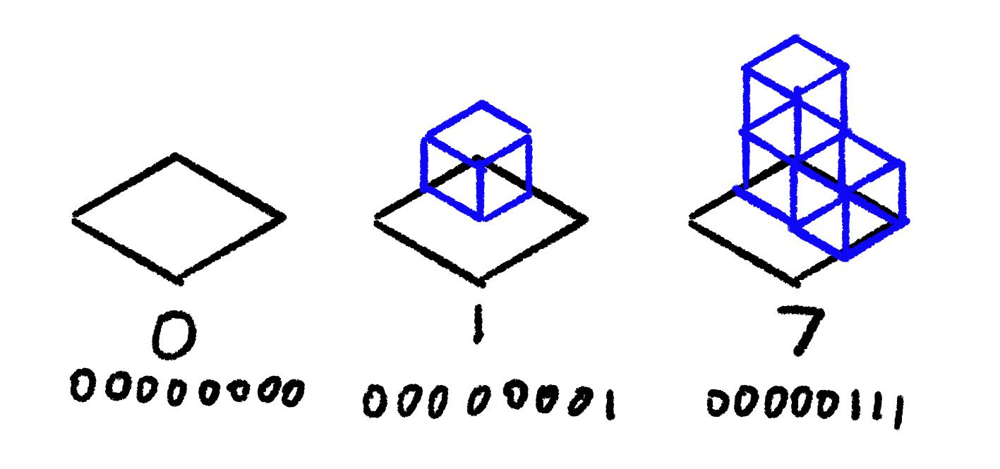

## Driven WFC

[BorisTheBrave
describes](https://www.boristhebrave.com/2021/06/06/driven-wavefunctioncollapse/)
Townscaper as "Driven WFC". That is, WFC but we set up the initial conditions
with some intention. Let's take the implementation from [last post](../02-basic-wfc/)
and feed it some specific coordinates. We'll remove `empty` 
from the possibilities list at those coordinates, and force
all the other cells to be `empty` before running `solve`.


## Problems

## Enumerating Tiles

In the [last post](../01-marching-squares/), we built a basic autotiler for a 2D
square grid. We will need a tileset before we can extend it to support a 3D cube
grid. For each cell, there are now eight corners and therefore 2⁸ (256) possible
ways to fill that cell.

Rather than thinking in corners, I prefer to consider the octants after dividing
the cube in half in each dimension. In the same way as before, we assign one bit
of a now 8-bit integer to each octant.



We can take an integer between `0` and `255` and convert it
to or from a `2x2x2` array of "filled" or "empty".

```python
def int_to_cube(c_int: int) -> np.ndarray:
    s = format(c_int, "#010b")
    o = np.array([int(s[i]) for i in range(2, len(s))]).reshape((2, 2, 2))
    return o

def cube_to_int(cube: np.ndarray) -> int:
    return int("".join(cube.reshape(8).astype(str)), 2)
```

We're using Python 3 with NumPy because `ndarray` is very convenient.
This code doesn't need to run in our game engine and will end up
being more useful in Blender scripts, which must be Python.

Similar to 2D, many of cases are transformations of other cases. We can generate
the unique cases pretty easily:

```python
def possible_tiles():
    seen = set()
    unique_cubes = set()

    def add(cube, unique=False):
        v = cube_to_int(cube)
        if unique and v not in seen:
            unique_cubes.add(v)
        seen.add(v)

    # skip 0 and 255 because they don't need a model
    # they're empty and interior tiles
    for i in range(1, 255):
        if i not in seen:
            unique_cubes.add(i)
        seen.add(i)

        # register the transformations as "seen"
        # so that we will ignore them in future interations
        rc = int_to_cube(i)
        for rot in range(4):
            rc = np.rot90(rc, axes=(0, 1), k=rot)
            seen.add(cube_to_int(rc))
            seen.add(cube_to_int(np.flip(rc, axis=1)))

    return unique_cubes


if __name__ == "__main__":
    tiles = possible_tiles()
    print(len(tiles))
```

53 unique cases. Not bad! We can safely ignore the `0` and `255` cases. Because
0 is empty and 255 is completely on the interior, so we can't actually see it,
there is no need to provide a model for them.

## Generating Meshes

// TODO blender script to place some cubes

## Combining Handmande Meshes

// TODO 26 subtiles to generate the rest
// Should I figure out rotations or use WFC
// Should I write a basic WFC post first using vertex data sockets?
