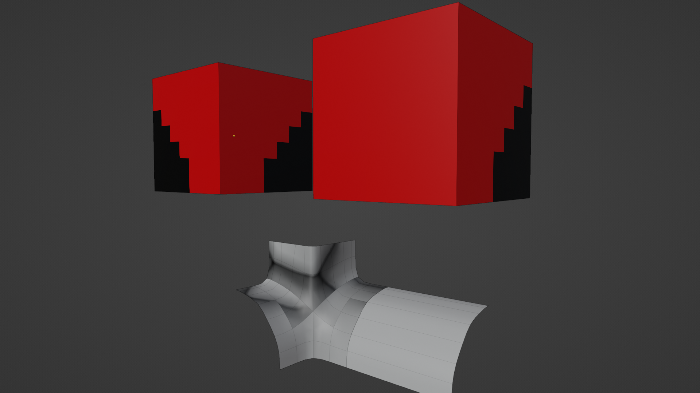

+++
title = "Wave Function Collapse: Adjacency data"
weight = 6
+++

In the previous post, we discussed how we could use 8 bit integers to represent
a cube divided into 8 octants. This idea inspired me to abandon mesh data as
a means for adjacency data in favor of 2D images.

# Defining Sockets and Compatibility

Previously, sockets were opaque identifiers assigned to each face of a tile.
Instead, let's make them images.


Those images are a low resolution representation of the actual tile.



When comparing horizontal sockets, they're compatible only if they mirror images of each other. That is the north socket of tile A
needs to be the mirror of the south socket of tile B for them to connect.

For vertical sockets, we expect sockets to be identical. The top of one being identical to the bottom of another will be compatible.

# Dense representation

So far we haven't talked about the format we store any of our tileset data in.

Each tile gets 4 or 8 variants. Each is called a prototype. It has roughly this format:

```json
{
    "mesh": "gen_1", // reference to the mesh we would render
    "rotation": 0, // the number of 90 degree rotations to use when rendering
    "flip": false, // whether to flip the mesh on the x axis when rendering
    // the "sockets" on each face
    "north": "???",
    "east": "???",
    "south": "???",
    "west": "???",
    "top": "???",
    "bottom": "???"
}
```

If sockets are images, how will we store them in a JSON file? Base64 encode them, then decode them
to our game engine's native Image struct or object? What is an image if not a list of which pixels 
are and aren't filled. If we have only 1 color in our image, and it's 7x7 pixels we only need 49 bits.
This fits easily in a 64 bit `uint`. The following socket has the first 3 bits set `0b11100000` (7 in decimal).


Using some leftover bits, we can store information like whether the image is the flipped version of another
image. Now when we compare a horizontal socket, we don't need to loop over the image and actually flip it.
We can simply figure out the unique set of images in our tileset before hand, and mark some as flipped.
The check becomes `a == b ^ (1 << 63)`. We might use another bit to store whether the image is symmetrical
so we know NOT to flip the bit.

This gives us:
* A dense way to store sockets in JSON.
* A ~quick way to compare them at runtime. This doesn't matter much.

# Generating Images

In the previous post we generated our tiles by enumerating filled octants.
If we take the 4 octants that make up one face, we can convert that into a 7x7 image easily.
Let's say if two adjacent octants are filled, we want the whole row of pixels to be filled. If we have 3 of 4 octants
the socket will look like this:


The code is relatively straightforward:

```python
def gen_sock(cube_id: int, face_name: str, seen_socks: Sockets, bitmap_size=7) -> int:
    """
    Convert a 2x2 face into a bitmap, then encode it as a socket.
    """

    cube = int_to_cube(cube_id)
    face = get_face(cube, face_name)

    # Generate a bitmap that has some room in the middle.
    # It's 7x7, so we can have more complex tiles with complex sockets elsewhere.
    assert bitmap_size % 2 == 1  # must be odd for 1 pixel gutter in center
    fill_size = int(bitmap_size / 2)
    socket_bitmap = np.zeros((7, 7), dtype=int)
    for x in range(len(face)):
        for y in range(len(face[x])):
            if face[x, y] == 0:
                continue
            sx = x * (bitmap_size - fill_size)
            sy = y * (bitmap_size - fill_size)
            ex = sx + fill_size
            ey = sy + fill_size
            if x == 0 and face[x + 1, y] == 1:
                ex += 1
            if y == 0 and face[x, y + 1] == 1:
                ey += 1
            socket_bitmap[sx:ex, sy:ey] = 1

    # Set the very center bit when the whole thing is filled
    socket_bitmap[fill_size, fill_size] = (face == 1).all()

    # Deduplicate sockets that are just transforms of other sockets
    if not seen_socks:
        raise AssertionError("seen socks util is required")

    if face_name in v_face_names:
        return seen_socks.store_v(socket_bitmap)
    return seen_socks.store_h(socket_bitmap)
```

# Flexibility in geometry


We don't have to worry about floating point errors or perfectly aligning geometry.
If we want to cover seams with some rocks or a mesh skirt, we are free to do so.

# Building Adjacency Map

So far we've looked at optimizing the asset creation workflow, and dug into some
details on how we get that into the game. What will we do with that data in game?

```python
class Adjacency:
    # Index first by face, then by prototype id. 
    # The value is a bitmask.
    matrix = [[], [], [], [], [], []]

    def __init__(prototypes: List[Prototype]):
        for face in range(6):
            for i in range(len(prototypes)):
                for j in range(len(prototypes)):
                    if prototypes[i].compatible(face, prototypes[j]):
                        matrix[face][i] &= (1  << j - 1) 
                        matrix[opposite(face), to] &= (1  << j - 1) 
```

Here we build a list of 6 arrays of N bitmasks, where the bitmask has length N.

If we look at this nice [WFC web demo](https://bolddunkley.itch.io/wfc-mixed), we
can think of each cell in our grid as containing the entire tilset to start. The tiles
available to choose in each cell can be called its domain.

Once a cell "picks" a tile, we set its domain to a single item. Neightbors domains
are reduced to only contain tiles compatible with something in it's neighbors domain.

Our adjacency could be modeled as a list of 6 faces where each element in the list
maps a socket to the set of prototypes that are compatible with it.

A naive way to propagte things out would be something like this using a ton of unions:

```python
allowed = []
for possibility in self.domain:
    allowed = allowed.union(adjacency[face][possibility])
domain = domain.intersection(allowed)
```

Instead we could have those sets be a `BigBitmask`. Essentially a list of integers. 4 64 bit integers would be 256 possible tiles.
Each bit index represents a tile ID. Replace the union with a bitwise OR and things speed up quite a bit.

The caveat is iterating over the "set bits" could be slow, but most [CPUs support an instruction](https://gcc.gnu.org/onlinedocs/gcc/Other-Builtins.html#index-_005f_005fbuiltin_005fclzll) 
for finding the "next set bit".

```python
allowed = []
for possibility in set_bit_indices(self.domain):
    allowed |= adjacency[face][possibility]
domain &= allowd
```
