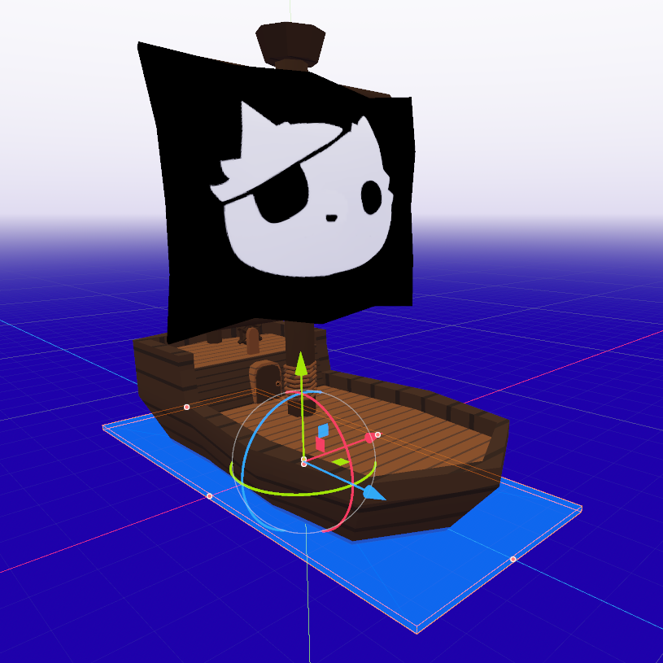



For the intro to a game I (perodically) work on, I decided to put the player on
a pirate ship. Scrolling textures on a big plane looked pretty boring. To make
things a bit angrier I decided to add waves.

## Waves

The visual component is the most common technique for basic waves: displacing
the height of each vertex on a subdivided plane.

Inspired by [sum of sines](https://developer.nvidia.com/gpugems/gpugems/part-i-natural-effects/chapter-1-effective-water-simulation-physical-models#:~:text=The%20sum%20of%20sines%20gives,to%20the%20continuous%20water%20surface.)
which can make semi-realistic ocean shaders, I'm taking the basic idea of adding two waves
with different frequencies to break up the repetitiveness. The result is good enough for this
cartoon style.


```glsl
float wave(vec3 p) {
	float time = TIME * wave_speed;
	vec2 uv = (p.xz + time * vec2(0.5, 0.5)) * wave_size;
	float dist = length(uv);

	return pow(2.1231, sin(dist) + sin((uv.y + 1.0))) * height;
}

void vertex() {
	world_position = (MODEL_MATRIX * vec4(VERTEX, 1.0)).xyz;
	VERTEX.y = wave(world_position);
}
```

## Floating

There are two components to making objects float on top of our waves:

* Position: move the object up and down so it sits on top of the water.
* Rotation: orient the object according to the slope of the waves.

We generally want some of the object to sit beneath the surface of the water.
Instead of doing anything fancy like using volume to calculate actual buoyancy,
we can just define our own y-offset from the model's postition, and a 2D size
of the "buoyancy-plane". In Godot, `CSGBox3D` conveiently lets us visualize and edit
these properties.



### Orientation


The easiest way to orient the object is find the slope of the wave using basic
"rise over run"; aka finite differences with a small step.

```gdscript
var small_dx = _wave(center + Vector3.RIGHT * step / 2) - _wave(center + Vector3.LEFT * step / 2)
var small_dz = _wave(center + Vector3.BACK * step / 2) - _wave(center + Vector3.FORWARD * step / 2)
var gradient = (Vector3(small_dx, 0.0, small_dz) / step).normalized()
```

If the surface of our wave is very noisy, this will look pretty bad. A quick
fix would be sampling at the edges of the plane that makes up our object's
"floating surface". This would be "central differences".

```gdscript
# find points on each side (the rotation puts us into global space, needed by _wave)
var left = _wave(center + (Vector3.LEFT * size.x / 2).rotated(Vector3.UP, plane.global_rotation.y))
var right = _wave(center + (Vector3.RIGHT * size.x / 2).rotated(Vector3.UP, plane.global_rotation.y))
var front = _wave(center + (Vector3.FORWARD * size.y / 2).rotated(Vector3.UP, plane.global_rotation.y))
var back = _wave(center + (Vector3.BACK * size.y / 2).rotated(Vector3.UP, plane.global_rotation.y))

var gradient = Vector3((left - right) / size.x, 1.0 , (front - back) / size.y).normalized()
```

Central differences will use a diamond shaped sample of points. Taking the
corners into account, the normals can be calculated by looking at the triangles
that make up our quad. In this example, I only use front and back triangles
because I assume the shape of my rectangle is longer on that axis.

```gdscript
# find the corners (the rotation puts us into global space, needed by _wave)
var front_r = center + (Vector3(size.x, 0, size.y) / 2.0).rotated(Vector3.UP, plane.global_rotation.y)
var front_l = center + (Vector3(-size.x, 0, size.y) / 2.0).rotated(Vector3.UP, plane.global_rotation.y)
var back_r = center + (Vector3(size.x, 0, -size.y) / 2.0).rotated(Vector3.UP, plane.global_rotation.y)
var back_l = center + (Vector3(-size.x, 0, -size.y) / 2.0).rotated(Vector3.UP, plane.global_rotation.y)

# project the points onto the wave
front_r.y = _wave(front_r)
front_l.y = _wave(front_l)
back_l.y = _wave(back_l)
back_r.y = _wave(back_r)
center.y = _wave(center)

# average normals from the triangles
var normal_f = (front_l - center).cross(front_r - center).normalized();
var normal_b = (back_r - center).cross(back_l - center).normalized();


# rotation based on avg of cross products of triangles in the plane
var normal = ((normal_b + normal_f) / 2.0)
# undo the global space transformation
normal = normal.rotated(Vector3.UP, -plane.global_rotation.y).normalized()
```


    
    
    


From left to right are examples using the back normal, the averaged normals and
the front normal on top of a sharp peak.

### Position

Assuming our buoyancy-plane is already offset from the model, and we use
`position.y = wave(position.xy)`, concave parts of the curve will have the boat
dip into the water on each side.


    
    


We should re-frame our goal to be none of the or extremes of our bounding shape
dip under the water. If we instead use the mean of our samples, we fix the concave case but now we'll
end up submerged in convex areas.

To get the best of both, we just take the `max` of the center sample or the edge
samples ([desmos](https://www.desmos.com/calculator/y4neofo1zw)).

```gdscript
# for central differences, re-use the samples
surface_point.y = max(center.y, (left + right + front + back) / 4)
# or if we're doing triangles, re-use those samples
surface_point.y = max(center.y, (front_l + front_r + back_l + back_r) / 4)
```

## Riding the Waves

Just for fun, I took things a step further and actually used the waves to drive
the motion of the boat. While this may or may for the gameplay to move the boat
around, it could be a cool effect for objects that fall into the water.

While I could find the [partial
derivatives](https://www.wolframalpha.com/input?i=derivative+of+e%5E%28sin%28sqrt%28x%5E2%2By%5E2%29%29+%2B+sin%28y%29%29+*+H)
of our wave analytically, I'd have to deal with that each time I change the
structure of it. The normals and the gradient are closely related. In fact,
when using finite differences, we've already computed the gradient.

```gdscript
func fit_plane(plane: Node3D, size: Vector2) -> Transform3D:
    # ...
	var step = .2
	var small_dx = _wave(center + Vector3.RIGHT * step / 2) - _wave(center + Vector3.LEFT * step / 2)
	var small_dz = _wave(center + Vector3.BACK * step / 2) - _wave(center + Vector3.FORWARD * step / 2)
	var grad = (Vector3(small_dx, 0.0, small_dz) / step).normalized()

    var surface_point = center - grad
    # ...
```




Simply setting the object's position to the `surface_point` like this it will
slide towards a local minimum of the wave and get stuck there. When we use a
smaller step we lag behind the wave, so the gradient at the point of the boat
changes over time. This results in a nice swaying effect.





## Swimming

What about objects that aren't _always_ in the water? We can re-use all of what
we've done so far to implement a swimming mechanic. Instead of the model being
a child of the plane, we can have a plane that is the child of a body.


First we detect whether or not we're in the water to turn the influence on or off:

```gdscript
# get swimming position of the parent body
var surface_pos = water.fit_plane(self, Math.vec2(size))
surface_pos.origin -= (global_position - parent.global_position)

# activate swimming mode if we're submerged
if surface_pos.origin.y > global_position.y:
    active = true
    animation.queue_action("swim")

# if the player jumps or otherwise ends up above the surface, we're no longer swimming
if parent.global_position.y - surface_pos.origin.y > deactivate_margin:
    active = false
```

And then apply the influence of the water on the body to `velocity` rather than directly
changing the `position`.

```gdscript
# align to surface
parent.global_position.y = surface_pos.origin.y

# push the player around with the waves
parent.velocity += (surface_pos.origin - parent.global_position) * delta
```



This bobbing effect looks neat. After some fine tuning, it could be pretty
good, but there is already a lot of motion applied to the player outside their
control. Another layer of unpredicatability would take away from the fun, so
instead, lets make them stick to the water's surface.

```gdscript
parent.velocity += (surface_pos.origin - parent.global_position) * Vector3(1, 0, 1) * delta
parent.global_position.y = surface_pos.origin.y
```



Well, setting the position directly means `move_and_slide` doesn't get the
opportunity to slide the player and leads to them clipping through walls.
Instead, we can _assign_ the y component of velocity so that it puts us exactly
on the surface.

```gdscript
var impulse = (surface_pos.origin - parent.global_position) * Vector3(delta, 1/delta, delta)
parent.velocity += impulse
parent.velocity.y = impulse.y
```



## Conclusion

Both the game's frame-budget and my own free time to work on personal projects
are limited. It might be fun to implement a proper plane fitting algorithm such
as [Least Squares](https://en.wikipedia.org/wiki/Least_squares) or [Principal
Component
Analysis](https://en.wikipedia.org/wiki/Principal_component_analysis), but the
added fidelity (and noise) aren't worth the effort for this style of game.
