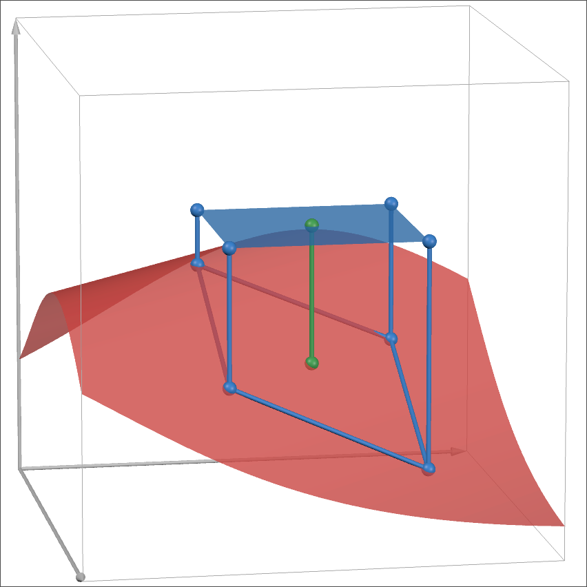
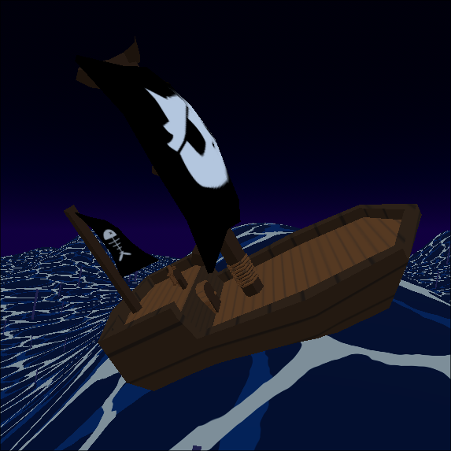
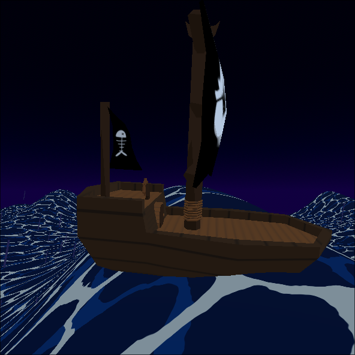
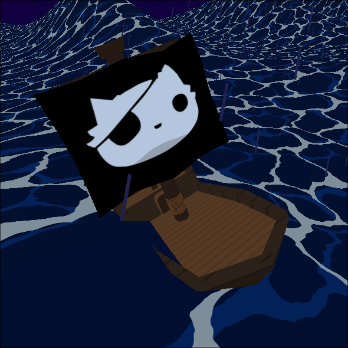
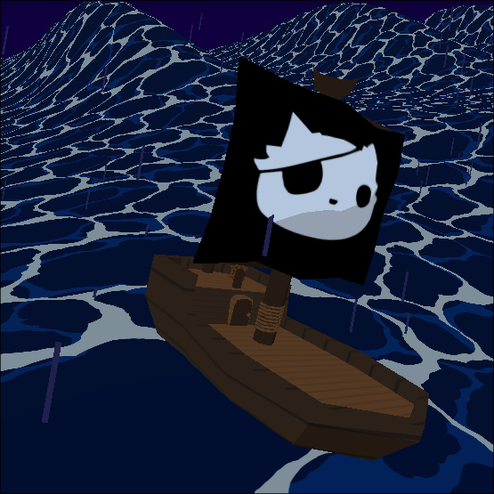



For the intro to a game I'm working on, I decided to put the player on a pirate
ship. If (when) the player tries to jump off the ship, we could prevent them,
have them reset/die, or swim. I decided on the simplest option, resetting them.

Next, I moved on to making the boat rock with the waves. At first, I just made
the X-axis rotation oscillate between two values, and this worked fine. Recently,
I discovered [Acerola's](https://youtube.com/@Acerola_t) amazing channel. In
[one of his videos](https://www.youtube.com/watch?v=ja8yCvXzw2c) he mentions
using plane fitting algorithms as a method for faking buoyancy. This inspired
me to add a bit more fidelity to the rocking.

## Simple "Plane Fitting"

Plane fitting is a 3D form of [line
fitting](https://en.wikipedia.org/wiki/Line_fitting); a process of finding the
straight line that can best fit some data points. Acerola's example used a
bunch of samples from the bottom of an object as data points and fed them to
what I assume was a "proper" plane fitting algorithm such as [Least
Squares](https://en.wikipedia.org/wiki/Least_squares) or [Principal Component
Analysis](https://en.wikipedia.org/wiki/Principal_component_analysis). 

Those seemed somewhat complicated to fully grasp. It's probably overkill for my
stylized game. My requirements are minimal:

* Orient the object to rest on the water's curve surface.
* Put the object (near) the top of the water.

### Orienting

Starting with the orientation, we can look at this very similarly to looking
for the normal of a heightmap. Our waves are just a vertex-displaced plane,
where the y-displacement is defined by some function. There are a few options for
computing the normals:

#### Normal Calculation

* Analytically differentiate the function and use the tangents to figure out
  the normal. 
* Use central differences, sampling different parts of the area we want to fit
  on our 3D curve.
* Leverage the cross product to find our normals.

The last one is the easiest, in my opinion. The first paragraph of [the
Wikipedia article for the cross
product](https://en.wikipedia.org/wiki/Cross_product) mentions using them to
calculate normal vectors.

We can start by defining a rectangle, centered at \\(P\\). Next, we
take 4 samples of \\(f(x)\\) to get the corners
[projected](https://www.desmos.com/3d/89a779a469) down onto the curve:
\\(A\\) \\(B\\) \\(C\\) \\(D\\) and
\\(P\\) projected onto the wave as \\(P_w\\).



Next, we have to choose 3 points to form 2 vectors from. The cross of those two
vectors will be the normal. We can get a pretty accurate normal by averaging
the cross products of the sides of each of the triangles formed by
\\(P_w\\) and the rectangle's corners. For gameplay purposes, we
care much more about the tilt either forward or backward, so we'll use the
average \\(\vec{AP_w} \times \vec{BP_w}\\) and
\\(\vec{CP_w} \times \vec{DP_w}\\) as our normal.

```gdscript
func fit_plane(center: Vector3, size: Vector2) -> Transform3D:
	# form corners of the axis-aligned plane
    var front_r = center + Vector3(size.x, 0, size.y)
    var front_l = center + Vector3(-size.x, 0, size.y)
    var back_r = center + Vector3(size.x, 0, -size.y)
    var back_l = center + Vector3(-size.x, 0, -size.y)

	# project the points onto the wave
	front_r.y = _wave(front_r)
	front_l.y = _wave(front_l)
	back_l.y = _wave(back_l)
	back_r.y = _wave(back_r)
	center.y = _wave(center)

	# front normal
	var v1 = front_l - center;
	var v2 = front_r - center;
	var normal_f = v1.cross(v2).normalized();

	# back normal
	v1 = back_r - center;
	v2 = back_l - center;
	var normal_b = v1.cross(v2).normalized();

	# rotation based on average of cross products
	var normal = (normal_b + normal_f) / 2.0;
```


    
    
    


The left side uses only `normal_b` and the right side uses `normal_f`. The center is the
averaged normal. In my opinion, it looks much better.

#### Allowing Rotated Objects

Our calculation is still inaccurate, especially if the plane we're using
isn't a square. This is easy enough to fix by taking the source object's
rotation into account when finding the corner points:

```gdscript
func fit_plane(plane: Node3D, size: Vector2) -> Transform3D:
    var front_r = center + Vector3(size.x, 0, size.y).rotated(Vector3.UP, plane.global_rotation.y)
    var front_l = center + Vector3(-size.x, 0, size.y).rotated(Vector3.UP, plane.global_rotation.y)
    var back_r = center + Vector3(size.x, 0, -size.y).rotated(Vector3.UP, plane.global_rotation.y)
    var back_l = center + Vector3(-size.x, 0, -size.y).rotated(Vector3.UP, plane.global_rotation.y)

    #...

	# rotation based on average of cross products
	# we now need to convert back into local space by undoing the objects rotation
	var normal = ((normal_b + normal_f) / 2.0).rotated(Vector3.UP, -plane.global_rotation.y);
```


    
    


### Positioning

Now that our plane faces the right direction, we want to put it at the surface
of the water. We could choose to use the point on the curve under the center of
the plane, \\(P_w\\). 

```gdscript
var surface_pos = center.y
```

This works extremely well for how simple it is, but we can take it further.
Waves usually move things, right? How can we capture the force created by a
wave? The amplitude of the wave should affect the strength of the push we give.
It sounds like we need to look at the slope... otherwise known as the gradient
which we can find using the partial derivatives of the wave.
The current wave is defined by:

$$w\left(x,y\right)=H\cdot e^{\sin\left(\sqrt{x^{2}+y^{2}}\right)+\sin\left(y\right)}$$

Using this intermediate term:

$$d = \sqrt{\left(x^{2}+y^{2}\right)}$$

So that our [partial
derivatives](https://www.wolframalpha.com/input?i=derivative+of+e%5E%28sin%28sqrt%28x%5E2%2By%5E2%29%29+%2B+sin%28y%29%29+*+H)
are a bit more readable:

$$\frac{\partial f}{\partial x} w(x, y) = \frac{w\left(x,y\right)\cdot x\cos\left(d\right)}{d}$$

$$\frac{\partial f}{\partial y} w(x, y)  = w\left(x,y\right)\cdot\left(\frac{y\cos\left(d\right)}{d}+\cos\left(y\right)\right)$$

Once we convert this to code, we can adjust our target position using this:

```gdscript
func _wave_gradient(p: Vector3) -> Vector3:
    # in reality x/y are further parameterized by time
	var time = total_time * wave_speed
	var uv = (Math.vec2(p) + time * Vector2(0.5, 0.5)) * wave_size 
	var d = uv.length()

	var w = pow(2.1231, sin(d) + sin((uv.y + 1.0))) * height
	var dx = (uv.x * w * cos(d)) / d
	var dy = w * ((uv.y * cos(d)) / d + cos(uv.y + 1))
	return Vector3(dx, 0, dy)

func fit_plane(center: Vector3, size: Vector2):
    # ...

    var surface_point = center - _wave_gradient(center)

	# convert to transform
	var rotation_axis = Vector3.UP.cross(normal).normalized()
	var rotation_angle = Vector3.UP.angle_to(normal)
	if rotation_axis.length_squared() < .1:
		rotation_axis = Vector3.RIGHT
	return Transform3D(Basis(rotation_axis.normalized(), rotation_angle), surface_point)
```

If we simply set our object's position to the `surface_point` it will slide
towards a local minima of the wave.



That looks a bit too quick. Multiplying by delta time fixes this:

```gdscript
global_position += (surface_transform.origin - global_position) * Vector3(push_strength*delta, 1, push_strength*delta) 
```

We can add some artistic control by adding a `push_strength` parameter.

```gdscript
func fit_plane(center: Vector3, size: Vector2, strength: float):
    # ...
    var surface_point = center - _wave_gradient(center) * strength
```




Because of the smaller step, we don't keep up with the wave. Because of the
wave changing slope at a given point over time, the object can eventually end
up changing direction. Instead of getting stuck at some local minimum after
encountering one wave, our object looks like it's swaying back and forth.


## Swimming

What about objects that aren't _always_ in the water? We can re-use all of what
we've done so far to implement a swimming mechanic. Instead of the model being
a child of the plane, we can have a plane that is the child of a body.


First we detect whether or not we're in the water to turn the influence on or off:

```gdscript
# get swimming position of the parent body
var surface_pos = water.fit_plane(self, Math.vec2(size))
surface_pos.origin -= (global_position - parent.global_position)

# activate swimming mode if we're submerged
if surface_pos.origin.y > global_position.y:
    active = true
    animation.queue_action("swim")

# if the player jumps or otherwise ends up above the surface, we're no longer swimming
if parent.global_position.y - surface_pos.origin.y > deactivate_margin:
    active = false
```

And then apply the influence of the water on the body to `velocity` rather than directly
changing the `position`.

```gdscript
# align to surface
parent.global_position.y = surface_pos.origin.y

# push the player around with the waves
parent.velocity += (surface_pos.origin - parent.global_position) * delta
```



This bobbing effect looks neat. After some fine tuning, it could be pretty
good, but there is already a lot of motion applied to the player outside their
control. Another layer of unpredicatability would take away from the fun, so
instead, lets make them stick to the water's surface.

```gdscript
parent.velocity += (surface_pos.origin - parent.global_position) * Vector3(1, 0, 1) * delta
parent.global_position.y = surface_pos.origin.y
```



Well, setting the position directly means `move_and_slide` doesn't get the
opportunity to slide the player and leads to them clipping through walls.
Instead, we can _assign_ the y component of velocity so that it puts us exactly
on the surface.

```gdscript
var impulse = (surface_pos.origin - parent.global_position) * Vector3(delta, 1/delta, delta) 
parent.velocity += impulse
parent.velocity.y = impulse.y 
```



## Conclusion

As with any stylized art, it's best to start with a somewhat realistic "ground
truth" and then simplify and improvise. Even cartoonish styles require
attention to detail. The key is choosing _which_ details to draw attention to
and which to minimize or omit. But of course, not having as many performance
concerns as a hyperrealistic render is nice as well.

