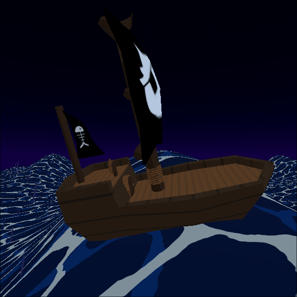



For the intro to a game I (perodically) work on, I decided to put the player on
a pirate ship. Scrolling textures on a big plane looked pretty boring. To make
things a bit angrier I decided to add waves. 

## Waves

The ocean shader displaces the height at each point on a subdivided plane.


```glsl
float wave(vec3 p) {
	float time = TIME * wave_speed;
	vec2 uv = (p.xz + time * vec2(0.5, 0.5)) * wave_size;
	float dist = length(uv);
	
	return pow(2.1231, sin(dist) + sin((uv.y + 1.0))) * height;
}

void vertex() {
	world_position = (MODEL_MATRIX * vec4(VERTEX, 1.0)).xyz;
	VERTEX.y = wave(world_position);
}
```

[Sum of
Sines](https://developer.nvidia.com/gpugems/gpugems/part-i-natural-effects/chapter-1-effective-water-simulation-physical-models#:~:text=The%20sum%20of%20sines%20gives,to%20the%20continuous%20water%20surface.)
is a fancy method to simulate water by summing increasingly small amplitude
sine waves with different parameters. This is not that, but the idea that
summing two sines makes for an interesting wave still holds. I had to [play
with it](https://www.desmos.com/3d/znqsrie3nn) a bit until I found something I
liked. I simple but interesting wave because that fits the cartoon style. 

## Floating

Next, the boat must stay above the surface of the water. Simply setting the
`position.y = wave(position)` would look odd. Both the position and orientation
are affected here.

Starting with the orientation, we can look at this very similarly to looking
for the normal of a heightmap. The waves are just a vertex-displaced plane,
where the y-displacement is defined by some function. There are a few options for
computing the normals:

* Using small finite differences to approximate the normals at a single point.
* Use central differences according to the size of the object to calculate the
  average normals.
* Using the triangles that make up a quad _representing_ the objects size.

These methods are all very smiple and avoid:

* Real buoyancy involves volume and dipslacement. This ends up being very noisy
  and it's a lot of work.
* Proper plane fitting algorithms such as [Least
Squares](https://en.wikipedia.org/wiki/Least_squares) or [Principal Component
Analysis](https://en.wikipedia.org/wiki/Principal_component_analysis). Again
  the added fidelity (and noise) isn't worth the effort.

### Finite Differences

Finite differences is a method of estimating the slope of a function at a given
point. It's the "rise over run" concept from elementary school. Using a very
small step size results in an accurate-enough slope.

$$\Delta x ~= \frac{w(x, z) - w(x + S, z)}{S}$$
$$\Delta z ~= \frac{w(x, z) - w(x, z + S)}{S}$$

To get a normal from these two 2D slopes, we can take the cross product:

$$
\vec n =
\begin{bmatrix}
    S \\
    \Delta x \\
    0
\end{bmatrix}
\times
\begin{bmatrix}
    0 \\
    \Delta z \\
    S
\end{bmatrix}
$$


While the small step gives a very accurate approximation, it might be too
accurate. The boat spans _many_ points on the 3D curve. A lot of the boat will
clip through the water on concave sections of the curve.

### Object-Sized Finite Differences

To mitigate this, we can take the size of our object into account
when computing the differences:

$$\Delta x ~= \frac{w(x - 0.5W, z) - w(x + 0.5W, z)}{W}$$
$$\Delta z ~= \frac{w(x, z - 0.5L) - w(x, z + 0.5L)}{L}$$

$$
\vec n =
\begin{bmatrix}
    W \\
    \Delta x \\
    0
\end{bmatrix}
\times
\begin{bmatrix}
    0 \\
    \Delta z \\
    L
\end{bmatrix}
$$

Notice that there are now four samples, and they all go in
different directions. This is a version of finite differences
called central differences. From these samples, if we rotate our
object then have a plane that _could_ fit on the wave but it sits
underneath, tangent to the wave's curve. This is fine in convex
scenarios, but it will lie underneath the curve in a concave area.
The adjusted position is the mean of our samples.

 $$
y' = \frac{w(x - 0.5W, z) + w(x + 0.5W, z) + w(x, z + .5L) + w(x, z - .5L)}{4}
$$


    
    


In the case where our rectangle spans across a convex area of the curve, this will
move us further down into the water. Using the higher of our adjusted value and the
height at the center of the rectangle easily mitigates this.

 $$
y'' = \max(y', w(x, y))
$$


    
    


All of this, in code, looks like this:

```gdscript
func fit_plane(plane: Node3D, size: Vector2) -> Transform3D:
    # take samples
    var center = plane.global_position
	var left = _wave(center + (Vector3.LEFT * size.x / 2).rotated(Vector3.UP, plane.global_rotation.y))
	var right = _wave(center + (Vector3.RIGHT * size.x / 2).rotated(Vector3.UP, plane.global_rotation.y))
	var front = _wave(center + (Vector3.FORWARD * size.y / 2).rotated(Vector3.UP, plane.global_rotation.y))
	var back = _wave(center + (Vector3.BACK * size.y / 2).rotated(Vector3.UP, plane.global_rotation.y))

    # compute the normal
    var dx = right -left
    var dz = back-front
    var normal = -Vector3(size.x, dx, 0).cross(Vector3(0, dz, size.y)).normalized()

    # place the object
    var surface_point = center
    var sample_mean = (left + right + front + back) / 4)
    var surface_point.y = max(_wave(center), sample_mean) 

    # create a transform
	var rotation_axis = Vector3.UP.cross(normal).normalized()
	var rotation_angle = Vector3.UP.angle_to(normal)
	if rotation_axis.length_squared() < .1:
		rotation_axis = Vector3.RIGHT
	return Transform3D(Basis(rotation_axis.normalized(), rotation_angle), surface_point)
```

### Triangles in a Quad

While the central differences approach works okay, it doesn't handle the subtle
rotation across the shorter part of the rectangle. The samples all lie on the
midpoints of the sides of the triangles, creating a diamond shape. Sampling at
the corners will more accurately represent a rectangular shape,
[projecting](https://www.desmos.com/3d/89a779a469) the entire shape onto the
curve. The decision to use this approach could be based whether you prefer clipping at
the corners of the shape or along the edges. 


The normal of a triangle in 3D space is the cross-products of two of its sides.
There are four triangles formed by the center and any two corners of the quad.
The average of just two of the normals yields good-enough results.

In code, this looks like:

```gdscript
func fit_plane(plane: Node3D, Vector3, size: Vector2) -> Transform3D:
	size *= Math.vec2(plane.scale)
    # corners of our rectangle projected onto the plane
    var center = plane.global_position
    var front_r = _wave(center + Vector3(size.x, 0, size.y).rotated(Vector3.UP, plane.global_rotation.y))
    var front_l = _wave(center + Vector3(-size.x, 0, size.y).rotated(Vector3.UP, plane.global_rotation.y))
    var back_r = _wave(center + Vector3(size.x, 0, -size.y).rotated(Vector3.UP, plane.global_rotation.y))
    var back_l = _wave(center + Vector3(-size.x, 0, -size.y).rotated(Vector3.UP, plane.global_rotation.y))

	# front normal
	var v1 = front_l - center
	var v2 = front_r - center
	var normal_f = v1.cross(v2).normalized()

	# back normal
	v1 = back_r - center
	v2 = back_l - center
	var normal_b = v1.cross(v2).normalized()

	# rotation based on average of cross products
	var normal = ((normal_b + normal_f) / 2.0).rotated(Vector3.UP, -plane.global_rotation.y).normalized()

    # place the object
    var surface_point = center
    var sample_mean = (front_r + front_b + back_r + back_l) / 4)
    var surface_point.y = max(_wave(center), sample_mean) 

    # create a transform
    ...
```


    
    
    


The left side uses only `normal_b` and the right side uses `normal_f`. The center is the
averaged normal. 

## Riding the Waves

Just for fun, I took things a step further and actually used the waves to drive
the motion of the boat. While this may or may for the gameplay to move the boat
around, it could be a cool effect for objects that fall into the water.

While I could find the [partial
derivatives](https://www.wolframalpha.com/input?i=derivative+of+e%5E%28sin%28sqrt%28x%5E2%2By%5E2%29%29+%2B+sin%28y%29%29+*+H)
of our wave analytically, I'd have to deal with that each time I change the
structure of it. The normals and the gradient are closely related. In fact,
when using finite differences, we've already computed the gradient. 

```gdscript
func fit_plane(plane: Node3D, size: Vector2) -> Transform3D:
    # ...
	var step = .2
	var small_dx = _wave(center + Vector3.RIGHT * step / 2) - _wave(center + Vector3.LEFT * step / 2)
	var small_dz = _wave(center + Vector3.BACK * step / 2) - _wave(center + Vector3.FORWARD * step / 2)
	var grad = (Vector3(small_dx, 0.0, small_dz) / step).normalized()

    var surface_point = center - grad
    # ...
```

Simply setting the object's position to the `surface_point` like this it will
slide towards a local minima of the wave and get stuck there.



It also looks a bit too quick. Multiplying by delta time fixes this:

```gdscript
global_position += (surface_transform.origin - global_position) * Vector3(push_strength*delta, 1, push_strength*delta) 
```

We can add some artistic control by adding a `push_strength` parameter.

```gdscript
func fit_plane(plane: Node3D, size: Vector2) -> Transform3D:
    # ...
    var surface_point = center - _wave_gradient(center) * strength
    # ...
```




Because of the smaller step, we don't keep up with the wave. Because of the
wave changing slope at a given point over time, the object can eventually end
up changing direction. Instead of getting stuck at some local minimum after
encountering one wave, the object looks like it's swaying back and forth.

## Central Differences (Again)

While this is very precise, doing the calculus to get that
gradient takes an extra step of manual work. Each time the
structure of the `_wave` function changes, that new function must
be differentiated. We can simply re-use the finite differences
method from earlier here. The analytic approach could still be
useful for validation. 

The only modification is how we construct the vector to get the
gradient (aka slope) instead of the normal:

```gdscript
var grad = Vector3(dx, 0.0, dz) / step
```

## Swimming

What about objects that aren't _always_ in the water? We can re-use all of what
we've done so far to implement a swimming mechanic. Instead of the model being
a child of the plane, we can have a plane that is the child of a body.


First we detect whether or not we're in the water to turn the influence on or off:

```gdscript
# get swimming position of the parent body
var surface_pos = water.fit_plane(self, Math.vec2(size))
surface_pos.origin -= (global_position - parent.global_position)

# activate swimming mode if we're submerged
if surface_pos.origin.y > global_position.y:
    active = true
    animation.queue_action("swim")

# if the player jumps or otherwise ends up above the surface, we're no longer swimming
if parent.global_position.y - surface_pos.origin.y > deactivate_margin:
    active = false
```

And then apply the influence of the water on the body to `velocity` rather than directly
changing the `position`.

```gdscript
# align to surface
parent.global_position.y = surface_pos.origin.y

# push the player around with the waves
parent.velocity += (surface_pos.origin - parent.global_position) * delta
```



This bobbing effect looks neat. After some fine tuning, it could be pretty
good, but there is already a lot of motion applied to the player outside their
control. Another layer of unpredicatability would take away from the fun, so
instead, lets make them stick to the water's surface.

```gdscript
parent.velocity += (surface_pos.origin - parent.global_position) * Vector3(1, 0, 1) * delta
parent.global_position.y = surface_pos.origin.y
```



Well, setting the position directly means `move_and_slide` doesn't get the
opportunity to slide the player and leads to them clipping through walls.
Instead, we can _assign_ the y component of velocity so that it puts us exactly
on the surface.

```gdscript
var impulse = (surface_pos.origin - parent.global_position) * Vector3(delta, 1/delta, delta) 
parent.velocity += impulse
parent.velocity.y = impulse.y 
```



## Conclusion

I was able to get pretty decent effects without imlementing any hardcore
simulations or algorithms. Both the game's frame-budget and my after work
playtime are both very time constrained. Tasks like these where my personal
time contraints, gameplay considerations and performance requirements converge
are incredibly satisfying.
