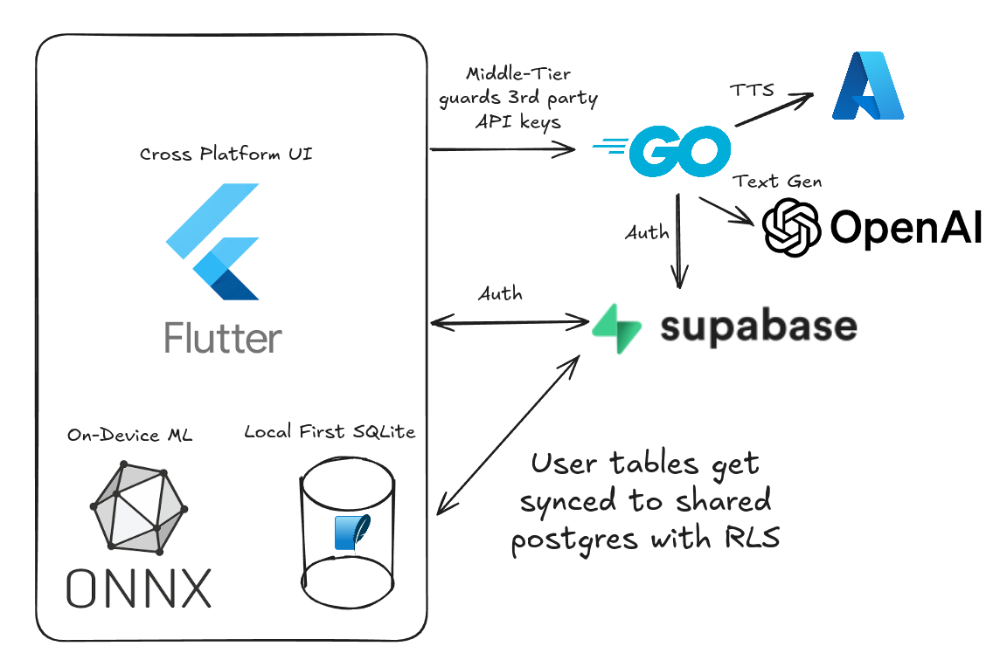

[Just want to see the app?](#the-app)</code>

## My learning journey so far

I've been studying mandarin chinese for a few years now, using a few pretty
great apps. I started out just learning ultra basic phrases from my spouse who
bought me Pimsleur to listen to in the car which was my foundation. The next
app I used, which got me all the way through the basics was [Hello
Chinese](https://www.hellochinese.cc/), easily the best app I've used for
learning. Besides gamified lessons and reviews, it included a reader with a
solid library of short texts. When reading if you didn't know a word, you could
tap on it to hear it and see the English translation.  There are other apps for
these graded readers, like [DuChinese](https://duchinese.net/), but I already
paid for Hello Chinese so I focused on that.

Eventually, I finished all the lessons HelloChinese had to offer so I focused
on reading. When you don't know a word, you have the option to save it for
review... but this saves words into a separate review system from the lessons.
Instead of the multiple choice quiz and typed-response grammar review, you'd
get flashcards. I really don't like flashcards. Lots of people love them, but I
find the self-grading aspect annoying. What I disliked more than flashcards, is
the lack of the grammar review. You'd see an English sentence and have to type
it in Chinese. I'm pretty sure _output_ being part of my daily review routine
helped my retention a _lot_, especially when it comes to how to structure
sentences. After a while, I gave up on this app and decided to focus on
Comprehensible Input.

The term Comprehensible Input is used pretty frequently in language learning
circles. This is input (audio, text, video) that you can _mostly_ understand.
Some people say it's the "natural way that babies learn languages" which is
probably mostly true. Your brain should soak up patterns over time, get used
to recognizing words without thinking about it, and begin to naturally replicate
pronunciation. I _don't_ agree with those who claim CI is the _only_ tool you need
to reach fluency. Especially when the target language is so completely different
than your own native language.

I can still remember the feeling of "Holy shit I understand exactly what he
said!" the second time I tried listening to [Tea Time Chinese
(茶歇中文)](https://teatimechinese.com/). My favorite CI resources for chinese are:

* [Tea Time Chinese (茶歇中文)](https://teatimechinese.com/).
* [Lazy Chinese](https://www.lazychinese.com/)
* [Hello Chinese (Graded readers)](https://www.hellochinese.cc/)

Another form of Comprehensible Input, is conversation practice with a native
speaker. Websites like [Italki](https://www.italki.com/) allow you to pay a
reasonable price for tutors from all over the world for different languages.
Every teacher has a different approach, and I think I am very lucky to have
found a teacher who just had conversations with me, sometimes with a topic in
mind, sometimes just letting the conversation naturally flow. He would
strategically introduce new words. When I was trying to say something too
complex, he'd encourage me to use the simpler language that I'm already
comfortable with to express myself, and use simple language to teach words
without using any English!


Now, as I said before, CI is amazing but until you're nearly fluent, I don't
think it can be the only tool for learning. In fact, I recently started taking
more structured online classes with a teacher from [GoEast
Mandarin](https://goeastmandarin.com/) and they're going well. I'd consider the
entire class period to be CI since we use 90+% Chinese, but with a bit of
English when introducing new words.

Doing a couple hours a week of classes and using bit of Chinese at home with my
spouse is _not going to get me from intermediate to fluent in a reasonable
timeframe. Another tool besides CI that many language learning enthusiasts swear by
is a Spaced Repetition System or SRS. There are apps for this like [Anki](https://apps.ankiweb.net/)
or you could simply systematically organize physical flashcards. The basic idea is
that you review whatever you're trying to memorize daily. When you are correct on the first try,
you advance that item one level. Items in a higher level are reviewed less frequently until you
consider them "learned".

I hated flashcards, and Anki is pretty much a flashcard app. What I wanted was something more akin
to the Hello Chinese review system that was used with their in-app lessons. So I started building
one myself and realized there were a lot of tools I could build myself on top of that basic SRS.

# The app


    
    


What I have built so far has a few key features:

* A dictionary interface built on top of the open-source [CC-CEDICT](https://www.mdbg.net/chinese/dictionary?page=cedict).
* SRS for both Words and Sentences with stats and a streak-tracker.
* Reader that provides a similar experience to DuChinese and Hello Chinese.
* TTS all over the place.

And I still have a lot to do:
* A library of Comprehensible Input content to feed into the reader
* Camera based OCR to look up words you encounter IRL
* Component/radical search for the dictionary
* A floating widget that displays over other apps to look up words
  the way you would in my reader mode.

### Architecture




The app is built on Flutter, because it's easy to use, has a good librry of pre-built
components, and I am not writing the app a second time to support iOS.

Local first is very important to me. Bad internet, or no internet shouldn't get in the way.
In fact, connecting to Supabase for backing up your progress is completely optional. Everything
is written around the local SQLite database which syncs data to and from Postgres (Supabase) in
the background.

Supabase is a nice managed Postgres, but it also provides an easy way to spin up local
development databases with its CLI. It also gives us a nice Dart API with support for
doing 3rd party OAuth (google) or E-Mail/Password auth, all of that tying into Postgres
Row-Level Security (RLS). There is a generic syncer that just uses a version and timestamp
column to choose which side will overwrite what, and options for special merge rules. Other than
that, the only difference between local and remote schemas are a user_id column in Postgres.

Finally, since I'm reaching out to Azure for TTS and OpenAI (maybe I'll switch
to Deepseek since it's Chinese?) I want to keep those off of the user's phone,
so we have a little Go middle man that can maybe take on more responsibility if
I find the need later.

Again, keeping with the local-first priority, there are some on-device ML models
that handle advanced word-to-dictionary mapping usecases. Models are trained with torch
but then converted to ONNX because that's the only thing I found that worked without
having to write my own wrappers around native iOS/Android/Linux to do inference.

### TTS

Language learning is an audio-visual activity. With a language like Chinese,
the written language is not directly tied to how a word or character sounds.
Even with pinyin, the romanization system for chinese pronunciation, it's important
to actually hear the words or sentences you're studying.

A unique challenge that pops up all over building for Chinese is the ambiguity
of the langauge. Word boundaries are not obvious. Sometimes a single character
is a word, sometimes several characters are all one word. On top of this, a
single character may be pronounced differently based on the surrounding
context.

If I sent the sentence “他们在那里呆了很长时间。”, the character 长 would likely
be mispronounced by a lot of TTS systems. Is it 'cháng' or 'zhǎng'? Plenty of TTS
services _do_ take context into account, but what if I'm looking at the two separate
dictionary entries for 长's  pronunciations which  have their own meaning?

The only service I found that allows passing the pinyin along with the characters
is Azure's TTS, which has a `phoneme` element.

### Reader






Arguably the most critical tool besides the SRS, is the reader. This is still
quite a work in progress. Currently you can import content from:

* Text in your clipboard
* URLs, with a best-effort to identify where the primary content is on a
  webpage. (There's special handling for the transcripts on
  https://teatimechinese.com!)
* YouTube URLs! I have a custom backend that handles downloading the captions
  if they're available. (Both Lazy Chinese and Tea Time Chinese videos usually
  do!).

Major TODOs are:

* ~~Allow saving stories to be read later~~ Done!
* An editor mode that allows writing and editing content directly.
* ~~A button that shows other potential words in the dictionary if my automated
  mappings are wrong~~. Done!
* ~~Custom TextPainter and Markdown support~~ Done!
* Potentially, a curated library of content. I'm not sure how I'd source this
  legally and ethically. Unless...
* Users or teachers could produce and share their own content, potentially
  with some kind of marketplace platform if it's not a free and open place to share.
  Content moderation is a real concern though.


### Automated dictionary mappings


As I mentioned in both the TTS and Reader sections, it can be difficult
to tell what word and definition in the dictionary corresponds to a character
in some text. There is so much ambiguity, and rule-based systems can only do
an okay job dealing with it. Some examples:

> 我的学长留学了在北京外国语大学很长时间.

It can be tricky to figure out whether 长 is 'cháng' or 'zhǎng'.
The first instance is easy. 学长 is a word in the dictionary, so
we can deal with that by just looking for the longest sequence that
exists in the dictionary.

"北京外国语大学" is also tricky; should we group 外国 (foreign) or 国语 (the
national language, Mandarin). In this case, it should either be "外国",
"外国语" (foreign language) or even "北京外国语大学" since that's the name of
the school. Since 外国 actually exists in the dictionary database, we should
pick that, and then the mappings for 北京， 语，and 大学 still make sense on
their own.

Another example, with 的话 a super common pair of characters that only
_sometimes_ should be separated:

> 如果你喜欢周杰伦的话，你应该听妈妈的话。

In this case, 的话 has two possible meanings:

1. 的话 - a conditional particle meaning "if the previous statement is true, then..."
2. 的 - posessive particle; 话 - words

The above sentence says "If you like Jay Chou, you should listen to your
mother['s words]". (A reference to the song 《听妈妈的话》). Using the longest
sequence would always be wrong in the case where 的 and 话 are split. This is a trivial
example, but the general problem is still worth solving.

To do this, I introduced a word segmentation model, from
[ckiplab/ckip-transformers](https://github.com/ckiplab/ckip-transformers/tree/master).
This model does a _decent_, but not perfect job at segmenting things. I ended up having
to hand-tune the output confidences to bias it myself.

```dart
// each token gets a score on whether it should be part of
// the same word as the preceding token
final bScore = tokenScores[i][0];
final iScore = tokenScores[i][1];

// do some funny math to figure out _how_ confident the model is
// this makes the numbers a bit more interpretable for tuning threshold
final pB = exp(bScore / temperature) /
    (exp(bScore / temperature) + exp(iScore / temperature));
final pI = exp(iScore / temperature) /
    (exp(bScore / temperature) + exp(iScore / temperature));
final absDiff = (pB - pI).abs();

// only include it if we're above `threshold` difference
// in confidences for or against inclusion
if (bScore > iScore && absDiff > threshold) {
  if (current.isNotEmpty) {
    tokens.add(current);
  }
  current = sentence[i - 1];
} else {
  current += sentence[i - 1];
}
```

Now, this is getting closer, but there are _still_ a lot of cases that it gets wrong.
Some of this is due to the segmentation model not being super accurate, and some of it
is due to cases where the word segmentation doesn't even make a difference.

> 我长大了。
> 我等了很长时间。 (Yes, 很久 makes more sense, this is just an example.)

In both cases, 长 is a single character. The meaning changes along witht he
pronunciation, though. Unfortunately, ckip-transformers nor huggingface
provides a solid model for doing Chinese text to pinyin mappings. So I decided
to train my own model. Using the ckip-transformers albert models as a base, I
trained my model using some datasets I found online.

> Input: 我 不 知 道 这 是 不 是 爱 。
>
> Expected Output (Pinyin): wǒ bù zhī dào zhè shì bù shì ài
>
> Predicted Output (Pinyin): wǒ bù zhī dào zhè shì bù shì fu

It took a while... and I had to learn a bit about modern ML techniques,
how to tune batch size, create a custom loss function, dynamically change the
learning rate and more.

> Input: 我 不 知 道 这 是 不 是 爱 。
>
> Expected Output (Pinyin): wǒ bù zhī dào zhè shì bù shì ài
>
> Predicted Output (Pinyin): wǒ bù zhī dào zhè shì bù shì ài

But eventually, the robot finally understands what 爱 (love) is.

The final model character-level accuracy level of **99.62%** and a
sentence-level accuracy level of **`96.91%** (both of those numbers are when I
ignore tone markers).

I use the output of my pinyin model, the ckip-transformers wordseg model and
the length of a candidate word to generate scores for all the possible
dictionary mappings inside a sentence to determine my most confident prediction
for the entire sentence. This isn't perfect, but I'm pretty sure it's better
than anything else on the market. _And the whole thing runs with acceptable performance
on my Pixel 8_.


### SRS


By <a href="//commons.wikimedia.org/wiki/User:Zirguezi" title="User:Zirguezi">Zirguezi</a> - <span class="int-own-work" lang="en">Own work</span>, <a href="http://creativecommons.org/publicdomain/zero/1.0/deed.en" title="Creative Commons Zero, Public Domain Dedication">CC0</a>, <a href="https://commons.wikimedia.org/w/index.php?curid=20328125">Link</a>


The SRS itself is a pretty basic [Leitner
system](https://en.wikipedia.org/wiki/Leitner_system). There's actually very
little interesting technical stuff going on here. The interface on top of it is
what I find more useful than others' systems; but it's still very, very simple.


    
    
    


The source of the items to review are added manually, by searching in the dictionary
or typing out the sentence and its english translation. There is a feature to use AI
to generate sentences of varying degrees of difficulty, but I'm not sure how authentic
the output is at times. The automatic mappings can still fail, so there is a (WIP) UI
that allows correcting the mapping's segmentation and pick the correct definition.



    
    


Multiple choice questions are the only alternative to flashcards. Going between
English and Chinese in both directions has been helpful, in my experience.


    
    


Seeing words in context is also incredibly important, so when we have
sentences that use a word, fill-in-the-blank questions are generated.

Saved sentences are fed directly into the sentence review. This activity
is more time consuming than the multiple-choice word review, but output
shouldn't be ignored as part of a review habit.


    
    


Any reviewable item also can be given custom tags. The use-case I had in mind
was preparing for specific events. I play the Yu-Gi-Oh TCG, and I think it
would be fun to one day play in a competition overseas in Taiwan or mainland
China. Besides the daily review, you can also do a cutom review and filter
using these tags if you're studying a particular topic.

## What's next?





The main idea of the app is "bring your own content". I've been dogfooding
it for a little while now, and it has definitely sped up my vocab acquisition.
There is a lot of polish yet to be done. Scalabilty checks, testing on other devices,
and just a couple more features:

* A screen reader to get the tap-to-lookup experience in any app. Likely
  Android only.
* Curated content library. Maybe even daily/weekly releases of short readers,
  like [Maayot](https://www.maayot.com/).
* Reccomendation algorithms to asses a new user's current Chinese level, and
  
* Test the pinyin model, and potentially train an additional model, to ensure
  traditional chinese works well.
* Integrate a higher quality dictionary. CEDIT is pretty good, but I at least need
  to have the option to hide "Potentially innapropriate words". For example,
  reading about [a duck (鸭) shouldn't show a slang definition "male prostitute" by
  default.
  ](https://www.mdbg.net/chinese/dictionary?page=worddict&email=&wdrst=0&wdqb=%E9%B8%AD)

I'm not sure when it will be done.I'll continue to iterate. It's a slow going
process and I just have the nights and weekends that I'm not doing other
hobbies and work. Hopefully I can make this project a priority in the near future.
