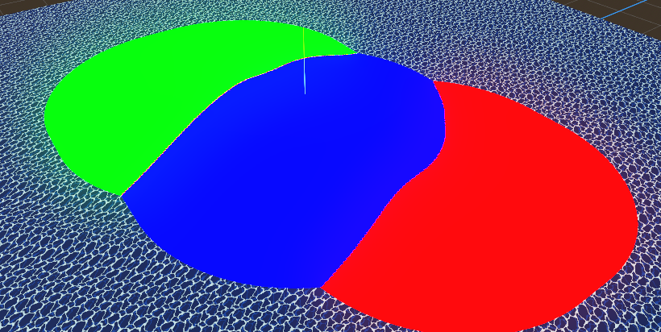

I am not a good artist. One of the reason 3D is a bit more
attractive to me is that I can usually build something rather
than draw it or sculpt it. Digital art gives you an "undo"
button, but being able to undo or redo things out of order makes
it even easier to experiment.

Most of the terrain tools out there have a destructive workflow. Using various
brushes, you write directly to a heightmap. Including the concept of "layers"
can help here, but I want something closer to modeling.

What I've built is a way to take `Node3D`s tagged as `ShapeInstance`s and
compose them onto the heightmap. Their `y` position is their height, and their
`y` scale is the steepness of the shape. Other transform properties work normally (except for rotation on `x` and `z`).



A couple of custom properties are `roundness` so that rectancular shapes don't
have sharp corners, and a `shape` ID. The currently supported shapes are
`recatangle`, `circle` and `ramp`. In the future, I'd like to get rid of `ramp`
and instead support rotation on the horizontal axes for creating slopes.

## SDFs

Signed distance functions are an easy way to describe shapes using math. This
could be in either 2D or 3D. [Inigo
Quilez](https://iquilezles.org/articles/distfunctions/) has a nice library of
functions for different shapes on his website. They have all sorts of uses in
graphics; you can [render them directly](https://www.youtube.com/watch?v=BNZtUB7yhX4)
with a ray marcherwith them direclty, they can be used in [global
illumination](https://docs.godotengine.org/en/stable/tutorials/3d/global_illumination/using_sdfgi.html),
and they are probably in many other ways.

The SDFs of each shape are composed onto a single heightmap in a compute shader that looks roughly like this:

```glsl
layout(set = 0, binding = 0, std430) buffer ParamsBuffer {
    int n_shapes;
    int resolution;
    float world_size;
    vec2 world_offset;
}
params;

layout(set = 0, binding = 2, std430) buffer ShapesBuffer {
    ShapeData data[MAX_SHAPES];
} shapes;


layout(local_size_x = 32, local_size_y = 32, local_size_z = 1) in;
void main() {
    vec2 uv = gl_GlobalInvocationID.xy;
    float height = -999999999.0;
    for (uint i = 0; i < params.n_shapes; i++) {
        ShapeData shape = shapes.data[i];
        shape.position = world_to_shader(shape.position);
        shape.size *= shader_scale();
        shape.steepness *= shader_scale();
        float shapeHeight = heightmapFromDistance(shape, uv, sdf(shape, uv));
        if (shapeHeight >= height) {
            height = shapeHeight;
            maxInfluence = int(i);
        }
    }
    int heightIdx = toIndex(uv);
    heightmap.data[heightIdx] = max(height, 0.0) / MAX_HEIGHT;
}
```

## Clipmap

One difficult issue with large terrains is stitching the borders of chunks.
Instead of dealing with that, we can use a wandering
[clipmap](https://developer.nvidia.com/gpugems/gpugems2/part-i-geometric-complexity/chapter-2-terrain-rendering-using-gpu-based-geometry).
A massive plane that has more subdivisions towards the center, and fewer on the
edges gives us some basic LOD. As the player moves through the world, we
peridically recenter the clipmap at their position so the stuff they can see
closely has higher detail.



This technique works _especially_ well with the way we generate the heightmap.
We don't even need to create chunks of the heightmap, or be concerned with
artifacts due to sampling along the borders of two chunks. Instead, we can just
center the heightmap's world space offset along with the clipmap, and only
include the `Node3D` shapes that would be visible at this offset. To avoid
regenerating the heightmap everytime we move the clipmap, we can generate the
heightmap to be 2 times as big in world space. When we move outside some
margin, the heightmap gets recentered.


## Cursor Selection

In the editor, a `Node3D` with no collisions is a bit annoying to select in the
tree rather than visually. Writing the shape index that is actually influencing the
heightmap at some point lets us give the heighmap its own collider, and based on the `xz`
coordinate, we can sample that "influence map" to select the right shape.




## Splat Mapping

It would be pretty boring to only have the grass, cliff and beach textures
based on normals and height. Paths, grass, plazas and other interesting details
should be available.



With a few modifications, we can use the very same code for terrain generation
for splatmap generation as well. Using these primitive shapes is pretty
unwieldy , so in the future I'd like to be able to use the `Path3D` node to
create paths and roads on the splatmap, as well as a free form drawing brush.
Maybe noise texture overlays as well with masking.


## Optimization

Currently, this recalculates the terrain using every input shape, every time.
There is a simple optimization that would cache the result of every shape but
the actively selected one and then just re-apply that one shape. I haven't done
measurements to see whether this is worth it. If this editor was being shipped
in game, rather than being just an editor tool, it needs some tuning.
