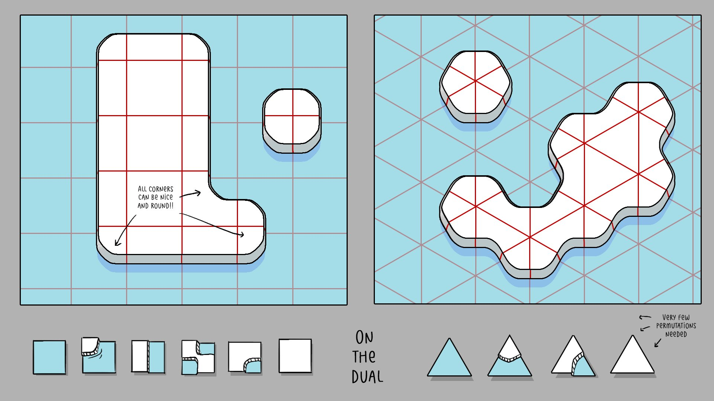
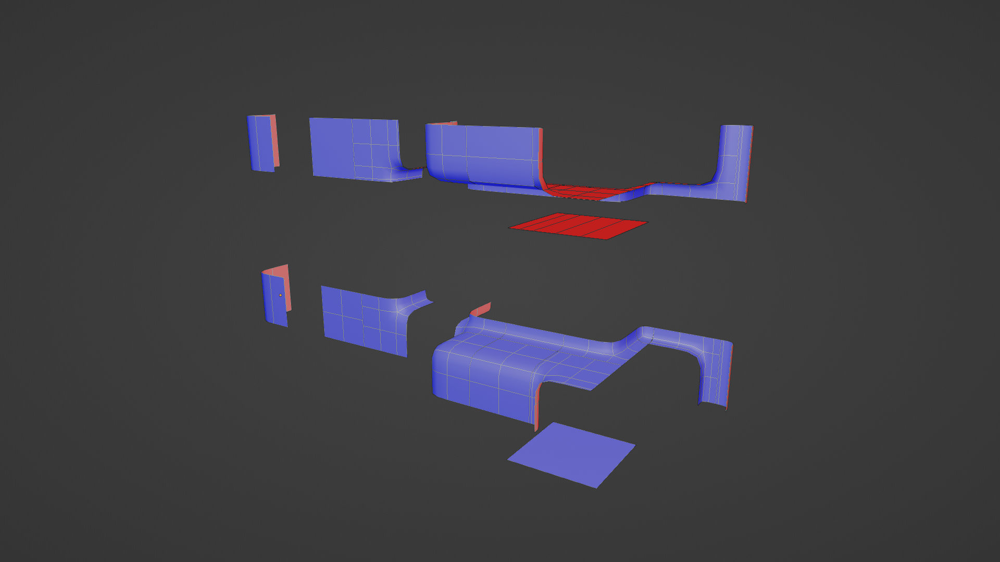



In the last post we were able to randomly generate "correct" looking 3D
shapes. However, my goal was something that a user or game developer
could create levels with. Let's look at our requirements:

* The user should have direct control of the generation. [BorisTheBrave
  describes](https://www.boristhebrave.com/2021/06/06/driven-wavefunctioncollapse/)
  calls this "Driven WFC".
* We need a lot of tiles. That would take a lot of time to model for a game developer.
  This isn't totally avoidable, but we can optimize our workflow.
* If the user is going to interact with this, the algorithm for solving the generation
  needs to be fast. Our naive implementation needs a major upgrade.

## Driving WFC

### Initial Constraint

Our method of "driving" WFC will be specifying which cells aren't empty
as an initial contraint.

In the [first](../wfc-01-basic-wfc/) post I described a
dual-grid. Because our tiles describe transitions, we can't say a single cell
is filled. We must use at least 4 non-empty tiles in 2D, or 8 tiles in 3D to
create a manifold shape.


If a user fills the coordinates: `[(0, 0, 0), (0, 1, 0), (0, 2, 0)]` we will
expand that to 16 coordinates. It's not 24 because the affected cells overlap.

For each those expanded coordinates, we remove `empty` from the possibility
list. The cells not included in that list have their possibility list reduced
to _only_ the `empty` prototype. The full implementation is
[here](https://github.com/stevenctl/basic-wfc-blender/blob/7b44e30794c7ee7dd2ef1e8c377494c48f87bd20/wfc/solver.py#L311C15-L311C24).

This is the result:



### Ambiguous Cases

The example above _should_ be a plain rectangle. The problem is our constraint
says "every cell must have a non-empty tile". That is satisfied.

#### Special "empty" Tile

We could expand the constraint to say "all our tiles must be connected on a non-empty face".

```python
{
    "name": "empty",
    "mesh": "",
    "rotation": 0,
    "north": "empty;empty_only",
    "east": "empty;empty_only",
    "south": "empty;empty_only",
    "west": "empty;empty_only",
    "top": "v_empty;v_empty_only",
    "bottom": "v_empty;v_empty_only",
}
```

We can give the `empty` prototype a special socket `empty_only`.

* An `empty` tile can allow the `empty` socket from any tile.
* A tile with a mesh that has an `empty` socket shouldn't connect to other
  other meshes outside faces.

In the "constrain to neighbor" step, we modify our rules a bit:

```python
if not cell.possibly_empty():
    if "empty" or "v_empty" in allowed_sockets:
        allowed_sockets -= {"empty", "v_empty"}
        allowed_sockets += {"v_empty_only", "empty_only"}
```

filled cells can't use their `empty` side to connect to other filled cells now.


### The Donut Case



Stopping empty sockets from connecting to each other restricts
us from getting some valid results. It is also insufficient.
Half of the connecting faces of the `L` tiles are not empty,
so our special rule isn't triggered. How can we fix this?

### Simplified Marching Cubes


Again, we go back to looking at Marching Squares, except this time Marching
Cubes. In that algorithm, we set a bit on the cell's `tile_index` that
corresponds to each "filled" corner from the dual grid. We can expand it to 3D,
generating a `cube_id` based on which octants contain the mesh.


The cognitive load is too much for manually labeling the tiles. We can simplify
this to just _count_ the number of filled octants. We'll call that the `volume`
of a tile. This reduces the manual labeling workload.

When we're setting our initial conditions, we find the volume for each cell, then
constrain it to all the tiles with that volume:

```python
corner_counts = {}
for coord in crossgrid:
    for coord in expand_coord(coord):
        if coord not in corner_counts:
            corner_counts[coord] = 0
        corner_counts[coord] += 1

protos_by_voume = itertools.groupby(prototypes, lambda p: p.volume)

for coord, cell in grid:
    volume = corner_counts[coord]
    cell.possibilities = copy(protos_by_voume[volume])
```

This ends up being much cleaner. No special casing `empty` or looking for
fully surrounded cells. And it gets us the result we want.

### Impossible Configurations

You may have noticed a while ago, or maybe you noticed when we brough up marhcing squares.
If a square has 4 corners, or 4 bits, there are 2⁴ tiles to cover every case. In 3D this
explodes to 2⁸ (256) tiles. Our manually created tileset cannot handle all possible user input.

## Generating Tiles

While we can rotate and flip our tiles to increase the number of tiles, we
can't be sure we covered all the cases. Instead it's easier to generate most
of the tiles from smaller parts. At the same time, we can annotate the tiles
with the "volume" data instead of doing that manually for 256+ tiles.


### Enumerating Tiles

To ensure we don't miss any possibilities, let's enumerate all the cases in code.
Intuitively, there can't be 256 _unique_ cases. Let's figure out how many are left
if we ignore duplicates.


We can take an integer between `0` and `255` and convert it
to or from a `2x2x2` array of "filled" or "empty".

```python
def int_to_cube(c_int: int) -> np.ndarray:
    s = format(c_int, "#010b")
    o = np.array([int(s[i]) for i in range(2, len(s))]).reshape((2, 2, 2))
    return o

def cube_to_int(cube: np.ndarray) -> int:
    return int("".join(cube.reshape(8).astype(str)), 2) ```

We're using Python 3 with NumPy because `ndarray` is very convenient.
This code doesn't need to run in our game engine and will end up
being more useful in Blender scripts, which must be Python.

Similar to 2D, many of cases are transformations of other cases. We can generate
the unique cases pretty easily:

```python
def possible_tiles():
    seen = set()
    unique_cubes = set()

    def add(cube, unique=False):
        v = cube_to_int(cube)
        if unique and v not in seen:
            unique_cubes.add(v)
        seen.add(v)

    # skip 0 and 255 because they don't need a model
    # they're empty and interior tiles
    for i in range(1, 255):
        if i not in seen:
            unique_cubes.add(i)
        seen.add(i)

        # register the transformations as "seen"
        # so that we will ignore them in future iterations
        rc = int_to_cube(i)
        for rot in range(4):
            rc = np.rot90(rc, axes=(0, 1), k=rot)
            seen.add(cube_to_int(rc))
            seen.add(cube_to_int(np.flip(rc, axis=1)))

    return unique_cubes


if __name__ == "__main__":
    tiles = possible_tiles()
    print(len(tiles))
```

53 unique cases. Not bad! We can safely ignore the `0` and `255` cases. Because
0 is empty and 255 is completely on the interior, so we can't actually see it,
there is no need to provide a model for them.

### Less Modeling

If I were to manually build the 53 models, there would certainly
be repetitive substructures. While iterating on art, it would be
very annoying to update every variation to keep the look consistent.

What if we imagine each octant as a tile? It can't be that hard to auto-tile a
2x2x2 grid. In the talk [Beyond
Townscapers](https://www.youtube.com/watch?v=Uxeo9c-PX-w&t=126s), and on
[twitter](https://twitter.com/OskSta/status/1448248658865049605) Oskar uses
this image to show tiles for a dual-grid.



I tried to classify the square cases.

* Empty
* Corner
* Edge
* Diagonal
* Bend
* Full

Those are the cases I want to end up with at the end. The combinatorial
explosion into 3D is big. Let's cut those into quadrants to make the _dual-dual_ tiles.
We end up eliminating the Diagonal case. Only four models are needed to start:


Expanding to 3D isn't that bad. We just need walls, edges and bends along the Up axis.
That can be accomplished with some simple rotations.


It doesn't fully cover it though. We have to be able to transition vertically
between flat tiles or edge tiles. We'll call these "lip" tiles since they're
kind of skinny. There are 5. 4 for to match up to the base cases and a 5th that
is a corner between two lips. It's basically the "outward" part of an "outward
blob cut" approach.


Finally, we duplicate all of these and flip them upside down so we have some
dedicated for the top layer of our 2x2x2 grid that transition from the ceiling
downward instead of from the floor upward.

In total There are 26 tiles to model. Very manageable!




### Assembling WFC Tiles

To combine the tiles, we rely heavily on some naming/classification.
The names of the Blender object concatenate:

* Their base type - Lip, Corner, Bend, Edge
* Their Layer - Top, Bottom
* Their Direction - Horizontal, Vertical, Horizontal + Vertical, Corner

We can then determine which micro-tile belongs in an octant
based on which neighboring octants are also filled. The implementation is
[here](https://gist.github.com/stevenctl/3492292c6461c8235e22f858c22ce6b8).
I wrote it on a long flight and jetlag affected the readability. The rules are:

* If 4 octants are filled in the same "plane", this is either flat or a "lip".
* If 3 adjacent octants are filled, this is a 3-way bend.
* If 2 adjacent octants are filled, this is a 2-way bend.
* If 1 adjacent octant is filled, this is an edge.
* If 0 adjacent octants are filled: this is a corner.

### Orienting the Tiles

We know which category of tiles go where but the simple rules above don't
explain how to rotate them into alignment. I was far too lazy to figure this
out. Turns out I wrote an algorithm for this already. WFC!

If we run our [adjacency](../wfc-01-basic-wfc#generating-sockets-and-prototypes)
script, then setup a 2x2x2 WFC grid and set the [initial conditions](../03-driven-wfc/)
of each cell to have all the rotations of the mesh that we're sure we want...
it will spit out exactly what we need!

## Additional Tiles

We've discussed how we could use 8 bit integers to represent a cube divided
into 8 octants. This idea inspired me to abandon mesh data as a means for
adjacency data in favor of 2D images.

A "socket" in our WFC we only have a few requirements:

* Capture the contour of a single face of a tile
* We can easily check if it is flipped or symmetrical.
* Easy to determine if it's a rotation of another tile.

What are the drawbacks of the current approach?

* An opaque string does not preserve the visual representation.
* Suffix markers: `s` (symmetrical) `r` (rotations), `f` (flipped) have to
  be trusted. We can't reproduce them from their base case without the mesh.
* Meshes must be perfectly constructed to have verts sitting on bounding box faces.
* Small errors in the model can cause incompatible tiles.

The current model makes for a nice workflow in the happy path, but failure cases
are a pain to debug or notice. Instead, we can use this cube data to create simple
2D images:


We can auto-generate these for our standard 256 prototypes. This does
place a new burden on the artist: they must manually draw images for
additional tiles outside of the base set. Manually drawing low-resolution
images turns out to be easier than makinag sure 3D meshes perfectly align.
It is often easier to hide seams with details like stones or other decorations.
The image approach _enables_ that sort of artistic liberty.

### Encoding

Base64 encoding and decoding images could work. Instead I decided to over-engineer this
a bit. I don't want to rely on using any library's `Image` abstraction. My images
don't need much resolution at all.

The base tiles could be captured with a 2x2 image. I landed on using 7x7
monochrome images encoded into 64-bit integers. 2x2 isn't enough if we create
detailed tiles down the road. An 8x8 image would use 64 bits,
and we want leftovers.

Using some leftover bits, we can store information like whether the image is the
flipped version of another image. Now when we compare a horizontal socket, we
don't need to loop over the image and actually flip it. We can simply figure out
the unique set of images in our tileset before hand, and mark some as flipped.
The check becomes `a == b ^ (1 << 63)`. We might use another bit to store
whether the image is symmetrical so we know NOT to flip the bit.

For example, `0b00000111` would look like:


The advantages we get:

* Dense serialization
* Fast compatibility checks
* Canonical unflipped socket.
* Canonical 0 rotation socket.

Those last two are very useful properties. With the old approach, the first
hash we saw would get a name, and the transformations would be derived from that name.
With this approach, the "canonical" untransformed image can be determined by performing
the transformations to the image and sorting by the integer value.


### Images from Octants


Converting from 2x2 to an arbitrary size isn't too hard. Just loop through and
fill up the corners. For odd numbered resolutions, like 7, a corner would be
3x3. There is additional logic to fill these gaps where it makes sense.

```python
def gen_sock(cube_id: int, face_name: str, seen_socks: Sockets, bitmap_size=7) -> int:
    cube = int_to_cube(cube_id)
    face = get_face(cube, face_name)

    assert bitmap_size % 2 == 1  # must be odd for 1 pixel gutter in center
    fill_size = int(bitmap_size / 2)
    socket_bitmap = np.zeros((bitmap_size, bitmap_size), dtype=int)
    for x in range(len(face)):
        for y in range(len(face[x])):
            if face[x, y] == 0:
                continue
            sx = x * (bitmap_size - fill_size)
            sy = y * (bitmap_size - fill_size)
            ex = sx + fill_size
            ey = sy + fill_size
            if x == 0 and face[x + 1, y] == 1:
                ex += 1
            if y == 0 and face[x, y + 1] == 1:
                ey += 1
            socket_bitmap[sx:ex, sy:ey] = 1

    return encode_socket(socket_bitmap)
```

### Manually Authored Tiles


The whole reason we're using WFC and not Marching Cubes is to allow
for interesting shapes to emerge under certain conditions. We can texture
some cubes parented to manually modeled tiles that extend our base set of 53.
The sockets for the base set are simple and easy to reason about. We can be a
bit clever designing socket images for our custom tiles.

Luckily the Blender Python API (`bpy`) gives us a representation that is compatible
with NumPy. We can keep our authoring workflow fully inside of Blender.

```python
imgs = [node for s.material.node_tree.nodes if node.type == 'TEX_IMAGE']
img = np.asarray(imgs[0].pixels).reshape((21, 28, 4))
```

## Optimizing the Algorithm

The workflow for creating tiles is optimized, and we may have squeezed out a
bit of performance by comparing integers instead of strings. It's still nowhere
near fast enough.

### Current State

For each cell, we might make a random choice. For each random choice, we do a
propagation for each face of a cell. There's a chance a single cell with can be
affected in circular paths before the propagation is complete. This means we're
worse than `O(N^2)` propagations.

At the deepest part of this nested loop/recursive iteration we have an expensive
computation:

```python
allowed_sockets = [allowed_socket(other[opposing_face]) for other in other_cell.possibilities]
self.possibilities = [p for p in self.possibilities if
                      len(p.sockets_for_face(my_face).intersection(allowed_sockets)) > 0]
```

### Adjancy Table

Instead of doing all the work to check socket compatibility
during generation, we can do it upfront. Consider each `Prototype` as having
an `id` which is its index in the initial list.

```python
adjacency = []
for proto in prototypes:
    allowed = {}
    for face in faces:
        allowed[face] = allowed_for_face(proto, face, prototypes)

def allowed_for_face(proto, face, prototypes):
    set([
        i
        for i, other in prootypes
        if compatible(proto, face, other)
    ])
```

We can reduce the work in the loop to be an intersection of sets:

```python
allowed_protos = set()
for proto in other_cell.possibilities:
   allowed_protos.intersection_update(adjacency[proto.id][opposing_face])
self.possibilities = allowed_protos
```


### Bit Set

Bit representations of cubes and images got me thinking: we don't have a crazy number of protos.
What if the `possibilities` list was just a set. Each bit represents one prototype. In Python, a number
can have more than 64 bits. In other languages, you'll need to roll an abstraction over a list of integers.
We have 256 base tiles, plus some manually created ones. Let's say our max tilset size is 512.

If `possibilities` is now something we can use the binary `&` operator on we get some micro-optimzations:

* We don't necessarily need the heap.
* Single instruction intersections.
* Maybe it's cache efficient? I don't do this kind of optimization often.

This could be called a micro-optimzation, but for large tilesets it is probably
worth it. Instead of doing `O(N)` union of hash tables, we can do `O(N /
sizeof(int))` bitwise `&` operations. For a large tileset of 2048 tiles this is only
32 `&` operations compared to 2048 hash table lookups.

## Conculsion

I know this was a long post and could have been split into multiple articles,
but I just wanted to get this out. The game I was planning to make with this
just isn't something I have time to work on. This is the first time I've written
a tech blog and I've done it just so I can share this work in some form.
